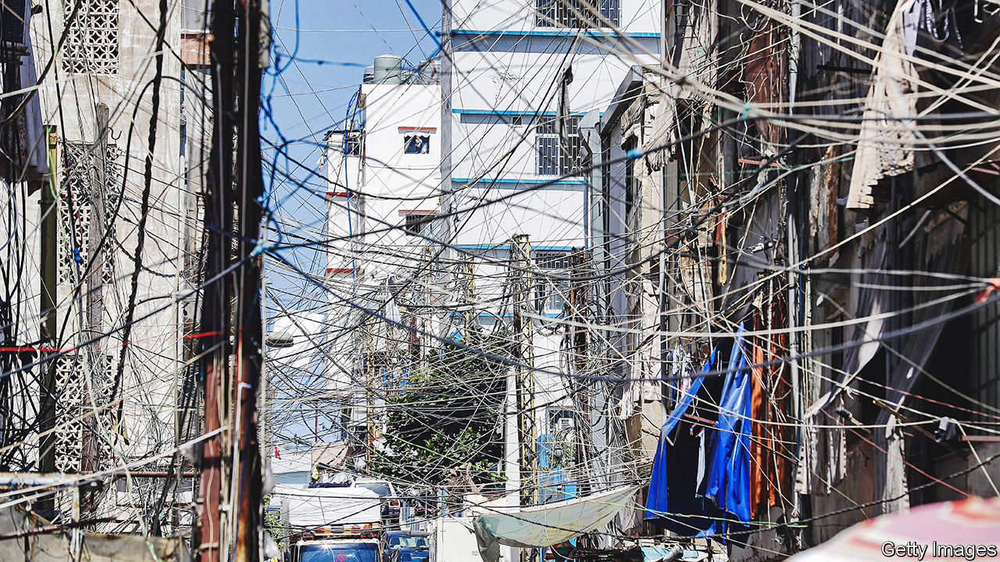

###### Blue-sky blues

# Lebanon’s economic crisis is wrecking the environment, too 

##### Generators spew toxins into the air, while sewage pollutes the water 

 

> Oct 6th 2022 

NOSTALGIA is powerful in Lebanon, a country whose population is dwarfed by its diaspora. Ask Lebanese expats to describe home and they may offer sweet memories: the scent of jasmine and cedars, of coffee spiced with cardamom and of (flatbreads) fresh from the oven; the sound of Fairouz, a beloved , warbling from cafés and car radios.

Three years into an economic crisis, though, the defining sensory experience of Lebanon is the smelly, noisy diesel generator. The machines run at all hours, providing power that the state cannot. The air takes an acrid tinge; their roar keeps people awake at night. And they are perhaps the most telling sign of how economic collapse is harming Lebanon’s environment.

GDP has shrunk by more than half, from $52bn in 2019 to $22bn in 2021. Though still officially pegged at 1,500 Lebanese pounds to the dollar, the currency actually trades at around 38,000; the finance ministry says it will soon adjust the official rate. Annual inflation has been above 100% for the past 26 months in a row. Most banks are bankrupt and allow depositors to withdraw only pocket money every month.

Public services have ground to a halt. Ministries have run out of paper and ink. Many civil servants no longer show up for work: getting there costs almost as much as their salaries. One research group estimates that the average teacher earns just $3 a month after commuting costs.

Desperate people are increasingly trying to flee across the Mediterranean. Last month a boat packed with migrants capsized soon after it set sail from northern Lebanon. At least 100 bodies, many of them Lebanese, were washed ashore in neighbouring Syria.

For those who remain, economic crisis is causing environmental catastrophe as well. Start with the air. Even in better times Lebanon did not provide round-the-clock electricity. Citizens used diesel generators to fill the gaps—three hours a day in the capital, longer elsewhere. This is an especially dirty way to generate power. A study conducted in 2012 in Hamra, a neighbourhood in west Beirut, found that the level of airborne carcinogens jumped by 60% during the hours of generator use.

Today, with barely any fuel to run power plants, the situation has reversed. The state provides at best two hours of power. Generators roar around the clock, in car parks and garages and wherever else they can be stashed. Sometimes they catch fire from overuse. Many buildings have scheduled “rest” hours to allow for cooling and maintenance; a few have backup generators for their backup generators.

They are spewing loads of cancer-causing chemicals into the air. Researchers at the American University of Beirut estimate that the level of toxic emissions has jumped three-fold since before the crisis. They think Lebanon’s incessant generator use will mean an extra 550 cancer patients and 3,000 cases of chronic obstructive pulmonary disease each year.

Power plants are getting dirtier, too. One of them, Zouk, sits close to a populated area, its smokestacks looming over nearby beach clubs. As it was running out of fuel, the authorities decided to load a shipment of heavy fuel oil that had been in storage. When it arrived, they deemed it too dirty and viscous to use but, with no alternative, they still loaded it into the plant.

Water has become poisonous, too. Lebanon’s infrastructure was a mess before the crisis. Many homes were either not connected to the grid or suffered regular outages. So they relied on lorries to supply water for bathing and washing; those who could afford it bought bottled water to drink. Fewer people can afford anything now. UNICEF, the UN children’s fund, says the price of trucked water has increased six-fold since 2019.

With little money for maintenance and little electricity to run treatment plants, what water does arrive is often polluted. Hepatitis A, commonly spread by infected faeces, is rife. In the first half of the year authorities logged 555 cases, more than usual. The health ministry blamed collapsing infrastructure: sewage seeps into the water people drink. The health service is ill-equipped to handle these consequences. Hundreds of doctors and nurses have emigrated. Hospitals and chemists are short of medicine, especially cancer drugs, which many patients cannot afford anyway.

Lebanon aims to produce 30% of its electricity from renewables by 2030. Some joke the country will get there much faster: “We’ll be the world’s first zero-emissions country when we have no fuel,” quips an economist. Stand on a balcony and gaze out over Beirut’s skyline, and solar panels seem to be everywhere. Engineers who install them have one of the few booming businesses in Lebanon—although, at around $3,000 for a five-amp system, not many people can afford them.

In any case, regulations barely exist. Many solar systems are put in on the cheap. Equipment is imported, sometimes from dodgy suppliers. Installers are not always properly trained. There are fears that shoddy wiring will start fires or that winter storms will blow solar panels off rooftops. For a failed state mired in economic crisis, even the sun has a dark side. ■

