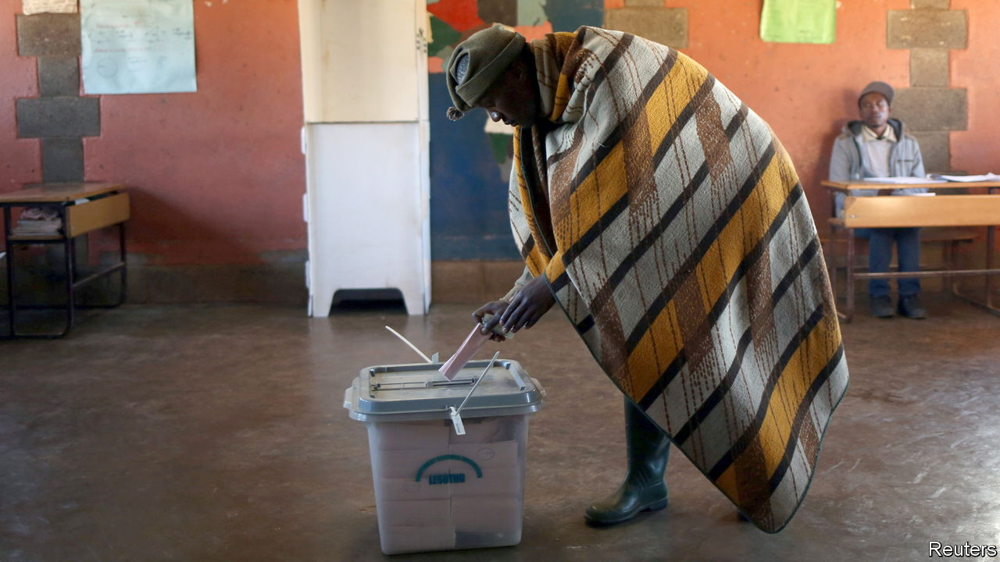

###### Let’s get this party started

# Why political parties are a growth industry in Lesotho 

##### There are few better ways to make a living than founding one 

 

> Oct 6th 2022 

Lesotho is a gold mine for pub-quiz crafters. It has the highest lowest point of any country in the world, and, as it happens, the highest pub in Africa. It is one of just three countries entirely encircled by another—in its case, South Africa. (San Marino and Vatican City are the others.) 

Less whimsically, Lesotho’s economy is nearly a tenth smaller than in 2016 and its 2.2m people are poorer than the average sub-Saharan African. The more than two-thirds who live off the land face erratic rains and climate change. Factories built by Taiwanese and Chinese firms in the 1990s to make clothes for Americans are shedding jobs. A huge dam to supply its neighbour with water is delayed. 

There is one booming sector, though: political parties. “It is one of the only growth areas,” notes John Aerni-Flessner of Michigan State University. Some 65 were registered for elections on October 7th, up from 27 in 2017. Scholars reckon that in Lesotho the number of parties, relative to population, is among the world’s highest.

One reason is that barriers to entry are low. To set up a party takes just 500 signatures. Under Lesotho’s version of proportional representation, a party does not have to reach a minimum share of the vote to be granted seats in parliament. In any case, candidates have few ideological or ethnic differences. Once in parliament there are no rules against MPs joining other parties or forming new ones. Coalition governments are ephemeral. Political entrepreneurs thus have every incentive to found their own parties. In 2015 one got a mere 1,900 votes and its leader ended up in the cabinet. 

What makes a political career attractive in the first place is the lack of economic alternatives, besides looking for work in South Africa. “The only available means of survival is to be close to the state,” says Motlamelle Kapa of the National University of Lesotho (NUL). Public spending is more than 50% of GDP, a higher share than elsewhere in southern Africa. 

Much of it is wasted. “Corruption is rampant in Lesotho,” says Mamello Rakolobe, also of the NUL. Local reporters highlight dodgy schemes. There are allegations that MPs illegally occupied land they sold to cannabis farms and that a minister was involved in a plot to pass off imported kangaroo meat as beef. 

The battles for spoils mean that politics in Lesotho is rarely dull. After elections in 1998 the prime minister asked Botswana and South Africa to send troops to quell riots. It did not go well. Much of the capital, Maseru, was burned or looted. In 2014 the army botched a coup against Thomas Thabane, then the prime minister. In 2020, after a spell out of office, he quit after his third wife was accused of killing one of her predecessors. A year later he was charged, too. (In July all charges were dropped.) Mr Thabane’s successor, Moeketsi Majoro, will step down after the elections because he has lost the support of his party. 

Some Basotho (as the locals are known) have tried to overhaul their politics. In 2019, pressed by South Africa and local activists, Lesotho set up the National Reforms Authority (NRA), which proposed fixes to structural problems. Parliament was meant to pass a bumper bill based on its ideas before the election. But politicians had other plans. They stalled for so long that the session expired. Under renewed pressure from donors, Mr Majoro declared a state of emergency and recalled parliament. MPs came back and passed an increase in their pensions. A court then ruled the state of emergency unlawful, leaving the nra’s reforms in the cold. 

In a recent poll by Afrobarometer, a research group, 86% of Basotho said the country was going in the wrong direction. More approved of one-party rule (55%) or rule by the king (69%), currently a figurehead, than the status quo (49%). Just 26% said they were satisfied with their democracy—half the average for democracies in sub-Saharan Africa. Elsewhere in Africa, says Khabele Matlosa, an academic, demand for democracy outstrips supply. “Lesotho is the only country where supply is higher than demand.” There may be an abundance of political choices for Basotho voters. But not one of them is appealing.■

