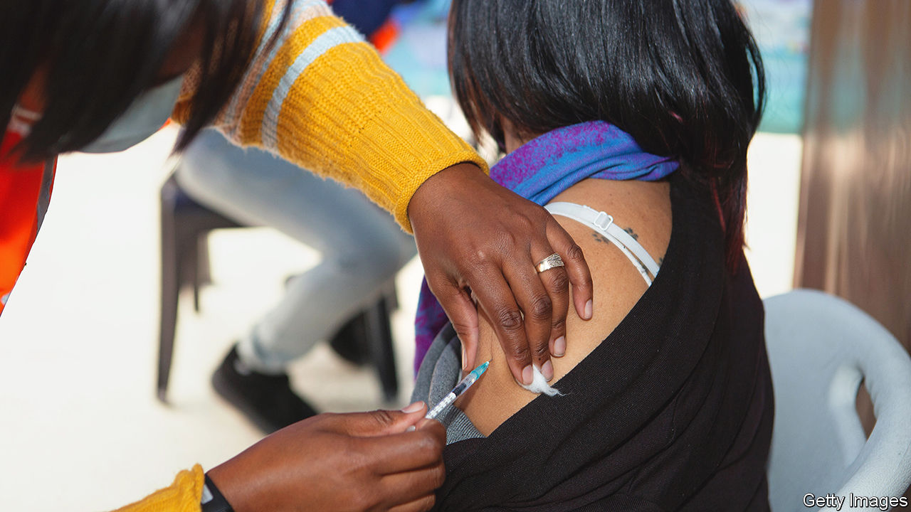

###### Covid vaccines and menstruation

# A study allays fears that covid vaccines harm menstrual cycles 

##### Those swayed by contrary anti-vaxxer propaganda should take note 

 

> Oct 5th 2022 

The easiest way to promote a conspiracy theory is to take a grain of truth and blow it out of sensible proportion. This is exactly how one of the most pervasive sources of covid-19 vaccine hesitancy—misinformation about its impact on women’s fertility—spread. 

When women of reproductive age started to be vaccinated in large numbers in the (northern) summer of 2021, some noticed that their periods following vaccination were later than normal. By September of that year, there were more than 30,000 reports to Britain’s medicines regulator alone of late periods following covid vaccines (with the true figure presumably higher, because of underreporting). Anti-vaxxers then used this phenomenon to scare women with speculations about long-term damage to their fertility.

Research just published in the  by Alison Edelman of Oregon Health &amp; Science University in Portland and her colleagues has confirmed both that the effect is real and that there is probably nothing to worry about. Taking data from users of Natural Cycles, a menstrual-cycle tracking app, she and her team found covid vaccination was associated with a small but temporary increase in cycle length. 

Among those who received one dose of vaccine in a menstrual cycle, periods were on average nearly one day late. Those who received two doses in a single cycle saw an average of four days’ delay. For both groups, cycle-lengths returned to normal in the cycle following their second dose, designated as the “post-vaccine cycle”.

Dr Edelman’s study analysed data provided by 19,622 app-users from around the world, though most lived in Europe or North America. A quarter of them, who acted as controls, were unvaccinated. The vaccinated participants had received a variety of types of vaccine (mRNA, adenovirus vector or inactivated virus). Vaccine type made no difference to the result.

For a participant to be included, her app had to have collected three cycles of data before her vaccination as well as the cycles after the first and second doses of vaccine, and the subsequent post-vaccination cycle. For unvaccinated participants the requirement was four consecutive cycles. 

On average, delays to vaccinated individuals’ periods were within the normal range—up to eight days. So for most, vaccines did not have a medically concerning impact. However, the researchers found that 6.2% of vaccinated participants’ periods immediately after receiving a dose of a vaccine were more than eight days late. Those experiencing these abnormally late periods in the post-vaccine cycle tended already to have longer cycles. There was no evidence that this effect continued after the post-vaccine cycle, but the trial was not set up specifically to look for that, so Dr Edelman says, “the group would like to explore that outcome in future research.”

The world’s covid-19 vaccination programmes do indeed provide a golden opportunity to analyse how vaccines are researched. At no previous time had governments across the planet attempted to vaccinate all adults (including all women of reproductive age) at once. 

At the moment, to limit the risk of miscarriage and harm to fetuses during a vaccine trial, it is standard practice for women of reproductive age participating in such trials to be using birth control. That is a sensible precaution, as was the decision to not include pregnant women in specific formal clinical trials. (Instead America’s Centres for Disease Control and Prevention conducted real-world trials, into which individual pregnant women could opt, alongside the main vaccine roll-out.) But this abundance of caution relating to pregnancy and reducing the risk of harm to fetuses means that, as in this case, possible side-effects for women of reproductive age on their menstrual cycles were missed. 

Vaccine manufacturers, health regulators and scientists were therefore caught out when reports of late periods began to emerge as vaccination roll-outs, which started among the elderly, who were at most risk of dying if they became infected, reached down the demographic pyramid to women who had not yet reached menopause. Medical advice struggled to keep up with the pace of misinformation because reports of late periods as a side-effect could not have been found in clinical trials.

Without proof that this was a temporary phenomenon, false speculation and fake news found fertile ground in an often sensitive and emotive issue. Dr Edelman’s results should go some way towards countering that. ■


