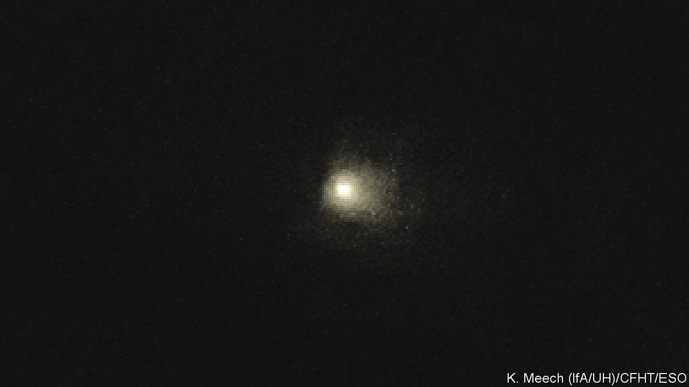
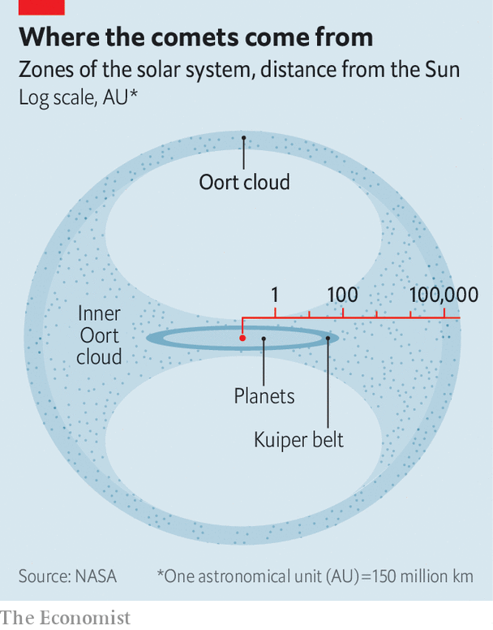

###### Manx comets

# Tailless comets could threaten Earth 

##### But they also offer an explanation of the solar system’s earliest days 

 

> Oct 5th 2022 

NASA’s DART mission was an impressive success. On September 26th, using a probe weighing 600kg, it hit Dimorphos, an asteroid 160 metres across that was, at the time, 11m kilometres away from Earth. The purpose was to determine whether asteroids which might otherwise strike Earth could have their paths altered by what is, in effect, a game of cosmic billiards. Though the results are not yet in, it seems likely that they could.

But that depends on seeing them early enough. Asteroids have predictable orbits, so cataloguing them is feasible, and is currently being done. This does not generally apply to comets. Though some (like Halley’s) have known orbits, most sweep in from the farthest reaches of the solar system, with little notice of their arrival. And that lack of notice applies, , to a newly discovered class of them that do not flag up their appearance in the conventional way, by developing a tail.

The first Manx comet, so called after the tailless cats of the Isle of Man, was spotted in 2014 by a telescope in Hawaii (see photograph). Since then, several dozen more have been detected. And, as a meeting of the American Astronomical Society in London, Ontario, heard on October 5th, they are objects of great interest. The chance—albeit remote—that such a comet might hit Earth is one reason. Another is that they are a surprising source of evidence for what happened in the solar system’s earliest days.

 


Manx comets, like their tail-wagging brethren, come from the Oort cloud. This is a spherical shell of debris left over from the solar system’s formation that is way farther from the Sun than the farthest planet, Neptune, and farther even than the Kuiper belt, a disc-like repository of asteroids and minor planets, the most famous inhabitant of which is Pluto (see diagram). 

The Oort cloud is thought to contain trillions of icy chunks, some of which, because of a collision or the pull of a passing star, from time to time fall inward. As these inbound bolides approach the Sun, their ice sublimes, gas and dust escape, and a comet spreads its tail. A Manx comet, by contrast, is presumably a solid (and thus ice-free) lump of rock.

A tailed comet on a collision course with Earth might possibly be detected early enough for a successor to DART, stationed in outer space, to rush in and push it out of harm’s way. For a Manx comet, the warning time would be hopelessly short. Yudish Ramanjooloo of the University of Hawaii told the conference that his models suggest the median time between discovery and impact would be 30 days, and establishing its orbit sufficiently to be sure of the risk would shrink that to 18 days.

Another of the reasons for this lack of notice is that, having fallen so far through the Sun’s gravitational field to get there, Oort-cloud objects are, by the time they reach the inner solar system, travelling fast. If one hit Earth it would have an impact velocity of 50-70km per second, about three times that of a nearby asteroid. And smaller rocks with such velocities (and therefore presumably of Oort-cloud origin) do enter the atmosphere from time to time.

One such was observed, as Denis Vida of the University of Western Ontario told the meeting, by a programme called the Meteorite Observation and Recovery Project, which watches for meteors over Alberta, in western Canada. 

The object in question weighed about 2kg—too small to reach Earth’s surface. Instead, it burned up in the atmosphere as a fireball. But its velocity meant it came closer to the ground than most fireballs of that size, ending its run at a height of just over 46km, whereas 70-80km is normal. However, penetration that far into the atmosphere also meant it must have been a lump of solid rock, rather than the fragile icy conglomerate that standard comets are made of. A kitten, then, of a Manx comet.

Intrigued, Dr Vida searched the astronomical literature for similar fireballs. He found two others: one seen in the 1980s by the Albertan instrument’s predecessor; the second noticed over the Czech Republic in the 1990s. He then compared the two examples detected over Alberta with the number of high-speed fireballs seen by the same instruments that disintegrated in the upper atmosphere, and were thus, presumably, made of cometary material rather than solid rock. This gave him a rough estimate (about 6%) of the amount of rocky, as opposed to cometary, material in the steady rain that is falling from the Oort cloud—and thus of the ratio of rocks to conglomerates in that cloud.

This figure, which matches what other researchers have concluded is the proportion of comets which are of the Manx variety, matters to those interested in the formation of the solar system. They need to explain how such substantial quantities of solid rock—a substance thought likely to have formed only near the Sun, since it requires the stuff of the primordial solar nebula to have been concentrated into large objects, then melted and differentiated—ended up so far away from its birthplace.

As it happens, this mystery is the inverse of another, which is that there is less rocky material than expected between the orbits of Earth and Jupiter, the part of the solar system occupied by Mars and the asteroid belt. One explanation put forward for this is the “Grand Tack” hypothesis, that a juvenile Jupiter moved temporarily closer to the Sun, thus disturbing the asteroid belt and sending much of its contents into the Sun, into outer space or into the Oort cloud. Manx comets and their kittens suggest this is exactly what occurred. Just hope that one of those returning exiles does not pay Earth a visit on its way. ■


