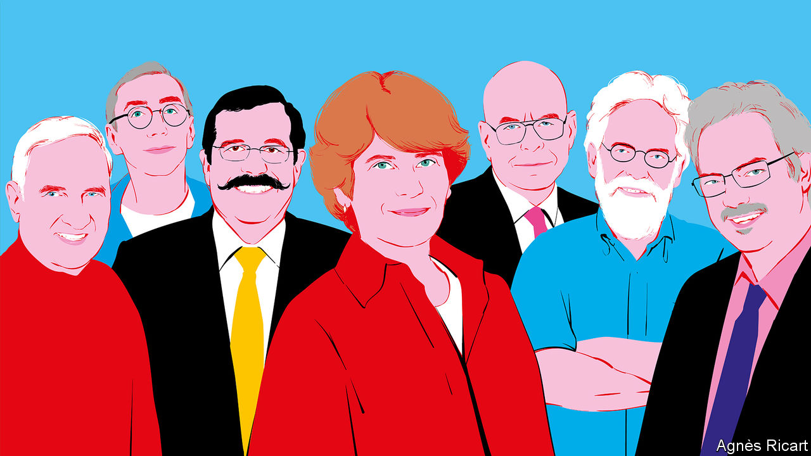
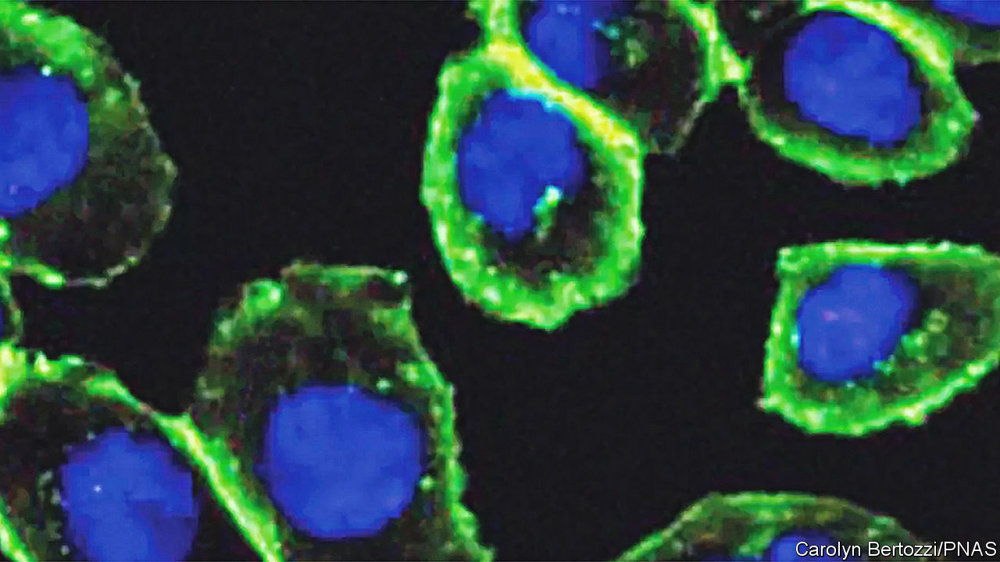

###### The 2022 Nobel science prizes

# This year’s Nobel science laureates have now been announced 

##### They worked on fossil human DNA, quantum entanglement and “click” chemistry 

 

> Oct 5th 2022 

The first Nobel prize to be announced each year is often referred to as the “Nobel prize for medicine”. But that is not its real name. It is actually the prize for physiology or medicine. And this year’s award was firmly on the physiological side of the divide. The winner—and there was only one, rather than the usual two or three—was Svante Paabo, a man who has the rare distinction of having invented an entire scientific discipline, palaeogenomics, more or less by himself. 

Palaeogenomics is the study of the genomes of ancient, often extinct, . In particular, Dr Paabo concentrated on ancient members of the genus . His early work, starting in 1985, was on Egyptian mummies. Mummification in Egypt began about 4,600 years ago—the blink of an eye in palaeontological terms—and the desert climate of that country is particularly conducive to the preservation of DNA. So this was a good place to begin. But gradually, as genetic-sequencing techniques improved, he was able to push his work backward in time.

His first big breakthrough came in 1997, when he sequenced mitochondrial DNA from Neanderthals, a human species that lived in Europe and western Asia, and became extinct about 30,000 years ago. A cell’s mitochondria are its power packs, extracting energy from glucose and transferring it to a molecule called ATP, which then drives metabolic reactions. Because they derive from bacteria that became symbiotic about 2bn years ago with cells ancestral to animals, plants and so on, mitochondria have their own DNA, separate from that in a cell’s nucleus. And because there are lots of them in a cell, whereas there is only one nucleus, their DNA is much more abundant, and therefore more likely to survive in detectable quantities.

Dr Paabo’s analysis showed that Neanderthal mitochondrial DNA is indeed different from that of . This provided, through estimates based on how quickly such DNA evolves, an estimate (800,000 years ago) of when the two species diverged. The real prize, however, came in 2009, when he and his colleagues at the Max Planck Institute for Evolutionary Anthropology, in Leipzig, Germany, which he helped to found, announced a —for technological improvements meant that the definition of “detectable quantities” had by then changed. That, together with successor sequences, has permitted the compilation of a catalogue of genes found in  but not . And within that catalogue, presumably, lies the explanation, not yet elucidated, of what makes  such an extraordinary species.

The biggest surprise of Dr Paabo’s career, though, was probably the identification, purely from its DNA, of an entire, new species, . The original genome of this species was extracted from a finger bone  in the Altai mountains of Russia. Denisovans were related more closely to Neanderthals than to , and subsequent analysis has shown that the two sometimes interbred. More relevant from a present-day perspective is that both also interbred with  when that African species began turning up in their European and Asiatic homelands 70,000 years or so ago. The traces are still there, with modern Europeans having 1-2% of Neanderthal DNA and some people in Asia and Australasia as much as 6% of Denisovan DNA.

Dr Paabo’s career is, then, a tour de force of scientific detection. And there is one other thing. Though he spent much of his career in Germany, he is Swedish. Alfred Nobel’s will specified, “It is my express wish that when awarding the prizes, no consideration be given to nationality, but that the prize be awarded to the worthiest person, whether or not they are Scandinavian.” It was, nevertheless, hard not to notice a slight swelling of patriotic pride when Thomas Perlmann, secretary of the Karolinska Institute’s Nobel Assembly, read out the announcement. 

A tangled puzzle

The physics prize went to a trio of scientists whose insights into the fundamentals of quantum mechanics have set the stage for a new era of technology. Quantum computers, quantum networks and secure quantum cryptography are all rooted in experiments carried out, over several decades, by Alain Aspect, John Clauser and Anton Zeilinger.

Their work revolves around a phenomenon called quantum entanglement, in which pairs of particles become correlated with each other so that they behave as if they were single units. This leads to counterintuitive effects—changing the properties of one particle in such an entangled pair will, for example, immediately change the other, no matter how far apart the particles are. They could be right next to each other, or at opposite ends of the galaxy. 

Albert Einstein—who was no fan of the probabilistic nature of quantum mechanics—described entanglement as “spooky action at a distance”. He and others were concerned that it seemed to break the rules of special relativity, which stipulate that nothing can travel faster than the speed of light. If entangled particles were separated by a great distance, he argued, how could information apparently travel between them instantaneously?

In 1935 Einstein and two colleagues, Boris Podolsky and Nathan Rosen, proposed a thought experiment (subsequently known as the “EPR paradox”) to probe whether the weird behaviour seen in entanglement implied that quantum mechanics was not a complete description of reality. Perhaps particles also carried with them hidden information, not described by quantum mechanics, about how they might act during experiments or when they were measured. In 1964 John Stewart Bell, a physicist at CERN, in Geneva, developed the EPR paradox further and came up with testable predictions to determine whether or not the hidden variables really existed.

Almost a decade later, John Clauser built the first experiment to test Bell’s idea. His results agreed with the predictions of quantum mechanics and showed that Einstein’s hidden variables probably do not exist. The experiments left a few loopholes, however, which were closed in the early 1980s by Alain Aspect, then a graduate student at Paris-Sud University in Orsay, France. By fine-tuning and improving on Dr Clauser’s experiments, Dr Aspect put the final nail in the coffin of Einstein’s hidden variables.

The third physics laureate, Anton Zeilinger of the University of Vienna, has spent decades looking for ways to put quantum entanglement to use. In 1997 he showed that it was possible to transfer information between particles, a process called “quantum teleportation”. He also demonstrated that two pairs of entangled particles can interact in interesting ways. In particular, bringing together one member of each entangled pair causes the two remaining particles (which have never been in contact) themselves to become entangled.

Manipulating the quantum states of systems of entangled particles has become the basis of technologies such as quantum computing and quantum encryption. Building on the work of this year’s physics laureates, signals composed of entangled photons (particles of light) have been sent through optical fibres several kilometres long and even been transmitted between the ground and a satellite orbiting hundreds of kilometres above Earth.

“Quantum information science is a vibrant and rapidly developing field,” said Eva Olsson, a member of the physics-prize awarding committee of Sweden’s Royal Academy of Science. “It has broad and potential implications in areas such as secure information transfer, quantum computing and sensing technology, predictions have opened doors to another world.”

Speaking after the announcement was made, Dr Zeilinger said that he had been surprised to receive the academy’s call an hour earlier. “I’m still kind of shocked,” he said, “but it’s a very positive shock.” 

The third of the science prizes, that for chemistry, went to the inventors of a technique called “click” chemistry. All chemistry is about putting molecules together and pulling them apart. The details inevitably vary from reaction to reaction. But there are many areas of the subject where it would be useful to have a way of snapping the building blocks of large molecules together regardless of the chemical properties of those smaller units, and that is what click chemistry does. 

Two of the three winners, Morton Meldal of the University of Copenhagen and Barry Sharpless of Scripps Research, in La Jolla, California (already a laureate for work on catalysts), invented the underlying trick. The third, Carolyn Bertozzi of Stanford University, adapted it for use in biological systems. In both cases, though, it uses a pair of chemical groups—azides (in which three nitrogen atoms are linked together in a row) and alkynes (in which two carbon atoms are connected by a triple bond)—that will, in the right circumstances, react to form a structure called a triazole (a five-membered ring of two carbons and three nitrogens), while remaining attached to their original molecules as well. In essence, the azide and the alkyne are like the two halves of a snap-together buckle.

Click and collect

Before Dr Meldal and Dr Sharpless applied themselves independently to the matter in 2001 and 2002, the reaction between azides and alkynes was known to work, but only slowly and with a tendency to yield a mixture of products. They sought to change that and, after a bit of experimentation, discovered that copper ions greatly improve both speed and purity. Thus was click chemistry born. And for purely chemical processes, their approach worked well. The result has improved drug development, DNA sequencing and the creation of better materials, to name but three fields.

 


When chemistry shades into biology, though, there is a problem. Copper ions are frequently poisonous to biological systems. So Dr Bertozzi decided to work on a way to make azides and alkynes react without their involvement. Her solution, which she published in 2004, was to include the alkyne half of the buckle in a molecule that would put it under strain and thus make it more reactive. She did this by inserting the triple-bonded carbon atoms into an eight-member ring. Rings of carbon atoms are most stable when they have six members. An eight-member ring distorts the bonds involved, hence the strain. 

To solve the particular problem she was interested in, which was to study carbohydrate polymers called glycans that are often found on the surfaces of cells, she attached azide groups to sugar molecules of the type that form the sub-units of glycans and fed the result to her cells. As she hoped, these modified sugars were incorporated into glycans. She was then able to attach fluorescent marker molecules to those glycans once they were exposed to the outside world, by fitting the markers with strained-alkyne rings.

Such molecule-specific fluorescent tagging (see photograph) is still an important use of bioorthogonal chemistry, as Dr Bertozzi dubbed her invention, to distinguish it from the copper-based version. It can now be employed not just to tag molecules, but to follow them around and see how they interact within a cell. Among other things, that yields a better understanding of the processes behind individual diseases, and it can also be used to assist the development of drugs. Click chemistry and its bioorthogonal offshoot are therefore among the most important chemical inventions of the 21st century, and their inventors are surely worthy winners of the prize. ■


