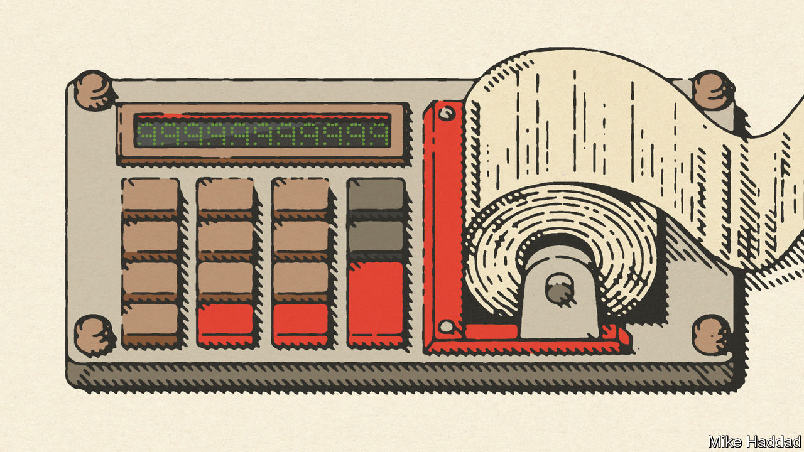
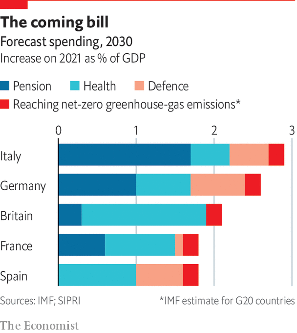

###### The total cost

# Adding up the fiscal drag from ageing, energy and defence 

##### The bill for the future looms ever larger 

 

> Oct 5th 2022 

In 2006 nato members set a target for defence spending of 2% of gdp. In 2014, after Russia annexed Crimea, they pledged to meet this target by 2024. But by 2021 most countries still fell short: averaging across western Europe, defence spending was only 1.6% of gdp. Some big countries—Germany, Italy, the Netherlands and Spain—were the worst offenders, spending just 1.3-1.5%.

After Russia’s invasion of Ukraine in February, European governments once again promised to reach the target. The Netherlands now says it will hit 2% in 2025; Italy will do so by 2028. Germany says its spending will exceed the 2% target at an unspecified date. In Britain, which spent 2.2% of gdp on defence in 2021, the new prime minister Liz Truss wants to spend 3% of gdp by 2030.

Such pledges create more long-term pressure on government budgets, on top of ageing and net zero.  has added them all up. The big uncertainty surrounds the energy transition, for which we apply the midpoint of estimates surveyed by imf staff: an average of 0.2% of gdp a year. This includes only the investment costs of decarbonisation, so assuming that revenues from taxing fossil fuels will be replaced as pollution falls. For forecast changes to health and pension spending, we use imf forecasts, which include a projection of growth in health-care costs based on historical trends.

 


The total extra annual fiscal squeeze from these three sources by 2030 is in the region of 2-3% of gdp. That is a manageable figure, but a painful one. In all the countries in our analysis the tax burden, as a percentage of gdp, is already at or close to its historical maximum. Funding this extra annual spending purely from higher revenues would take taxes to unprecedented levels.

The alternative of debt financing may work for a while, especially in Germany, which has the lowest debt-to-gdp ratios among big European economies. However, this is not a sustainable solution, because the fiscal pressure will last for decades. Eventually room to borrow more will be used up, even when interest rates are low. Moreover, the pressure on budgets will continue after 2030 as Europe goes on ageing.

In Italy there is not even room for manoeuvre in the near term. It already has huge net debts of nearly 140% of gdp. At an average financing cost of around 4.5% (roughly its current ten-year bond yield), inflation around 2% (the ecb’s target) and economic growth around 1% (an optimistic forecast once post-pandemic catch-up is exhausted) it needs a budget surplus before interest of nearly 2% of gdp just to stop its debt growing faster than its economy. A financing cost of 5% would push the required surplus to over 2.5% of gdp.

Italy has achieved surpluses of this size before, and it is getting a boost from the European Union’s recovery fund. But an additional fiscal drag of 2.9% of gdp, by our calculations, will make surpluses much harder to deliver. And on current projections Italy’s median age will not peak until the 2060s. ■

