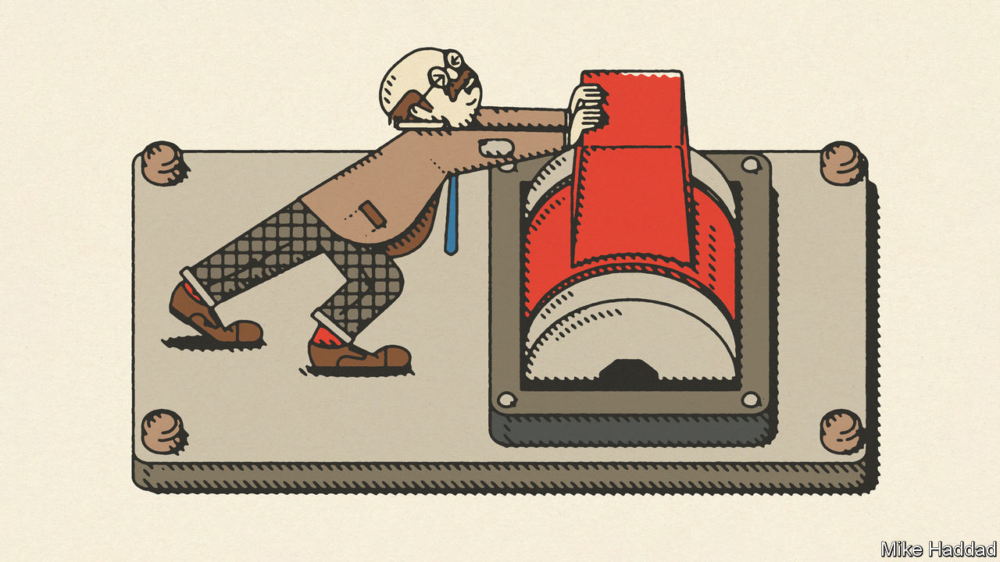
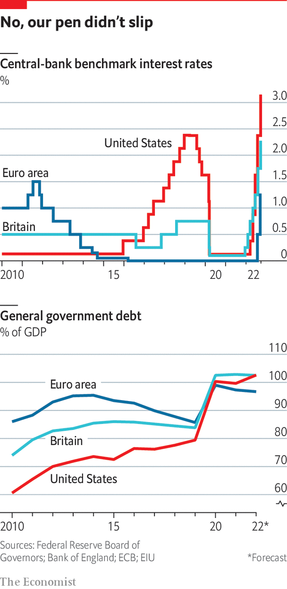

###### The world economy

# Inflation and rising demands on governments are changing economic policy 

##### It amounts to an upending of the previous regime, says Henry Curr 

 

> Oct 5th 2022 

In 2013 juliO rotemberG, an economist, proposed a theory of what drove once-in-a-generation shifts at the Federal Reserve: penitence. Something deplorable would happen in the economy, like the Depression in the 1930s or the great inflation of the 1970s. The central bank would be blamed. Then it would absorb the criticisms and change course. Monetary policymakers were, in effect, engaged in a decades-long process of trial and error. 

A moment of penitence has struck again today—and not just in America. Global inflation has surged to 9.8%, catching policymakers, economists and investors by surprise. Central banks, having spent most of 2021 insisting that inflation was a post-pandemic aberration that would dissipate in a few months, have abruptly changed tack. Fully 33 of 38 central banks monitored by the Bank for International Settlements, the central bankers’ central bank, have raised interest rates in 2022. The Fed has tightened monetary policy more sharply than at any time since the 1980s. Andrew Bailey, governor of the Bank of England, has spoken of “the largest challenge to the monetary-policy regime of inflation targeting” in its history. Like medieval medics preparing for bloodletting, many central bankers talk sternly about the pain that will be necessary to get inflation down.

 


It is not just central bankers. Governments are repenting too. But even as monetary policy is on course to switch from stimulus to restraint, governments have moved in the opposite direction. During 2020 and 2021 they spent 10% of gdp supporting their economies and provided another 6%-worth of loans. Whereas after the global financial crisis of 2007-09 many quickly turned to trying to balance budgets in the belief that their debts risked becoming unsustainable, today they are continuing to borrow and spend, on everything from tax cuts to subsidising energy bills.

This special report will argue that a great policy reversal is under way in the rich world. The tight-fiscal, loose-monetary policy mix that defined much of the 2010s is being upended into a loose-fiscal, tight-monetary policy one. The likely result is a tug-of-war between hawkish central banks and spendthrift governments that will make inflation harder to fight. It will lead to a reckoning about just how much short-term pain societies are willing to bear in the name of long-term economic stability. But it could, ultimately, help economic policy into a beneficial reboot.

Back to the future

The last time the world fought an inflation breakout, in the 1980s, monetary and fiscal policy worked in tandem to wring excessive spending out of the system. Between 1978 and 1984 Britain, Germany and Japan all dramatically cut their budget deficits; France and Canada did so at a gentler pace. The big exception was America, where Ronald Reagan’s unfunded tax cuts hit the economic accelerator even as Paul Volcker’s Fed was slamming on the brakes. But although Volcker usually gets the credit for taming inflation, it was not fully vanquished until monetary and fiscal policy worked in tandem there as well. America’s taxes rose, and budget deficits fell, in the second half of the 1980s, stopping inflation from rebounding as it had done after the recessions of the 1970s. A number of economists argue that the change in fiscal policy was crucial to bringing inflation under control.

Yet similar fiscal retrenchment looks highly unlikely today. In Britain Liz Truss, the new prime minister, has cast aside the fiscal austerity that her Conservative predecessors espoused in the 2010s. Her government is borrowing more to fund tax cuts, lambasting Britain’s economic “orthodoxy” of the past two decades. The European Union is doling out its €807bn ($782bn) “Next Generation” fund designed to underpin solidarity in the bloc, a level of fiscal integration and largesse that was unimaginable before the pandemic. The Japanese and South Korean governments are rhetorically committed to reducing borrowing but their actions speak louder than their words: Japan has stepped back from a target to balance its budget by 2025, and South Korea says it plans soon to cut corporate and income taxes.

America has passed the Inflation Reduction Act, a climate-change law that will also reduce government borrowing. But the disinflationary effect is marginal, and President Joe Biden’s proposed cancellation of student debt will cost roughly twice as much as the act will save. On budget projections from May, before that policy was announced, America’s budget deficit was already projected to average nearly 5% of gdp over the rest of the decade, enough to push the public-debt to gdp ratio to 105%.

Governments are spending freely to help households with soaring energy bills, especially in Europe, which is adapting to life with much less Russian gas. Protecting low-earners in 2022 would cost less than 1% of gdp, according to the imf. But governments are going much further. Germany has nationalised Uniper, its biggest gas importer, and is spending €200 billion (5.2% of gdp) on an “economic defence shield” including subsidies that will reduce gas prices. France is capping energy prices and has nationalised edf, an energy giant. Though windfall taxes on energy firms will pay for some of Europe’s spending, deficits will rise, too. Britain could borrow as much as 6.5% of gdp to cap energy prices. Germany is circumventing its usual limits on debt accumulation. 

A long list

The pressure on governments to spend will not abate much. Ageing populations push up outlays on health care and pensions. Governments want to decarbonise their economies, which will take significant public front-loaded investment. After Russia’s war on Ukraine, nato members are reiterating previously unmet promises to meet their target of spending 2% of gdp on defence. In isolation, many of these pressures may be manageable. In combination, they will place budgets under huge pressure.

In theory, big-spending governments plus rising interest rates are a recipe for persistently high inflation and/or a bond-market rout.  Investors have given Britain a stark reminder of this danger, reacting to Ms Truss’s largesse by selling British assets, especially government bonds. Yet for countries with more stable economic polices, long-term borrowing remains cheap by historical standards, especially once the possibility of higher inflation is taken into account. One consequence of ageing populations is a global glut of savings chasing scarce investment opportunities. There remains plenty of appetite for government debt. 

It would be foolish to forgo necessary spending on preventing climate change or securing peace in Europe when the world is awash with capital. Yet both short-term and long-term challenges lie ahead. The immediate difficulty is that big spending by governments will make it harder (and perhaps impossible) for central banks to hit their 2% inflation targets. Governments are unlikely to stand idly by as central bankers inflict pain on their economies in the name of getting inflation down. They could instead unleash fiscal stimulus before the disinflationary task is complete. The danger is even greater when economies are already buffeted by supply-side shocks, notably the energy crisis. Without fixing the underlying shortages, it is not within the gift of governments to stop the economic pain they cause—they can only redistribute to protect the poor. If politicians try to protect everyone’s living standards, they will cause prices to rise further.

The long-term challenge is to avoid fiscal crises. Ageing societies are a challenge spanning the whole of the 21st century. If governments do not control their spending on the old, eventually they will run up against fiscal limits, whatever their cost of borrowing. It would be a mistake to accumulate debts simply in order to put off hard choices, using up fiscal space that may be needed in future crises—not just climate change, but also unforeseen disasters such as pandemics. Yet reining in pension and health-care spending is easier said than done. ■

