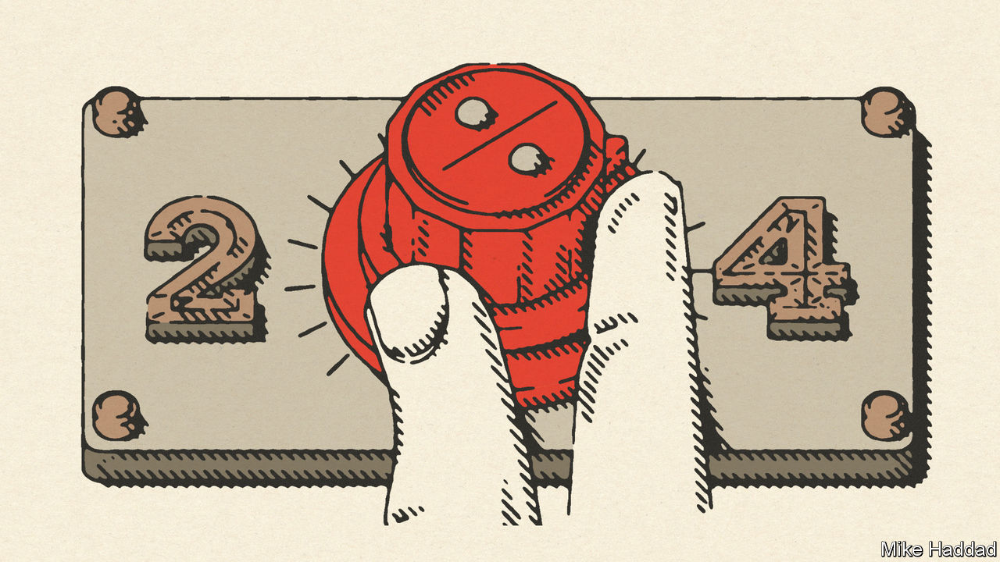

###### The end of 2%

# Policymakers are likely to jettison their 2% inflation targets 

##### Some by choice, some by accident 

 

> Oct 5th 2022 

THE LAST time rich economies conquered inflation it ushered in a decades-long era known as the “great moderation”. From the mid-1980s to 2007 growth was steady, inflation was low and economists celebrated their own “end of history”: the triumph of inflation-targeting technocracy over the naivety of 1970s policymaking. The economy was steered by a simple division of labour. Central banks would use monetary policy to keep inflation on target—typically at 2%—while governments would keep debts under control and focus on supply-side reforms.

This stability was shattered by the financial crisis. The 15 years since have exposed flaws in the macroeconomic regime. When interest rates fell to zero, central banks could not easily cut them further, making recovery from the crash slow and painful. When the pandemic struck, policymakers feared a repeat and so reached for alternatives: an enormous expansion of government spending and quantitative easing (QE), the buying of public debt with newly created money, whose full effects were poorly understood. The experiment went wrong, particularly in America. Inflation returned with a vengeance, and has since been worsened by an energy crisis—the response to which in Europe has been another round of government spending on a vast scale.

Today, as the balance of economic power tilts from technocrats towards politicians, it is unclear whether inflation can be brought back to the 2% target. Central bankers are keen to follow the path of the 1980s, imposing growth slowdowns—and, if necessary, recessions—to reach their goal. But the enormous support for households and businesses during the pandemic and the energy crisis has fed expectations that downturns will be met by government handouts, not welcomed as a cure for inflation. Although voters may be angry about the rising cost of living, they will lament higher unemployment once it hits. And if the energy crisis abates inflation will fall from today’s sky-high rates to a level that will still be above 2%, but may seem more politically tolerable, in part because rising prices will be matched by rising wages.


The good news is that out of crisis springs opportunity: to fix a fundamental problem with the system. Interest rates have fallen close to their zero lower bound in part because societies have aged, creating a global glut of saving and a dearth of investment opportunities. These conditions determine the real (ie, inflation-adjusted) rate of interest in the long term, and are not going away. Yet for any given real rate, higher inflation raises the nominal rate that can be set by central banks. As a result, long before the pandemic, many economists were arguing in favour of a modest increase in the inflation target, to 3% or 4%, to get rates away from zero and build up monetary-policy firepower.

Before 2021 the idea seemed distant and academic. Inflation was too low; it would be naive to aim higher. Today, a change of target would be simple to make. Policymakers should reduce inflation to 4%, say, and then stop. Though monetary policy would be more doveish in the short term, rates would eventually settle higher than they would have been under a 2% target. Central banks would get their mojo back.

Is such a switch viable? In the short term there would be costs and benefits. There would be no need for a deep and unpopular disinflationary purge, reducing the danger of conflict between central banks and politicians. Governments would not need to worry that spending on security or on long-term climate investment might interfere with central banks’ desire to squeeze economies. There would even be a budgetary windfall. Moving from a target of 2% to 4% would inflate away some long-term public debt that, on average across five big economies, would be roughly equivalent to the rise in public debt during the pandemic.

The big downside would be a knock to the credibility of policymakers’ promises. Having been burned once, buyers of long-term government bonds might fear the inflation target could be raised again, adding a risk-premium to bond yields and creating long-term uncertainty. Inflation of 3-4% would be that little bit more noticeable than 2%, imposing a psychological burden on the public and creating some friction throughout the economy. There would be arbitrary redistribution from creditors to debtors.

Yet this trade-off is minor set against the benefits of escaping the zero lower bound and returning to a system in which interest rates play the main role in fighting recessions. Milder downturns are an enormous economic prize. If monetary policy had had more firepower over the past 15 years, the slump of the 2010s would have been shallower. The mistakes that led to the post-pandemic overheat would have been less likely. Governments would have been less indebted. There could have been less QE.

One problem would remain. Just as in the old system, the power of central banks to control inflation would require governments to keep debts stable as a share of the economy in the long term—a commitment that is now under threat. The crises of recent years will be followed by more spending on pensions and health care as societies age, as well as a mass decarbonisation project that will cost more the longer it is delayed. Politicians of all stripes fear the prospect of cutting spending on elderly voters more than they fear deficits.

It would therefore be wise to pair any change to the inflation target with long-term reforms to control pension and health-care spending, to put public finances on a more stable footing. The one-time fiscal windfall from the new regime would provide some breathing space. But adjusting the inflation target must not become the go-to escape valve whenever budgets are tight.

There are broader options for deeper reform. A higher inflation target could be embedded into an overall goal for the level of nominal GDP, the total amount of cash growth in the economy, a gauge that is better suited for a world of supply-side shocks like the energy crisis. What has become clear is that inflation held to 2% is ill-suited to 21st-century macroeconomic conditions. And if the target is not changed, there is a great risk that it will simply be missed. Better to construct a new macroeconomic regime carefully than just to wait for the old one to collapse. ■

