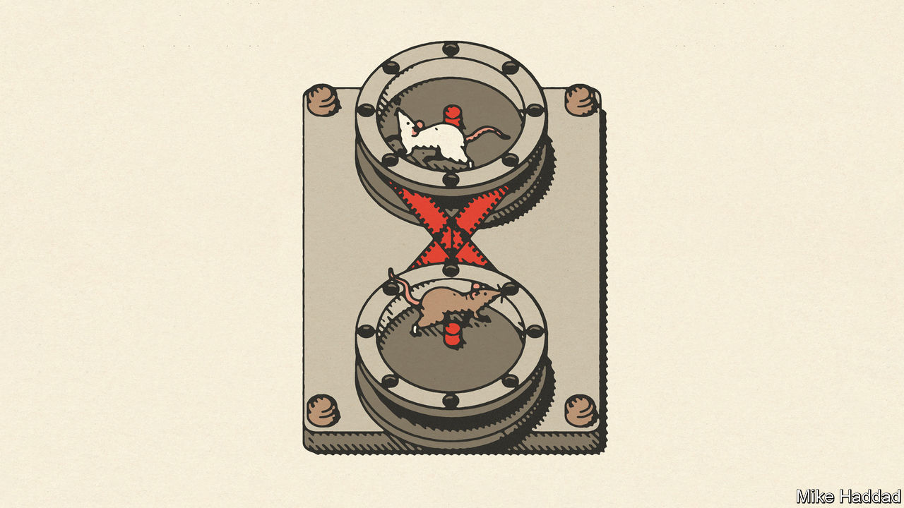
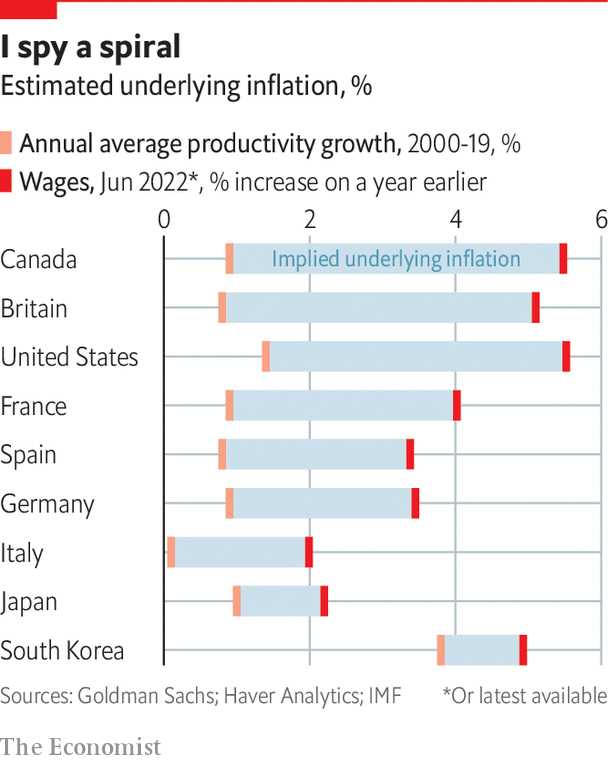

###### The long road back

# The inflation problem will get better before it gets worse 

##### When current disruptions recede, the underlying rate of inflation will remain higher than before the pandemic 

 

> Oct 5th 2022 

In 1978 milton friedman looked back at three recessions that had struck America’s economy over the preceding decade. “Each scenario has been the same,” he wrote. Loose money created a boom and then inflation. An outcry against rising prices led to higher interest rates and a recession, only for rising unemployment to catch more public attention. So economic policy turned stimulatory. Just as inflation began to fall, another boom kicked off. The inflationary cycle began again.

The world economy is now in the early stages of Friedman’s loop. Inflation has played havoc with central banks’ credibility and crushed consumer confidence. In Europe high gas prices will cause economic turmoil this winter; consumers are more miserable even than during the financial crisis. In Asia, which seemed immune to the inflation bug, dearer oil and falling currencies have forced central banks to raise interest rates. Policymakers are now focused on a single enemy: rising prices. The issue is whether they will hold their nerve as monetary hawkishness takes its toll. 

It might seem hard to believe, as Europeans don thicker jumpers and turn down thermostats, but inflation-busters are benefiting from some easy wins. The oil price is about 25% down from its peak in June, and food prices are more than 10% down. Disruptions to supply chains from the pandemic are easing: the Baltic Dry index, which measures the cost of shipping goods, has recently been lower than at any point since mid-2020. Headline inflation seems to have peaked in America. Even European energy prices have fallen. In any case they cannot keep rising at an extreme pace. If they merely plateau, that will bring inflation down, because it measures changes in prices, not their overall level. 

 


But when the tide recedes, the beach reappears. As the energy crisis and supply-chain disruptions fade, the underlying rate of inflation will be higher than before the pandemic, for several reasons. Economic stimulus during the pandemic, totalling 10% of global gdp, has caused overheating. Eighteen months of high inflation have raised expectations for price rises, which can be self-fulfilling. And in many countries tight labour markets threaten to inject into wages a momentum of their own.

So long as energy chaos reigns, underlying inflation is hard to gauge. One method is to look at “core” prices excluding energy and food. Yet energy is an input for almost everything else, from restaurant meals on cold winter nights to the ammonia used in fertilisers. Energy prices thus infect even core prices as businesses pass through higher costs. To judge underlying inflation it is better to look at how fast wages are growing relative to workers’ productivity. 

Goldman Sachs, a bank, produces composite measures of annual wage growth in 12 countries and the euro zone.  has compared those figures—and other data for South Korea—with average annual productivity growth since 2000. The gap between the two is largest in the Anglosphere: in America, Britain, Canada and New Zealand, it ranges from 3.8% to 4.6%. Next comes Europe: in the euro zone the average gap is 2.4% (though it is higher in some countries). Last come Asian economies. Trend inflation in both Japan and South Korea is little over 1% by this measure.

Such figures may seem reassuring when compared with today’s sky-high headline rates of inflation. Yet they may still be worrying when considered in light of the “sacrifice ratio”, the amount of pain that it takes to purge an economy of an inflation problem. It is a subject economists have largely ignored for the past three decades because inflation has been low. 

In a blog post in June Stephen Cecchetti and Kermit Schoenholtz surveyed ten American disinflationary episodes since the 1950s. A median fall in core inflation of two percentage points was achieved over a 30-month period only with a rise in unemployment of 3.6 percentage points, corresponding today to nearly 6m Americans losing their jobs. Jason Furman of Harvard University suggests that unemployment might need to rise by five percentage points for a year to bring inflation down a single percentage point. In a recent speech Isabel Schnabel, a member of the European Central Bank’s executive board, warned that a weaker relationship between unemployment and inflation—a phenomenon that had made central bankers complacent about the risks of overheating—could now make inflation harder to bring down. 

Counting the costs

Two particular uncertainties determine how painful it could be in America, as set out by Laurence Ball of Johns Hopkins University and Daniel Leigh and Prachi Mishra of the imf in a recent paper. One is how much inflation expectations drift upward as inflation continues to persist above the Fed’s 2% target. The other is whether the labour market can cool off not by shedding jobs but by shedding job vacancies, which have been extraordinarily high during the recovery from covid-19. 

In June the Fed projected that unemployment would rise only marginally from 3.7% today to 4.1% by 2024. Plugging this into their model, Mr Ball and his colleagues find that the rate of underlying inflation by December 2024 varies from 2.7% to 8.8%, depending on assumptions about expectations and vacancies. It takes a bigger rise in unemployment to narrow the range of inflation outcomes and centre it near the 2% target. The authors find that a scenario suggested by Lawrence Summers of Harvard University, in which unemployment rises to 7.5% and stays there for two years, leads to inflation of 1.6-3.2% by the end of 2024. 

Will policymakers tolerate such a sacrifice? The costs of disinflation can be high but not controlling inflation would mean “far greater pain”, Jerome Powell, chairman of the Federal Reserve, told fellow central bankers at this year’s jamboree in Jackson Hole, Wyoming. Andrew Bailey, governor of the Bank of England, promises to bring inflation to 2% “no ifs, no buts”. 

Even where underlying inflation has yet to take off, central bankers have acted. The Bank of Korea has raised interest rates from a low of 0.5% in mid-2020 to 2.5% in August. In an interview with , Rhee Chang-yong, the bank’s governor, said that there is no need to generate a recession “on purpose”—his objective is mainly to stop imported inflation from setting off a wage-price spiral. The recent global economic slowdown and falling energy prices had made inflation less likely to rise further. But if it did move up to American levels, the bank would think “very hard” about the trade-off.

Central bankers seem prepared for possible discomfort. But the inflationary risk no longer stems from monetary policy that is too loose but from politicians in charge of fiscal policy. As inflation rises even governments previously committed to budget discipline are spending freely to help households and firms cope with higher energy and food prices. In April the imf counted 94 countries that had taken such measures in 2022. Liz Truss, Britain’s prime minister, has both capped energy bills and slashed taxes. Mr Rhee may be committed to fighting inflation but the South Korean government, though promising to follow fiscal rules and reduce spending, plans to cut corporate and income taxes. 

It is not just that looser fiscal policy stimulates the economy, boosting inflation in the short term. Ultimately, the power of central banks depends on politicians pursuing sound fiscal policies that stabilise debt as a share of gdp. Higher interest rates are supposed to help produce modest fiscal austerity, because to maintain stable debts while paying more to borrow, governments must cut spending or raise taxes. In 1981 Thomas Sargent and Neil Wallace showed, in a paper titled “Some Unpleasant Monetarist Arithmetic”, that without this fiscal backup, monetary policy eventually loses traction. Higher interest rates become inflationary, not disinflationary, because they simply lead governments to borrow more to pay rising debt-service costs.


The risk of monetary unmooring is greater the more public debt rises, because interest rates become more important to budget deficits. Even before the pandemic, some economists were getting nervous about a potential conflict between monetary and fiscal policies. David Andolfatto, now of the University of Miami, and Andrew Spewak of the St Louis Fed warned in 2019 that, in part because of Donald Trump’s deficit-busting tax cuts, America could face “the perfect inflation storm” in which “it is not entirely clear what the Federal Reserve might do”. Those worries have since grown. In September Christine Lagarde, the ecb’s president, warned that “monetary and fiscal policy play a complementary role in fighting price pressures” and that they “must work hand in hand and not contradict each other”.

A growing number of economists agree. In a paper presented at Jackson Hole, Francesco Bianchi of Johns Hopkins University and Leonardo Melosi of the Federal Reserve Bank of Chicago revisit America’s disinflation under Paul Volcker in the 1980s and argue that it was “the result of changes in both monetary and fiscal policy”. Although Ronald Reagan cut taxes in August 1981, a series of deficit-reducing measures followed over the rest of the decade, and Reagan’s hawkish rhetoric contributed to a change in the fiscal regime. It was only once policymakers firmly established fiscal consolidation that inflation settled at low levels. Mr Bianchi and Mr Melosi argue that without greater backup from fiscal policy, central banks risk “fiscal stagflation”, in which higher interest rates kill short-term growth but, owing to the lack of budgetary backing, prove unable to bring inflation down.

How plausible is it that politicians will co-operate with central bankers? As the world again enters the phase of Friedman’s loop when the public worries about a slowing economy, they may prefer to dole out cash, not add to the pain. They may not even mind much if this stops inflation falling back to 2%, because some extra inflation could make budgeting easier. Higher prices erode the real value of long-term government bonds. There is a windfall from transitioning to a permanently higher inflation rate which investors did not price in at the time the bonds were sold. It is bigger the more long-term debt a country has issued.

has made a rough calculation of the pay-off to governments in large economies if they shifted from trend inflation of 2% to 4%. We take the weighted average maturity of a country’s bonds, excluding central-bank holdings that are part of the public sector. We then calculate how much the present value of a zero-coupon bond of that maturity would fall on account of higher inflation. In most cases, it is enough to reduce the value of public debt by around 10%. As a percentage of gdp the windfall ranges from 7% in America, whose debts are of a fairly short maturity, to 21% in Japan, whose debts are enormous. Britain rakes in 14% of gdp, thanks to an unusually high share of long-dated debt (though it also has a large number of inflation-linked bonds whose value would rise). The one-time gains are of a comparable magnitude to the fiscal costs of the pandemic—a pay-off that is high because public debts are so large. 

The power of inflation to erode debts is why economists are so particular about central bankers’ institutional independence. They worry about “fiscal dominance”, whereby governments put political pressure on their central banks in order to keep rates low. There was plenty of this going on as inflation took off in the 1960s: Lyndon Johnson tried to bully William McChesney Martin, the Fed chairman, by driving him around his Texas ranch at breakneck speed.

The trouble is that even fiercely independent central banks cannot force politicians to keep their budgets in order. Big deficits can, in effect, lead to fiscal dominance at arms’ length. It is this threat that hangs over the credibility of promises to bring inflation down—but which might yet produce a beneficent change in the world’s macroeconomic regime.■

