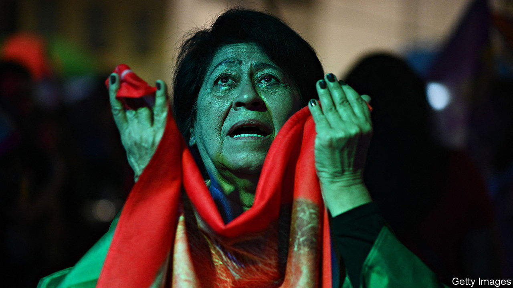

###### Bolsonarismo battles on

# Brazil’s presidential election will go to a run-off 

##### Jair Bolsonaro did better than expected. Lula is still the favourite, but narrowly 

 

> Oct 3rd 2022 

FOR LUIZ INÁCIO LULA DA SILVA, Brazil’s , it was a disappointing result. His supporters had dared to hope that Lula, as he is known, might win an outright majority in a presidential election on October 2nd. Instead the race was far tighter than . Lula attracted 48% of the vote, while , the hard-right populist incumbent, won 43%. The pair will face each other in a run-off on October 30th.

The polarised campaign turned largely on which candidate Brazilians disliked least. Many blame Mr Bolsonaro for mishandling the pandemic, for his crude attacks on opponents and for a generally lacklustre economic record during his term. Many others blame Lula and his Workers’ Party (PT) for a , from 2014 to 2016, and for a massive corruption scandal known as  (Car Wash). Lula spent 18 months in jail for receiving bribes, though his convictions were later overturned. At one point, 38% of Brazilians said they didn’t want either Mr Bolsonaro or Lula as president. But no other candidate mustered much support.

Mr Bolsonaro will go into the run-off feeling he has momentum. Many of his closest allies were elected to Congress. Contrary to what polls predicted, he got more votes than Lula in São Paulo, the most populous state. He clearly benefited from a hidden vote: in-person polls may have oversampled poor people, who tend to support Lula, and undersampled Bolsonaro fans, who may have declined to participate because they mistrust pollsters.

An improving economy may have helped the president, too. Inflation, which peaked at 12%, is now 8.7%. The government  on cash transfers and subsidies to poorer Brazilians, though more of them still voted for Lula. In a speech on election night, Mr Bolsonaro attributed their “desire for change” to high food prices and said he would convince them that “certain changes are for the worse.” The day after the vote, the government announced that October’s cash transfers would be doled out a week early, well ahead of the run-off.


Mr Bolsonaro will also seek to benefit from new alliances in the states, such as Minas Gerais, the second-most-populous state and a major battleground. Some 48% of its voters picked Lula, compared with 44% who chose Mr Bolsonaro. But the right-wing governor, Romeu Zema, won re-election with 56% of the vote. His post-election declaration of support for Mr Bolsonaro may prompt some  to switch their allegiance.

Lula remains the favourite to win the run-off, however. He beat Mr Bolsonaro by around 6m votes. Many poorer voters retain fond memories of his time in office, between 2003 and 2010, when his government channelled the fruits of a commodity boom into social programmes. On the morning of the election in São Bernardo do Campo, an industrial city near São Paulo where Lula got his start as a union leader, Lourdes Nunes, a janitor, said that a victory for the former president would allow her “to dream again”. Her parents joined the middle class working in the Volkswagen plant when Lula ran the metalworkers’ union. Her wages rose under Lula, too.

In a speech to his glum campaign staff after the election, Lula tried to lift spirits. “Some of you are disappointed that I have 30 more days of campaigning,” he said. “But I love campaigning.” His best hope for attracting the 15m voters who annulled their vote or plumped for one of the other candidates is to demonstrate his willingness to govern as a moderate. On October 5th he secured an endorsement from Simone Tebet, a centrist who won 4.2% of the vote. He may offer her a position in his government. He also received a lukewarm endorsement from Ciro Gomes, the fourth-placed candidate, who got 3%.

The run-off will test Brazil’s institutions, especially if Lula ends up winning by a narrow margin and Mr Bolsonaro . For more than a year the president has been sowing doubt about Brazil’s electronic voting system, insinuating that anything other than his own victory is a sign of “fraud”. On September 28th his Liberal Party released a document, misleadingly called an “audit”, that falsely claimed that voting machines were at risk of being hacked by “a few technicians [with] absolute power to manipulate results of the election without leaving a trace”. Rather than accepting that his strong result showed such criticisms to be misplaced, some of his fans are claiming that he really won.

In São Bernardo do Campo on voting day Cleiton Moseli was so certain that Mr Bolsonaro would win in the first round that he made a bet with a Lula supporter: three cases of beer. “Lula has no chance,” he said. He felt that, should Lula win, it would be proof of “manipulation” and he would protest. His friend, José Tadeu, said he would ask for the army to intervene to prevent Lula from taking office. Both echoed the president’s insinuations that Lula would “close churches” and “implement communism” if elected. Pablo Ortellado of the University of São Paulo, who monitors pro-Bolsonaro groups, thinks that if Lula wins there could be “tumult”.

Mr Bolsonaro will continue to paint Lula as a corrupt, immoral communist, says Cláudio Couto of the Fundação Getulio Vargas, a university. This rhetoric will intensify a campaign that has been polarised and at times violent. “Everything is tense,” says Esther Solano of the Federal University of São Paulo. “All that is needed is a spark.” Three Lula supporters and one of Mr Bolsonaro’s have been killed by each other’s fans.

In a recent poll commissioned by the Brazilian Forum on Public Security, nearly 70% of Brazilians said they feared being physically attacked because of their political opinions. The day before the election, a group of young people at Lula’s final campaign march in São Paulo confessed that, for the first time, they planned not to wear PT stickers when voting. “What if there’s a ? What if he has a gun?” wondered Giovana Moraes, a 23-year-old.

But voting on October 2nd went smoothly, with no reports of election-related violence or any serious problems involving voting machines (around 3,000 malfunctioned and had to be replaced, 0.6% of the total, which is normal in an election of this size). Many Brazilians will pray that the same is true on October 30th.

In the meantime, it is already clear that the success of right-wing parties in Congress will have long-term implications. Mr Bolsonaro’s party increased its seats and will be the largest party in both the senate and the lower house, where a bloc of conservative parties aligned with the president is just short of a majority. “We’re not talking about a Congress that’s more clientelistic,” says Guilherme Casarões, also of Fundação Getulio Vargas. “We’re talking about a Congress that is more .”

If Lula wins, he will struggle to govern. Passing constitutional reforms, which require a two-third majority, will be particularly difficult. Lula will need the backing of opportunistic, centre-right parties who will demand pork in exchange. Negotiations will happen on a case-by-case basis “and will not be cheap”, says Bruno Carazza of Fundação Dom Cabral, a business school. If Mr Bolsonaro wins re-election, he will have a far easier time pushing through laws to loosen environmental regulations and gun restrictions. He may attempt to increase the number of justices on the Supreme Court. Regardless of who wins ,  looks like a force that is in Brazil to stay.■

