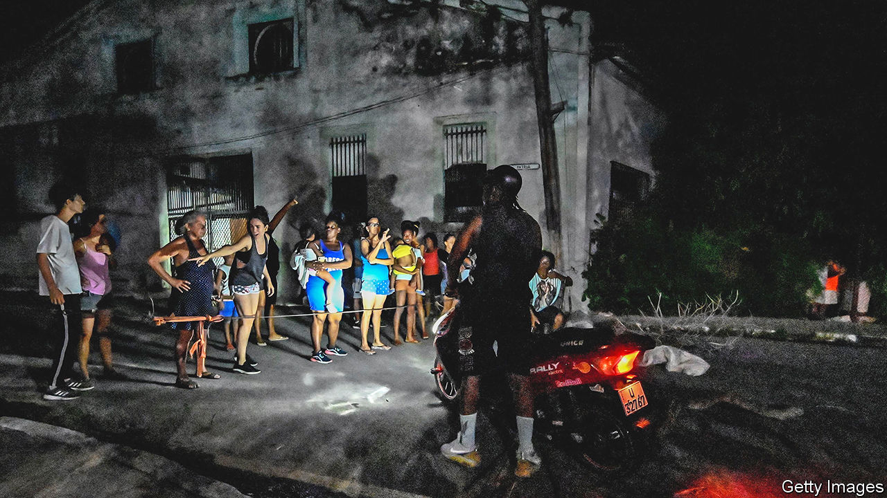

###### Voices of the powerless

# Cubans rage against the dying of the light 

##### Blackouts caused by Hurricane Ian add to the misery of socialist dictatorship 

 

> Oct 6th 2022 

On September 27th Hurricane Ian took out Cuba’s electricity grid. The blackout meant that the island’s food, which is scarce anyhow, rotted in the heat. But the cover of darkness also provided the opportunity for Cubans to protest. In several neighbourhoods of Havana, the capital, people banged pots and pans and called for light and , or freedom.

Even before the hurricane swept in, Cubans had a lot to protest about. The island is undergoing the worst economic crisis since the 1990s, after the fall of the Soviet Union. The current problems started with Venezuela’s economic collapse in 2014, which reduced the amount of cash and cheap oil it sent to the island. Donald Trump’s tightening of the American embargo limited how much money Cuban Americans could send to their relatives, and how often. Covid-19 shut off the island further from tourist dollars, and few have returned. “The economy is in a very deep hole,” says Ricardo Torres, an economist at the American University in Washington.

The government has not helped matters. At the start of 2021 it unified the currency. This involved devaluing the Cuban peso from parity with the dollar to its black market rate of 24 pesos to one greenback. One unfortunate consequence is that last year inflation soared to 152%, according to the Economist Intelligence Unit, our sister organisation. The exchange rate on the street is 200 to the dollar and rising. 

Salaries for state workers have increased five-fold. But that barely buys a meal. Marín, a primary school teacher, earns 4,200 pesos a month. At the official exchange rate, that is $175. In reality it is $21. He drives a taxi to earn more. Similarly, from their kitchen in an outhouse, Sandra and Yoanka Borges describe bartering with neighbours for milk, sugar and eggs to make the Cuban sweets for their business, “Dulces Doña Manuela”. Over the past year the cost of sugar has increased ten-fold.

Quietly and over the past decade, the government has lifted some of its draconian restrictions on private enterprise. Last year private businesses with up to 100 staff became legal and foreigners were allowed to invest in them. Previously only freelancers, or , were allowed to run a small private business. Cubans can now import goods to sell rather just than for their own use. The list of items that may be brought into the country by plane has expanded to include cheese and condensed milk.

Cubans have seized these opportunities. More than 5,000 small businesses were founded in the year after legalisation. Today private enterprises outnumber state ones. But they are far smaller, and a thicket of regulations keeps them that way. The economy remains dominated by big, unproductive state firms that have privileged access to credit and dollars. All this keeps Cuba far poorer than it should be.

That leaves the government in a quandary. “They don’t want to open enough that the private sector has real power,” says Marta Deus, the founder of a food-delivery business. But the state cannot cope. Its traditional sources of income are hard to revive, reckons Mr Torres. Exports of tobacco, sugar and fish are down. (The hurricane blasted the tobacco crop.) The government has no money to buy seeds, fertiliser or animal feed. And because it has a monopoly on importing and distributing these things, no one else can buy them, either. In May President Joe Biden lifted caps on remittances to Cuba put in place by Mr Trump. But Cubans abroad are loth to send money home, at least via official channels, as these are run by the army and fleece their customers by swapping their dollars for pesos at the derisory official rate. 

Meanwhile, the power cut caused by the hurricane is not a one-off. The government has failed to overhaul its ageing electricity grid. Cuba currently relies on five Turkish power generators on ships floating off the coast. The island’s total supply is only two-thirds of the 3,000 megawatts of demand. Blackouts often hit Havana as well as the countryside. When the power goes out, residents exclaim  (let’s go in solidarity!), a dig at the government’s explanation that the cuts in the capital are to show empathy for rural folks. 

The Communist Party’s economic model is not the only thing that seems out of date. Few Cubans believe in socialism, the official ideology. Raúl Castro, Fidel’s brother, who took over in 2008, has been less charismatic but more reform-minded than his brother. Miguel Díaz-Canel, the current president and first secretary of the Communist Party, lacks both the Castro name and charisma. Even if he wanted to reform, he faces huge barriers from the party and the civil service, says Carlos Alzugaray, a Cuban former diplomat.

Vamos!

In July 2021 thousands of Cubans took to the streets to protest about shortages, lockdowns and one-party rule. Hundreds were arrested; many were sentenced to 30 years in jail. Small protests continue across the island, including in rural areas. 

Others are voting with their oars. In August residents of El Cepem, a coastal village, protested when police tried to stop them from emigrating on makeshift rafts. Since October 2021 almost 195,000 Cubans have been caught trying to cross the border between Mexico and the United States, around four times the number in the previous two years combined, and far more than in other exoduses in 1980 and 1994. Marín, the teacher, will soon head to Spain. “There is no future here,” he says. ■

