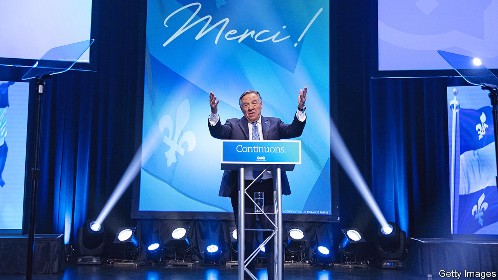

###### Isolated but not independent

# Quebec elects François Legault’s fiercely nationalist party 

##### But Montreal remains immune to his pro-Quebec, anti-immigrant rhetoric 

 

> Oct 6th 2022 

Is Quebec in or out? With a few brief interludes, the question has dominated the politics of the French-speaking province of Canada for more than half a century. Separatist governments were repeatedly elected, only for the population to shy away from independence when asked to vote in a referendum. With the crushing re-election of François Legault as its premier on October 3rd, the answer seems clear. Quebeckers want a fiercely nationalist provincial government within a united Canada. 

Mr Legault’s Coalition Avenir Québec (CAQ) tightened its hold on the Quebec legislature, winning 90 of its 125 seats, up from 74 when the party first won power in 2018. The two parties which have dominated the province’s politics since the 1970s were battered. The federalist Liberal Party received just 14.4% of the vote, the lowest in its 155-year history. But because its votes were concentrated in relatively few ridings (electoral districts) it remained the official opposition with 21 seats. Meanwhile, the separatist Parti Québécois won slightly more votes (14.6%) but only three seats. 

Mr Legault, an accountant who made millions founding a budget airline, was a Parti Québécois cabinet minister before losing faith in the separatist cause. He founded the CAQ in 2011. The party appeals to Quebeckers’ comfort zone by not requiring them to make a difficult decision, says Jean-François Lisée, a Parti Québécois political strategist who recruited Mr Legault. “It says to them, ‘You don’t have to love Canada but you don’t have to leave it either.’”

Mr Legault grew up in one of Montreal’s anglophone enclaves, yet winning support in the city has not been a priority for him. His government adopted legislation limiting access to services and education in English and other non-French languages, while reducing the number of immigrants allowed into the province. During the latest campaign, he derided Montrealers for “looking down” on people from elsewhere in Quebec.

So while it consolidated support elsewhere, the CAQ remains shut out of the metropolis, where it holds just two of 26 seats. “He’s talking basically to Joe Pickup,” says David Heurtel, a former Liberal cabinet minister. “Montreal is isolated; it truly is an island.”■

