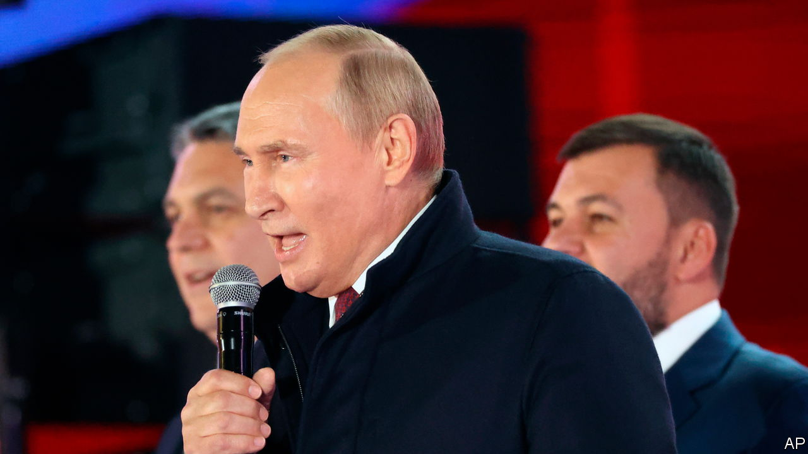

###### The Economist explains

# What is annexation? 

##### Vladimir Putin is staking a false claim to sovereign Ukrainian territory 

 

> Sep 30th 2022 

ON SEPTEMBER 30TH Vladimir Putin signed documents to annex four  Ukrainian provinces—Kherson, Zaporizhia, Donetsk and Luhansk.  had been conducted at gunpoint there, with little pretence of legitimacy. According to the Kremlin, in each province at least 87% of voters (and a preposterous 99% in Donetsk) voted for the land where they lived to become part of Russia. In his speech Mr Putin did not use the word “annex”, but he did claim that the territory (some 17% of Ukraine) would be “our citizens forever”. In reality Russia has no right to this territory. Its claim to Crimea, a strategic peninsula it occupied in 2014, is similarly bogus. But in both cases Mr Putin has presented the illegal act as reunification, not annexation. What is annexation, and why is it important to use the word?

Under international law, annexation is when one country forcibly asserts control and sovereignty over another country’s territory. This usually follows military occupation. Annexation is unilateral. Territorial control is declared by the occupying power; the other party gets no say. (If a territory gives up control to another, that is called cession.) Russia claims that the four Ukrainian territories it is annexing have acceded to Russian control, as demonstrated by the results of the sham referendums. In Russia this is presented as the correction of a historical wrong. Mr Putin has claimed on multiple occasions that Russians and Ukranians are one people with a common heritage dating back to the time of Kyivan Rus, a medieval political federation covering present-day Belarus, Ukraine and part of Russia. It is an empty justification for a war of imperial conquest.

Since 1945 very few leaders have conquered and annexed whole countries. (Saddam Hussein’s invasion of Kuwait in 1990 was a rare exception, and was swiftly reversed.) However, a larger number have expanded their borders by annexing small portions of territory belonging to others. An annexation is legitimised when it is recognised by other countries and by international bodies such as the United Nations and the International Monetary Fund. India justified its annexation of Goa in 1961 as the return of historically Indian territory from Portuguese colonial rule, and the UN recognised India’s claims almost immediately. 

By contrast the annexations of the Syrian Golan Heights by Israel in 1981 and of Western Sahara by Morocco in 1976 and 1979 remain unrecognised and are considered illegal occupations. Similarly, the United Nations General Assembly does not recognise Russia’s claim to Crimea. America’s president, Joe Biden, has already said that his country will “never, never, never” recognise this latest annexation.

That won’t deter Mr Putin. He has said that Russia refuses to live under the West’s “false rules”. Instead, he is making up his own. Having annexed parts of Ukraine, he may spuriously claim that when Russian forces fight Ukrainians on Ukrainian soil, they are in fact defending Russian territory. That same tactic could be used elsewhere in future: Russian troops already occupy parts of Georgia and . ■


