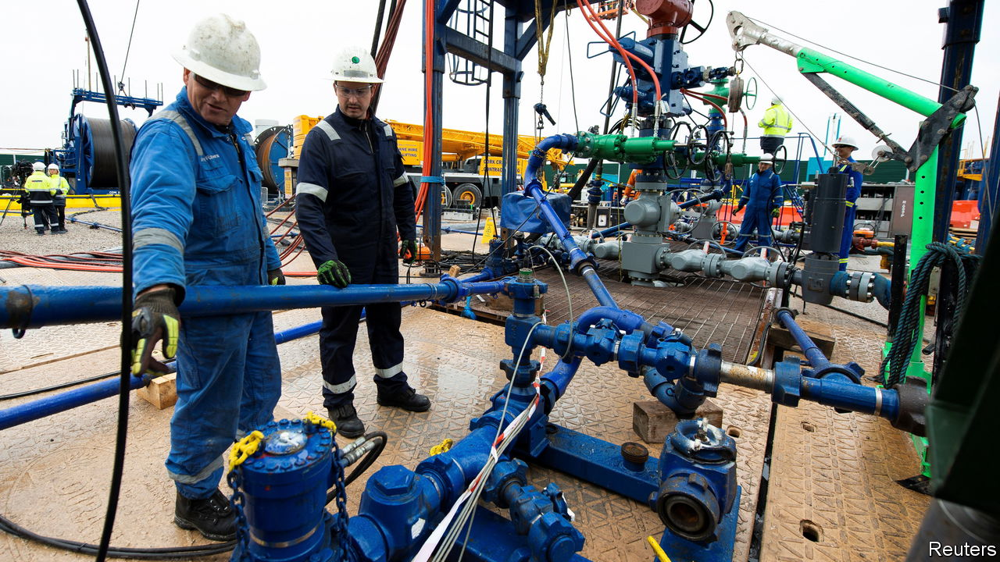
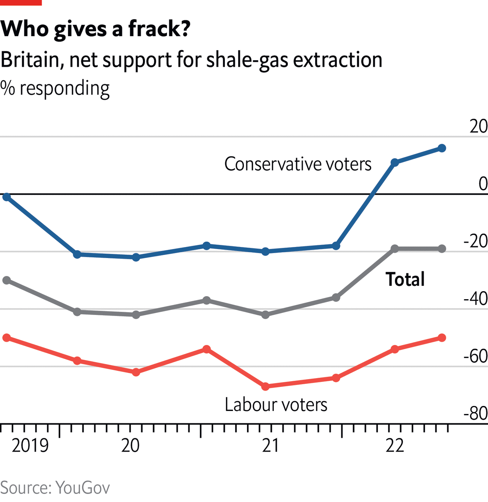

###### The Economist explains

# Why fracking cannot solve Europe’s energy crisis 

##### Exploiting the continent’s gas reserves would be harder than it has been in America 

 

> Oct 4th 2022 

EUROPE IS GRIPPED by an . Last year the EU imported 83% of its gas. Since then its main supplier, Russia (which provided around 40% of those imports) has . Britain produces half of the gas it uses, but it is also feeling the squeeze. This leaves the continent with an urgent need either to use less gas or to find more of it elsewhere. Some—including Britain’s new prime minister, Liz Truss—think hydraulic fracturing, or “fracking”, could be a big part of the answer. This method of extracting oil and gas has been hugely successful in America. Could it help Europe ramp up its energy production too?

America’s example looks like a reason for optimism. Its oil-and-gas companies developed fracking in the 1940s as a means to improve the flow in wells. The process uses water, sand and thickening agents to blast gas out of porous rock formations, known as shale, deep underground. Over the past decade the widespread application of fracking has . Most of the 950bn cubic metres (bcm) of gas America produces each year comes from fracking.

But European countries would struggle to produce anything like that. First, they have much smaller shale-gas reserves. The largest were thought to be in Poland and France, with around 4,000bcm each. But after further exploration Polish experts have cut estimates of their country’s recoverable, economically viable reserves to between 190bcm and 260bcm. At current consumption rates, that might be enough to meet Polish demand for a decade. France, which banned fracking in 2011, has hardly explored its reserves. Though its government estimated in 2015 that between 540bcm and 1,900bcm could be extracted over three decades, it is unclear whether this could be done profitably. Germany’s gas lobby says it could produce 10bcm a year—a far cry from the 800bcm in total reserves that the government’s geological institute had recently estimated. In Britain, total shale-gas production could be just 90-330bcm, according to a recent report.

Second, there are economic and political impediments. America’s shale-gas revolution was facilitated by the country’s relatively low population density, a helpful legal and regulatory environment and well-developed energy infrastructure and supply chains. The situation in Europe is very different. Its population density is much higher, and local opposition to shale-gas wells is likely to be more intense. That is partly because of environmental concerns, which are more vocal in Europe. Fracking can lead to methane leakage and groundwater pollution, as well as carbon emissions. Furthermore, in Britain and most other European countries, underground mineral rights are owned by the government and not, as in America, by the local landowner. European landowners therefore do not stand to benefit directly from a fracking boom, as Americans have.

 


Such factors explain why in Europe fracking has few friends and many enemies. Despite the enthusiasm of Ms Truss and many Conservative Party voters, most British people are against it (see chart). In France, no major political party wants to reverse the fracking ban. German lawmakers have made fracking almost impossible—and there is no serious political interest in revisiting the issue. Moreover, even if such obstacles could be overcome, progress would still be hard. European countries lack the deep industrial base, including drilling companies and pipelines, that enabled the American boom.

To produce significant amounts of European gas by fracking would probably take at least three years. Maybe it would be worth pursuing. But on its own, it is no answer to Europe’s current crisis. ■


