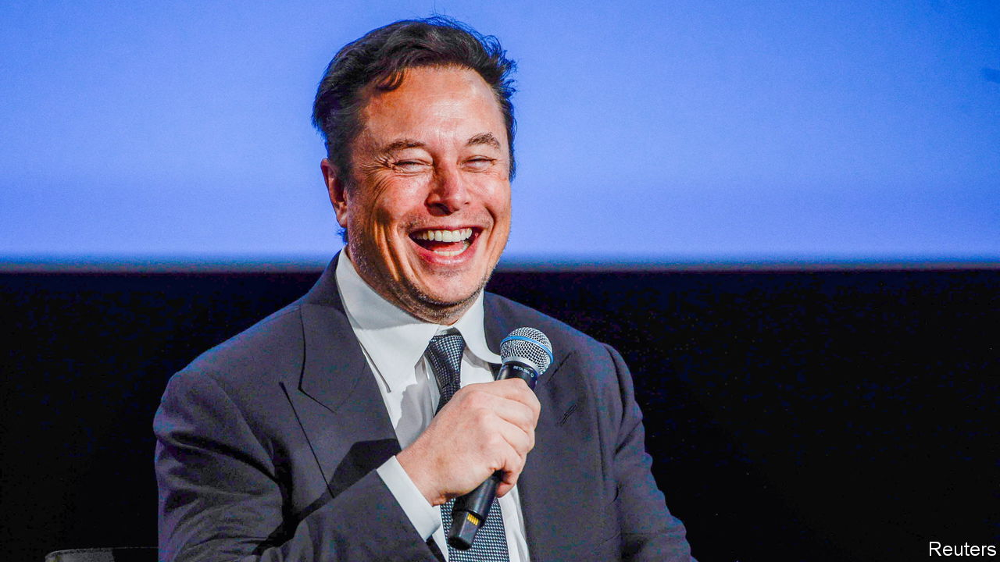
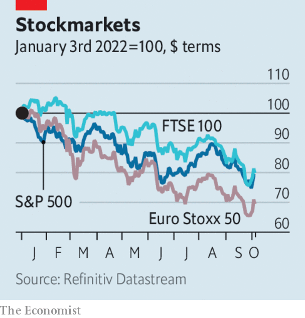

###### The world this week

# Business 

#####  

 

> Oct 6th 2022 

 changed course and offered to go ahead with his $44bn deal to buy , but only if a forthcoming trial that could force him to complete the takeover is stopped. A recent preliminary hearing in the case did not go well for his legal team. The mercurial Mr Musk offered to take Twitter private in April, said the offer was on hold in May, and abandoned the deal in July, prompting the legal action. He has suggested that he will turn the platform into “X”, an everything app, similar perhaps to the superapps that combine messaging, shopping and services in Asia. 

A cruel summer

 


 rallied briefly over the first two days of trading of the fourth quarter, after a brutal sell-off at the end of the third quarter. Despite some gains in August, share indices recorded an overall loss from July 1st to September 30th. The S&amp;P 500 was down by 5% over the quarter—September was its worst month since March 2020, the start of the pandemic. The NASDAQ Composite shed 4% and the Dow Jones Industrial Average 7%. The pain was worse in China. The CSI 300, which comprises stocks on the Shanghai and Shenzhen exchanges, finished the quarter 15% lower than at the start. 

 were calmer. The yield on ten-year British gilts eased back to around 4% after the government ditched its plan to scrap the top rate of income tax (two months ago the yield was around 2%). The yield on the ten-year US Treasury fell back to 3.6% having risen above 4%. In Britain banks started re-offering some  they had withdrawn amid the market uncertainty. The interest rate on an average two-year fixed-rate mortgage rose above 6% for the first time since 2008. 

The share prices of  rebounded following a number of government announcements to shore up the housing market. In addition, the People’s Bank of China lowered interest rates on certain loans for first-time buyers. 

OPEC+ said it would cut  by 2m barrels a day, around 2% of global supply. The headline figure is the biggest reduction to output since 2020, but some OPEC members are already struggling with production targets so the overall effect will be lower. Still, it was a blow for the Biden administration and European governments, which had pressed the cartel to keep cuts to a minimum so that prices don’t rise. The White House press secretary said that OPEC was now clearly “aligning with Russia”.

Annual  in the Netherlands (measured by the cPI) surged to 14.5% in September. Energy prices were up by 200%, year on year. Turkey’s inflation rate rose above 83%; transport and food prices increased at an even faster clip. 

 central bank lifted its main interest rate by a quarter of a percentage point, to 2.6%. Markets had expected a bigger rise, but the bank defended the smaller move because the rate has “increased substantially” this year. 

Executives at  had to battle rumours that the bank is in trouble. A memo sent by the chief executive, Ulrich Körner, to staff, reassuring them about the bank’s “strong capital base and liquidity position”, elicited the opposite effect in the markets. Its credit default swaps, which act as an insurance of a default, soared to new highs. Cooler heads dismissed the idea that Credit Suisse would become the next Lehman Brothers. 

Apple will have to adapt the  in the EU, after the European Parliament approved new rules to standardise charging points for linking electronic devices to USB-C connections. The change applies to all products, so some items made by Samsung and others will also have to adapt. 

The World Trade Organisation forecast that the , measured by volume, will grow by 3.5% this year, but by only 1% in 2023. Demand for imports will soften, it said, for a variety of reasons related to the squeeze on household spending. 

, a Chinese carmaker that owns the Volvo and Lotus brands, bought a 7.6% stake in . Geely has long wanted a piece of the British maker of sports cars (it is seen as a potential buyer of the firm), and says it looks forward to future collaborations. 

Death and taxes

, the only publicly listed funeral provider in Britain, reported a half-year pre-tax loss. The firm is not immune from the more earthly problems bedevilling other businesses. Rising fuel costs have caused it to consider a surcharge on the gas burned at its crematoriums. And although lower death rates from covid-19 are a blessing for us all, it has made year-on-year comparisons about the business difficult. Still, Dignity noted “positive signs” about its market, a nod to the fact that there will always be a demand for its services. 

