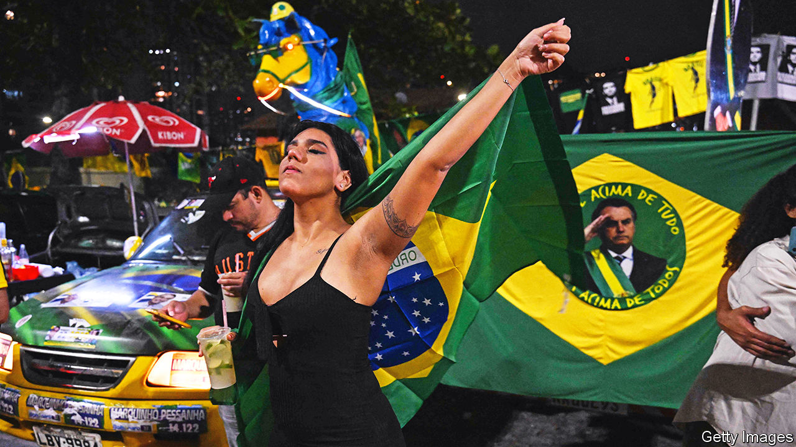
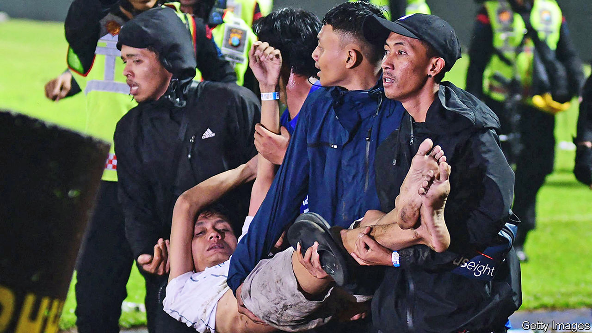

###### The world this week

# Politics 

#####  

 

> Oct 6th 2022 

In the first round of  Jair Bolsonaro, the populist incumbent, did better than expected. He had been trailing Luiz Inácio Lula da Silva, a leftist ex-president, by double digits in the polls for months, but on the night he was only five points behind. The two candidates now head to a run-off on October 30th. Mr Bolsonaro, a fan of Donald Trump, falsely suggests that the election is likely to be rigged, and may not accept the result if he loses. 

 went through the motions of illegally  four provinces of Ukraine, following sham referendums held at gunpoint. Vladimir Putin now claims that these provinces are part of Russia, but his spokesman was unable to say exactly where the borders might be. Russia does not fully control any of the four, and holds only roughly half of two of them. Mr Putin’s land-grab was widely condemned. 

 ignored it and continued to push back the Russian invaders. Its forces recaptured Lyman, a rail hub, and advanced rapidly in the south, where tens of thousands of Russian troops are at risk of being trapped on the west side of the Dnieper river. The bridges they might retreat across have been blown up. Some of Mr Putin’s henchmen sought to blame Russia’s defence minister, Sergei Shoigu, for the shambles.

The Kremlin said it had drafted 200,000 men to fight in Ukraine. At least 300,000 have fled Russia since the  was announced. Finland stopped issuing tourist visas to Russians, many of whom have been using Helsinki airport to escape on planes that are not subject to sanctions. 

 €200bn ($197bn) energy aid package fuelled fury in Europe. Some politicians said that by going it alone Germany had undermined a common approach to dealing with the energy crunch. The European Commission said it was committed to “avoiding harmful subsidy races” in the single market. 

The inaugural meeting of the  took place in Prague. Leaders from the 27 member states of the EU and 17 other European countries, including Britain, Switzerland, Turkey, and by video link, Ukraine, gathered to discuss security and economic issues. The forum was proposed by Emmanuel Macron, the president of France, as a means of forging pan-European unity on a number of issues. 

 called an early election for November 1st. The country faces soaring energy bills and is nervous about Russian aggression after two gas pipelines were sabotaged in nearby waters. Also, Mette Frederiksen, the prime minister, has come under pressure for having illegally ordered a cull of mink in 2020, believing it would help stop the spread of covid-19.

After ravaging Cuba,  swept through Florida, killing 120 people. That was the highest storm death toll in the state since 1935. 

The lady is for turning

 Conservative government plunged in the polls after markets punished its plan for unfunded tax cuts. A month after taking office, , the prime minister, is more unpopular than Boris Johnson, her predecessor, ever was. Kwasi Kwarteng, the chancellor of the exchequer, dropped plans to abolish the 45% top rate of tax. The Tories bickered over welfare cuts and other policies. Standard &amp; Poor’s and Fitch put Britain’s credit rating on a “negative” outlook.

 constitutional court ruled that Prayuth Chan-ocha, the prime minister, had not exceeded the constitution’s eight-year term limit and could stay in power. Mr Prayuth had been suspended from office by the court in August while it heard an opposition-party petition arguing that his time was up. 

Also in Thailand, dozens of people, mostly children, were murdered in a gun-and-knife attack at a  in the north-east. The suspect, a former police officer, killed himself. 

 


A  in the  city of Malang killed at least 131 people. It was triggered by police firing tear-gas to disperse fans who had run onto the pitch. 

A grid failure in left 75% of the country without electricity. Power was restored to Dhaka, the capital, by evening, and to the rest of the country by the following day. Bangladesh, like many poor countries, is suffering from shortages of gas as Europe tops up its supplies for winter. 

 fired a ballistic missile that flew more than 4,000km, far enough to reach Guam. It was the farthest a North Korean missile has ever travelled. A South Korean missile test ended in failure when it crashed to the ground. 

 against continued across the country. Some of the most striking were in universities and schools, where many female students threw off their headscarves and chanted songs denouncing the bossiness and corruption of clerical rule. 

The two main sides in the eight-year-long civil war in  failed to renew a truce signed in April that had been extended several times. But all-out war has yet to resume. The United Nations special envoy, Hans Grundberg, begged the adversaries to return to negotiations. 

The zero-covid approach

 in western China suspended passenger train services leaving the region to prevent the spread of covid. A local official said Xinjiang was facing a “major public-health emergency”. 

Indonesia became the first country to approve the emergency use of an mRNA  developed in China. The Chinese government has yet to approve any mrna vaccines for use among its own population, except in clinical trials. 

o suffered its second coup in less than a year. The new regime seized power after accusing the old one of not doing enough to stop jihadists who now plague large parts of the country.

 agreed to participate in peace talks hosted by the African Union with rebel forces from Tigray that it has been battling for two years. The war has left thousands of people starving in Tigray.

The commander of ’s army, Lieutenant-General Muhoozi Kainerugaba, threatened on Twitter to invade neighbouring Kenya. It was a joke, but Kenyans did not find it funny. Uganda’s president, Yoweri Museveni, stripped the general of his job but also promoted him. The general is his son, and possibly his favoured successor. 

