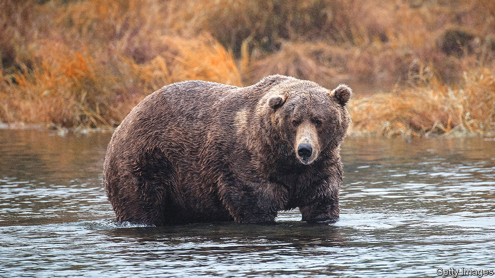

###### Winter is coming

# Alaska’s Fat Bear Week proves conservation can be joyful 

##### Katmai National Park finds a competitive way to teach people about wildlife 

 

> Oct 4th 2022 

For one rabid corner of the internet, October is Octobear. On October 5th, Katmai National Park &amp; Preserve in southern Alaska kicked off Fat Bear Week, when the park’s brown bears are pitted against each other in a bracket challenge much like college basketball’s . Fans use before and after photos to vote for the bear they think has gained the most weight over summer to prepare for hibernation. But what began as a niche contest for conservationists has become a global campaign where superfans stump for their favourite chunkster to be crowned the fattest of them all. 

Fat Bear Week began in 2014 as Fat Bear Tuesday. Mike Fitz, a former park ranger at Katmai, noticed that live webcams showing the bears generated a lot of online comments. He and the other rangers let people vote for their favourite fat bear on Facebook. The one-day event attracted just 1,700 votes in 2014. Last year’s week-long contest elicited nearly 800,000. Like its basketball progenitor, fans join office bracket pools and gather to watch the live bear cams set up around the park. Some go further. Jean Gross is hosting a bear-themed potluck where she lives in Northern Michigan. Guests must bring foods that appeal to both bears and humans, such as salmon patties and honey butter. This year Ms Gross says she is rooting for Holly, an older female, because “she is a nice little fat girl and so am I”. 

The contest serves two purposes besides gushing over the rotund ursids. America’s national parks are often in remote, undeveloped areas. They can be difficult and costly to travel to. Fat Bear Week brings  to fans’ computer screens. “The webcams help to democratise the experience,” says Mr Fitz, now a naturalist for explore.org, which operates the bear cams. “It’s not limited to the fortunate few who can go to the river any more.” 

Second, Fat Bear Week heaps attention upon the bears, and the ecosystems they inhabit. The 2,200 bears of Katmai are so husky because they feed from one of the healthiest salmon runs in the world, says Sara Wolman, a former park ranger. Salmon in the Pacific Northwest have suffered due to overfishing,  and  due to climate change. Brooks River, where Katmai’s bears like to fish, has so far dodged these threats. 

Creators and fans of Fat Bear Week argue the contest has gone viral because it is a conservation success story that for one week helps dispel feelings of doom about habitat loss and climate change. “Maybe things aren’t super great all the time in the world,” says Felicia Jimenez, a current Katmai ranger, “but there’s some really fat bears in Alaska.”■


