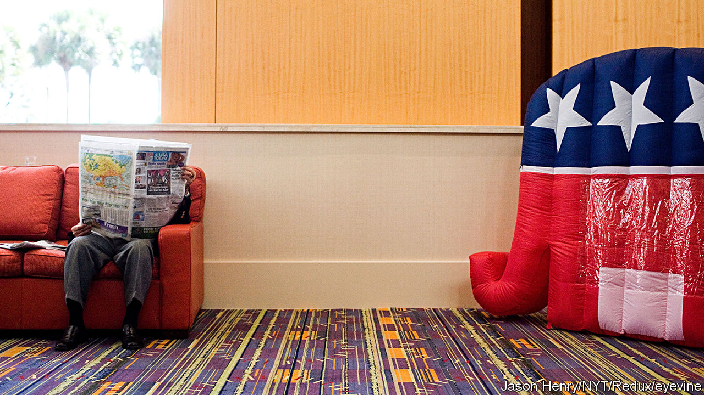
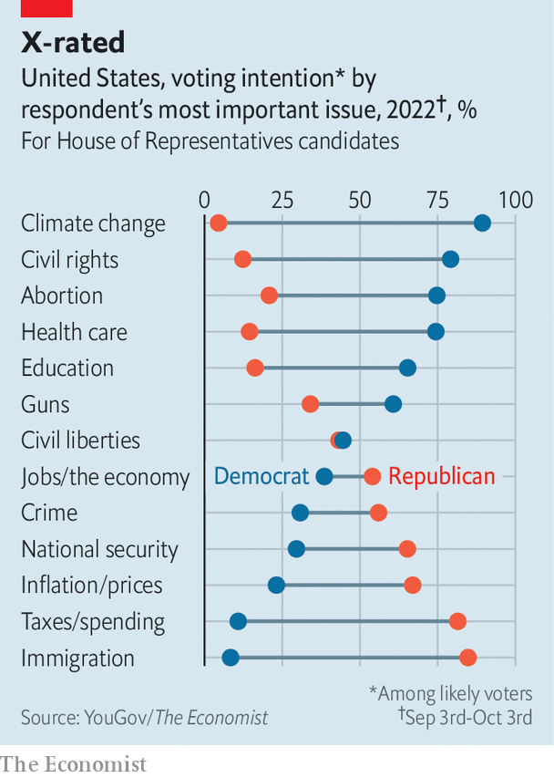

###### Midterm maths

# Democrats are losing on the economy, but lead on other issues 

##### Other than that, Mrs Lincoln 

 

> Oct 6th 2022 


Each year Gallup, a pollster, asks American adults which political party they believe will “do a better job of keeping the country prosperous”. For most of the middle of the 20th century, a plurality of respondents told Gallup they believed the Democratic Party would be a better pick on this question. That all changed in the 1970s. A decade of slow growth, high unemployment and soaring inflation left the Democrats’ image in tatters. Ronald Reagan’s presidential campaign proclaimed it was “morning again in America”. The result was a new decade of Republican dominance on Gallup’s metric.

Since the 1990s, however, the United States’ two major political parties have been locked in a bitter battle for voters’ trust to handle the economy. Democrats have tended to win elections when they had a clear lead on this question, such as during the financial crisis and in the 1992 election. At other times they either lost or the elections were close. 

 


This year high inflation, higher borrowing costs and related concerns may lead them again to the electoral wasteland. According to a new Gallup poll released on October 3rd, 51% of adults now trust Republicans more with the economy, compared with 41% for the Democrats. Though Republicans held the advantage on Gallup’s question for much of the past decade, the gap between the parties’ ratings is now the widest since 1991.

Folk theories of democracy would have you believe that such a gap would doom the Democrats in this November’s midterm elections. If the average voter trusts Republicans to make them more prosperous, surely they would not deliver Congress back to the hands of the Democrats? After all, what voter casts a ballot against their own personal prosperity? 

The answer, according to a survey carried out for  by YouGov, an online polling firm, is voters who prioritise other areas of domestic policy. Each week, YouGov asks 1,500 Americans to pluck from a list of a dozen or more problems the most important issue for them personally. Over a third today say that the state of the economy or inflation is their top concern, followed by roughly 10% each who say they are most preoccupied with health care, climate change and abortion. Of even less import to the average American are civil rights (7%), national security (6%), crime, immigration and government spending (5% each). Fewer than five out of every 100 Americans name either education, gun control or another issue as their top concern.


Our polling suggests that the prominence of economic issues has hurt the Democrats. Among YouGov’s respondents who said the economy or inflation was their top concern and also predicted they were “definitely” or “probably” going to vote in November, 63% said they would vote for Republican candidates for the House of Representatives. Just 28% said they would vote for Democrats. Yet Democrats lead among those who prioritise any other issue by 18 points, attracting 55% of their votes to Republican’s 37%. 

The salience of abortion has equally been a boon to the left. Whereas just 4% of adults last October said the issue was their top problem, nearly 9% do now. That group is disproportionately Democratic-leaning; among likely voters, 75% of them say they will vote for Democrats versus just 21% of Republicans. That makes for a much wider gap than the advantage Republicans enjoy on the economy. 

We have sliced YouGov’s data to illustrate how issue priority relates to voting intention. The numbers suggest that if just 20% of likely voters prioritised the economy above all other issues (rather than the 31% who say they do), Democrats would be ahead by seven percentage points. Much of the outcome of November’s midterms may thus rely on whether the Democrats can make gains among those voters who care about the economy, or if the state of the economy changes by election day.■


