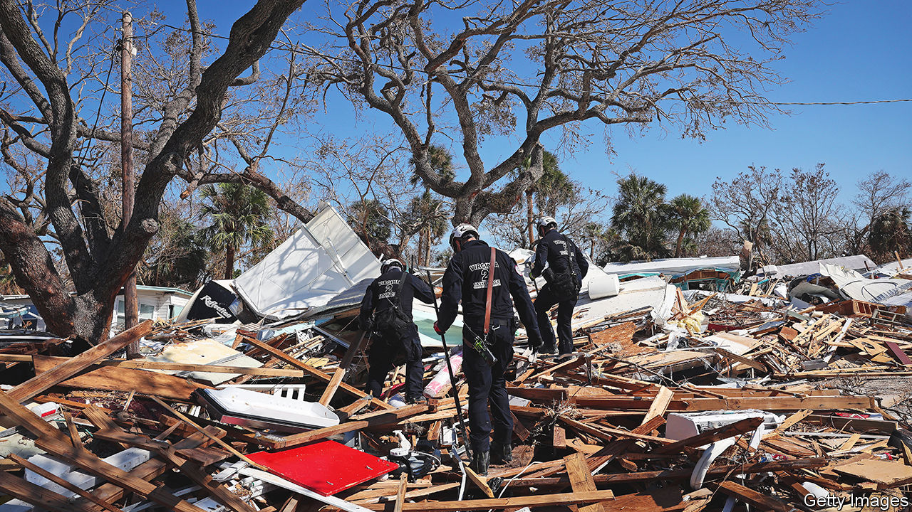

###### The Florida model

# Florida’s government subsidises people living in hurricane zones 

##### This props up the property market, which state revenue relies on 

 

> Oct 6th 2022 

After the storm come the loss “adjusters”. With clipboard and camera they tot up the damage from leaky ceilings and waterlogged floors. Blake Day, an adjuster who represents homeowners in dealings with insurers throughout south-west Florida, tells his bewildered clients two things. Photograph everything. And file your claim fast to get paid quickly, for some insurers will soon be bankrupt.

Hurricane Ian made landfall near Fort Myers on September 28th. About 110 Floridians were killed by the storm. Ron DeSantis, the governor, seems to have co-ordinated the short-term response well. “The big story is DeSantis demonstrating management skills, rather than political skills, because most people assume he is all about politics,” says Susan MacManus, a political analyst and veteran Florida-watcher. The long-term response is another matter. 

Insured losses from the storm could reach $57bn, estimates Verisk, a catastrophe-modelling firm. That would make Ian America’s second-costliest hurricane, after Katrina in 2005. Florida’s booming population and real-estate prices mean ever-larger losses when disaster strikes. Yet hurricanes have little effect on the willingness of people to move to Florida. Its population swelled by 15% between 2010 and 2020. House prices rose by more than 30% in the past year, twice the national rate.

The reason can be found in actuarial tables. Florida’s property-insurance market was tottering even before Hurricane Ian. (Property insurance covers wind damage; flood protection is administered separately, by the federal government, and has far lower take-up rates.) Annual premiums, at more than $4,200, are triple the national average. Still that is not enough to cover risk in the state most vulnerable to storms and sea-level rise. Six firms have turned insolvent this year, owing to extreme weather, litigation costs and fraud. 

As a result the state is playing a larger role. Citizens Property Insurance, the state-backed insurer of last resort, has doubled its number of policies in two years and has the largest market share, about 13%. Its premiums are 30-40% lower than private carriers’. Increases are capped and subject to state approval; earlier this year regulators denied Citizens’ request to raise most rates by an amount allowed by law. 

Florida has a big interest in making insurance affordable. Real estate generates about a fifth of state gdp. Florida has no income tax, so property tax accounts for a hefty chunk of government revenues. Affordable insurance, says Zac Taylor of TU Delft University, is the “keystone of the political and economic structure of Florida”.

The effect of subsidised insurance is that risk—such as coastal development—is not internalised upfront. Instead costs are redistributed after disasters. If Citizens cannot cover losses, it can levy a surcharge on almost all other property- and casualty-insurance policyholders in the state. The so-called “hurricane tax” was most recently collected between 2007 and 2015, after a run of bad storms in 2004-05. 

Citizens sits on a $6.7bn surplus, more than enough to cover its estimated losses of $3.8bn from Ian. But its risk exposure will only grow as Ian bankrupts more private carriers. “That’s going to eat through its capacity really quickly,” says Charles Nyce of Florida State University.

The state wants to keep the market viable; a concern is that the growing role of Citizens will undermine private players. In August Demotech, a ratings agency, dinged four insurers. More than a dozen others were warned of a similar fate. If downgraded any further that could spell their end: to get a government-backed mortgage, homeowners must have insurance from an A-rated carrier. So the state is searching for a less discriminating rating agency to keep them in business.■

