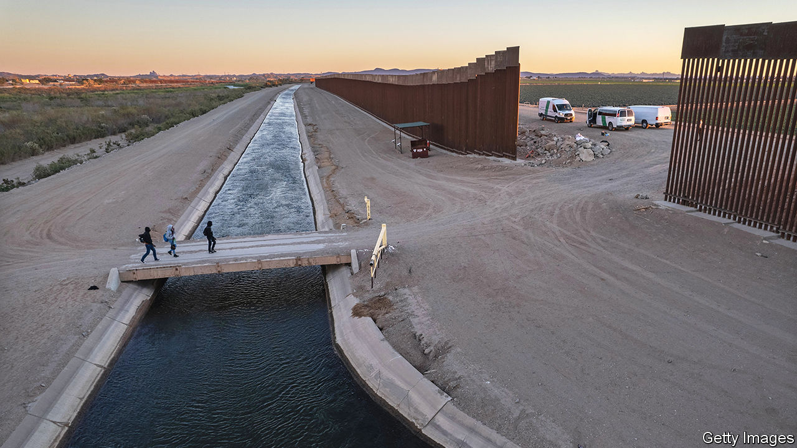
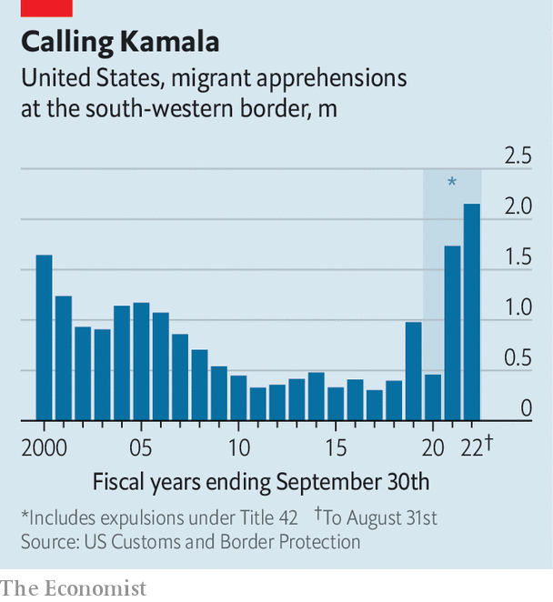

###### Border ordure

# The Biden administration is quietly completing bits of Donald Trump’s wall 

##### The southern border is a political problem for Democrats because it is an actual problem 

 

> Oct 4th 2022 

On the campaign trail, Joe Biden pledged he would build “not another foot” of border wall as president. But in the face of record numbers of migrants arriving at America’s southern border with Mexico,, agreeing to fill in some glaring gaps that were left when he abruptly halted construction on his first day in office. Staying mum about the wall-work, Mr Biden has not wanted to telegraph the decision and risk alienating backers who associate the border wall with Donald Trump.

That has not stopped Mark Kelly, a Democratic senator running for re-election in Arizona, from crowing about the news. Mr Kelly says he deserves credit for “pushing the Biden administration to close barrier gaps” on Arizona’s border with Mexico and boasts of helping secure $1bn for border security. He has co-sponsored a bipartisan bill in the Senate to help recruit and retain more border-patrol agents and give them a pay rise.

What explains the contrast between Mr Kelly’s outspokenness and Mr Biden’s silence about the wall? Mr Kelly is up for re-election in November and understands Democrats’ perceived weakness on border security could cost him votes. Blake Masters, the Republican challenger, has made Democrats’ mishandling of the border a cornerstone of his campaign. Although Mr Kelly’s defensive posture appears to be working, with recent polls showing a healthy lead of around six points over Mr Masters, many Democrats are not so lucky. According to a recent NBC News poll, registered voters perceive Republicans to be stronger on border security, leading Democrats by 36 points, the widest gap on any issue, including the economy.

 


November’s midterm election will not be the first in which illegal immigration and the border have featured prominently. However, in 2022 they are not just a conduit for partisan emotions. The border is a problem for Democrats because of the sheer volume of people coming and the White House’s refusal to lay out a compelling federal response. The administration’s strategy is basically “waiting, thinking that things are going to get better,” says Henry Cuellar, a Texas Democratic congressman who is seeking re-election and has been publicly critical of Mr Biden’s handling of the border.

If anything, the situation is only going to get worse. America’s relatively strong economy acts as a pull for people suffering from poverty, violence and inflation. Recent hurricanes will aggravate a looming food crisis in the Caribbean and further stoke migration. From last October until the end of August, border officials encountered migrants around 2.2m times on the southern border, up by a quarter from the year before and more than double the number of encounters in fiscal year 2019.

Since Mr Biden took office, some 1.5m people have probably been released into America, some combination of asylum-seekers, people who couldn’t be sent back to their home country, unaccompanied minors who could not be detained at length, and others, estimates Aaron Reichlin-Melnick of the American Immigration Council, a think-tank. Despite tepid assurances by Kamala Harris, the vice-president, who was tasked with managing migration from Central America, that “the border is secure”, few believe it. 

The nature of border arrivals and deportations has changed too. Many of those coming are seeking asylum, which they are legally entitled to do. Whereas migrants used to hail mostly from Mexico and Central America, high numbers of Cubans, Venezuelans and Nicaraguans are now coming. In August Venezuelans surpassed Guatemalans and Hondurans as the second-commonest nationality encountered at the border, after Mexicans. Strained diplomatic relations with the despotic governments of Venezuela, Cuba and Nicaragua make it difficult to send people home, so many are being released into America.

Republican candidates for office so often emphasise the border because it merges two priorities for Republican voters, immigration and law and order, says Cal Jillson, a professor at Southern Methodist University in Dallas. According to recent YouGov polls commissioned by , immigration is the second-most important issue to Republican voters, after inflation, with 12% of them ranking it first, versus a mere 2% of Democrats doing so. (Democrats say climate change and the environment is their top priority.) The border has become an embodiment of “the two Americas”, says Marc Sumerlin of Evenflow Macro, a research firm. “If you watch MSNBC you’re not going to see it, and if you watch Fox News, you’re going to see it every day,” he says.

The border is taking on the greatest importance in states that abut it. The exception is California, where the Republican candidate for governor, Brian Dahle, does not mention the border on his campaign website, perhaps believing it is too polarising in a heavily Democratic state.

Not so in Texas, Arizona or New Mexico. Greg Abbott, who is running for re-election as governor of Texas against the Democrat Beto O’Rourke, has spent $4bn in state funds on a border-security programme called “Operation Lone Star” in order to fight “Joe Biden’s open-border policies”. Kari Lake, a former television anchor who is running for governor in Arizona and has received Mr Trump’s endorsement, has promised that as soon as she takes the oath of office, she will declare an “invasion” is under way and deploy the National Guard. Even in Florida, illegal immigration is a prominent theme in Mr DeSantis’s re-election bid. He spent $600,000 in state funds to charter a flight for Venezuelan migrants from San Antonio to Martha’s Vineyard, prompting an investigation by a sheriff in Texas and Democrats’ calls for a probe into whether Florida deceived migrants about their destination.

and flying of migrants to blue states, such as Massachusetts and New York, is intended to rile up Republican voters and highlight the burden that housing and feeding new arrivals places on border communities. Despite the legal blowback, it has worked even better than Mr Abbott and Co could have imagined. Every time a Democratic mayor complains about being overwhelmed by small groups of recent migrants arriving by bus, it amplifies media coverage of the border crisis and offers an “indirect contribution” to the campaigns of Republican governors like Mr Abbott, says Mark Jones, a professor at Rice University.

Virtue and signalling

Nearly 2,000 migrants have shown up at Catholic Charities of the Archdiocese of New York with documents sharing the non-profit’s address as their final destination, wrongly believing that they can get permanent shelter there. “This is a national problem and we need to deal with this as a country,” says Monsignor Kevin Sullivan, the non-profit’s executive director.

Unfortunately, there is little hope of that. “I don’t see or hear anybody, whether it’s the governors or the Biden administration, articulating a real, detailed vision for how to change what’s going on at the border,” says Theresa Cardinal Brown of the Bipartisan Policy Centre, a think-tank. Ms Brown points to waves of higher migration than normal at the border since 2014, during Democratic and Republican administrations alike. Republicans’ obsession with finishing the wall will not resolve today’s border crisis, since so many asylum-seekers are turning themselves in to border-patrol officials. Republican promises to “end catch-and-release” policies is also deceptive. Immigration and Customs Enforcement has some 25,000 beds, a fraction of what is needed in order to detain and process the multitudes of those arriving before they can be expelled, if that is really Republicans’ plan.

As for Mr Cuellar, he has asked the Biden administration to show photos of people who are being deported, as a way to dissuade migrants from coming. But the administration has refused, because it does not want to upset immigration activists, according to Mr Cuellar. The result is that the White House is upsetting Democrats in competitive races instead. ■


