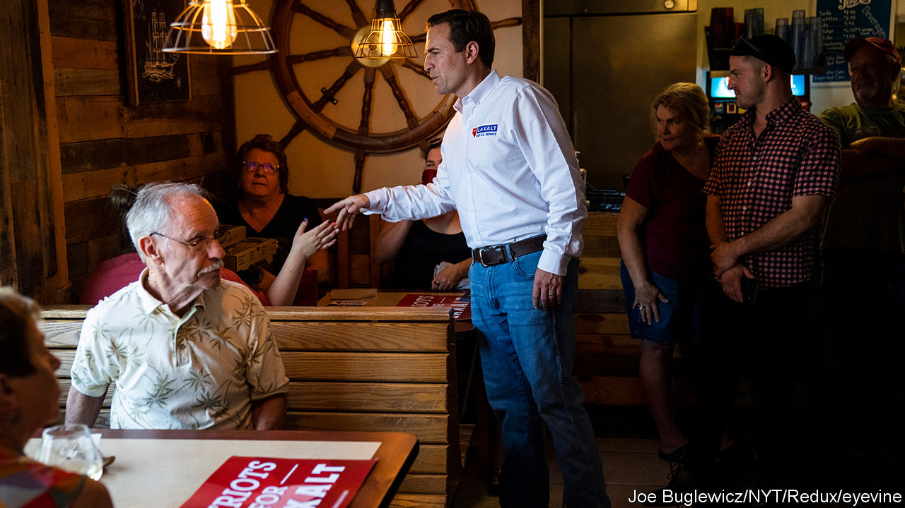

###### Viva Las Vegas

# Tight midterm races in Nevada may hinge on outreach to Latino voters 

##### Harry Reid’s machine turned Nevada blue. Will it stay that way? 

 

> Oct 6th 2022 


Posters line the walls of the Democrats’ campaign outpost in east Las Vegas, a heavily Hispanic area. Signs for Catherine Cortez Masto, an imperilled Democratic senator, read: “¡Una de las nuestras!” (One of us!). It is a theme echoed by volunteers making calls to Spanish-speaking voters on the Latina senator’s behalf. “She can understand our community, and our culture and language,” offers Antonio Garcia, a volunteer who became a citizen in 1997 after moving from Mexico. 

The erosion of Democratic support among Hispanics in  between 2016 and 2020 has heaped attention upon Latino voters, especially in swing states with large Hispanic populations. Nearly 18% of registered voters in Nevada and 19% in Arizona are Latino, compared to 10% nationally. Their electoral power will only grow. A new report from the Latino Donor Collaborative, a research group, suggests that the number of Latinos born in America grew by 31% between 2010 and 2020, compared with 2.8% for non-Latinos. A majority of Latino voters still consistently support Democrats. But analysis of YouGov data by  suggests that the  this year is a young Hispanic man without a college degree who lives in a city.

Democrats in Nevada are quick to distance the Silver State from the shift to the right perceived elsewhere. “Latinos in Nevada are not the same thing as Latinos in Florida,” says one long-time Democratic operative. Demographically, that is true. Concerns over creeping socialism may help push Latino voters into the arms of Republicans in Florida, which is home to vibrant Cuban and Venezuelan communities. But John Tuman, a political scientist at the University of Nevada-Las Vegas, argues that such worries don’t resonate as much in Nevada, where most Latino voters are of Mexican descent. 

An analysis from Catalist, a liberal political-data firm, suggests that in 2020 Donald Trump improved on his 2016 performance among Hispanics in Nevada by eight points, as he did nationally. Voters of Mexican descent, however, abandoned Democrats less often than other Hispanic groups did in 2020. A recent survey of Latino voters from Pew Research Centre found that Mexican-Americans were twice as likely to say they would vote for the Democrat as for the Republican in their local congressional district. 

The Senate and gubernatorial races in Nevada are tight. ’s  suggests that Ms Cortez Masto, the Senate’s first (and so far only) Latina member, is neck-and-neck with , the state’s former attorney-general. Yet election night may deliver the winner wider margins than polls suggest. Nevada is notoriously difficult to poll, as many voters who work in Nevada’s large tourism industry are transient, work odd hours and speak only Spanish. “Any poll that you see that doesn’t have Spanish interviews in it is not a real poll of Hispanics,” says Simon Rosenberg, a veteran Democratic strategist. 

Ms Cortez Masto was elected in 2016 as the hand-picked successor of Harry Reid, a former Senate majority leader and the most powerful politician in Nevada’s history. After an unsuccessful run for governor in 2018, Mr Laxalt helped run Mr Trump’s 2020 campaign in Nevada and advocated for an Arizona-style “audit” of the results. The outcome of Nevada’s Senate race may be crucial to winning a majority in the chamber. The result is a campaign trail that serves as a who’s who of wannabe presidential candidates. Ron DeSantis, the governor of Florida (and Mr Laxalt’s roommate in the Navy), and Nikki Haley, Mr Trump’s ambassador to the UN, have spent time around Las Vegas in recent months.

A majority of Latino voters, like a plurality of Americans, say economic issues are most important to them when deciding who to vote for come November. But Latinos are almost evenly split over whether they agree with Democrats or Republicans on economic policy, according to a recent /Siena College poll.

Equis Research, a public-opinion firm focused on Latinos, argues that the highest rates of undecided Hispanic voters are among those who prefer to speak in Spanish. Here, Democrats may have an advantage. Over the course of his 30-year Senate career, Reid built a Democratic machine that focused intensely on mobilising Hispanic voters. He knitted the state party, candidates, powerful unions, and non-profit groups into a network to elect Democrats. Ms Cortez Masto’s phone-bank volunteers in east Las Vegas were also campaigning for Steve Sisolak, who is running for a second term as governor, and down-ballot Democrats. Little, if any, English was spoken. Turnout may also increase this year, as 2022 is the first year Nevada will mail a ballot to all registered voters. 

Republican victories in Nevada’s big races would be even more remarkable for overcoming the advantages built up by the Reid machine, which lost its architect when he died last year. “I think if they win, it will probably be on the concerns around inflation,” says Mr Tuman.■


