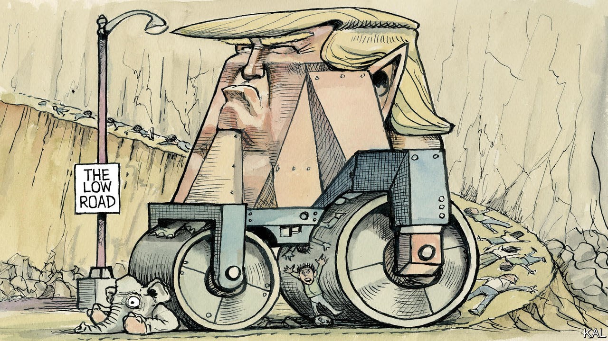

###### Lexington

# What Donald Trump understands 

##### He has a grim view of human nature, and he exploited it shrewdly—to a point 

 

> Oct 3rd 2022 

Donald Trump has always understood how the world works—or, at least, how it can be made to work—better than his opponents. Maybe because he has such qualities himself in abundance, his appreciation for human greed, cowardice, selfishness and other weaknesses has given him a granite confidence in human corruptibility. Across the decades, and throughout his term as president, that faith has been vindicated more often than it has been confounded. 

“History isn’t kind to the man who holds Mussolini’s jacket,” Senator Ted Cruz of Texas told an associate in 2016, explaining why he was not endorsing Mr Trump, according to the new book “Confidence Man”, by Maggie Haberman. Yet Mr Cruz eventually bent the knee—even though Mr Trump had attacked his wife, Heidi, so cruelly that even a Republican not named Cruz also said he could not back him. That Republican, Rudy Giuliani, would go on to make a bonfire of his reputation in service to Mr Trump.

How could a man who lies so transparently and exhibits such incompetence be so successful? Respectable people have been asking versions of that question since Mr Trump was in real estate, and as he moved on to entertainment and politics, or to all three at once. The answer says as much about them, or about all of us, as it does about him. 

Ms Haberman, of the  and CNN, stands out among journalists who have followed Mr Trump, and not only because she has covered him since he was a developer in New York and she was at the , a tabloid. Ms Haberman has always taken Mr Trump seriously, as someone, she writes here, who was “shrewd and smarter than his critics gave him credit for, possessed of a survival instinct that was likely unmatched in American political history”. 

Ms Haberman makes a particular contribution with this book by describing how the annealing interplay of politics and commerce in the New York of the 1970s and 1980s equipped Mr Trump with the low expectations and cynical convictions that would carry him so far: that racial politics is a zero-sum contest among tribes; that allies as well as enemies must be dominated; that everything in life can be treated as a transaction; that rapidly topping one lie or controversy with the next will tie the media in knots; that celebrity confers power; that not only politicians but even prosecutors are malleable. 

Yet these same convictions would also carry Mr Trump only so far. They doomed his presidency. After Mr Trump was elected, James Comey, the FBI director, warned him that a dossier was circulating that alleged Mr Trump had compromised himself in Russia. New York had taught Mr Trump that damaging information was a means of leverage, and so he assumed Mr Comey was threatening him. “Comey was blind to the depths of Trump’s paranoia and to his long history of gamesmanship with government officials,” Ms Haberman writes. Mr Trump would later , with disastrous repercussions for himself. The first exchange “set the terms” for Mr Trump’s subsequent interactions with intelligence and law-enforcement officials, according to Ms Haberman. 

Mr Trump bullied and humiliated senators and generals. “You’re losers and you’re babies,” he told America’s military leaders, when they brought him to the Pentagon in an attempt to persuade him of the value of the post-war order. He could reward servile lawmakers by tossing branded chocolate bars at them, then have the satisfaction of watching as they scrambled for one. But he found that foreign affairs and even domestic politics could not be managed only through bilateral transactions and tactical improvisation, and that his money could not buy everything. He was astonished when a New York Democrat he had donated to years earlier nevertheless backed his impeachment. 

Because Ms Haberman sees Mr Trump in full, she acknowledges “the Good Trump”—the one who would repeatedly check on a sick friend and be “funny and fun to be around, solicitous and engaged”. People accustomed to his all-caps Twitter persona or to press portrayals were often surprised on meeting him in the White House. He could be calm and charming. But that side of Mr Trump was less in evidence as his term wore on. During the 2020 campaign, Bill Barr, then the attorney general, pleaded with Mr Trump to turn on his charm, “to persuade people that you’re not an asshole”. But Mr Trump insisted his core voters “want a fighter”.

Defining deviancy down

That mania about his political base also set limits on Mr Trump. In 2018, after a 19-year-old man killed 17 people at a Florida high school, he met with parents and students from the school and promised action on gun control. “We’re going to get it done,” he said, and he could have. But he backed away after talking with officials from the National Rifle Association. Ms Haberman says her subject does not have a high opinion of his core supporters. ( “They’re fucking crazy,” he told his own aides.) But as an upstart from Queens he became persuaded in his New York days that the establishment would never accept him, and he would not take the risk of alienating his base by shifting toward the political centre.

Inevitably, “Confidence Man” must walk some well-trod paths, as when Mr Trump magnified his notoriety by questioning whether Barack Obama was born in America. The heart sinks to be reminded of all the Trump-era scandals, if only because one suspects we have lost the capacity for shock when, say, a candidate refuses to release tax returns. Ms Haberman rightly laments Mr Trump’s influence, writing that he “appeared to be ushering in a new era of behaviour, real and expected, from politicians”. Her devastating portrait of Mr Trump’s failure should give his imitators pause. He did not escape his own history, but other Americans certainly still can, given a leader with the wisdom to build on their strengths rather than prey on their weaknesses. ■


