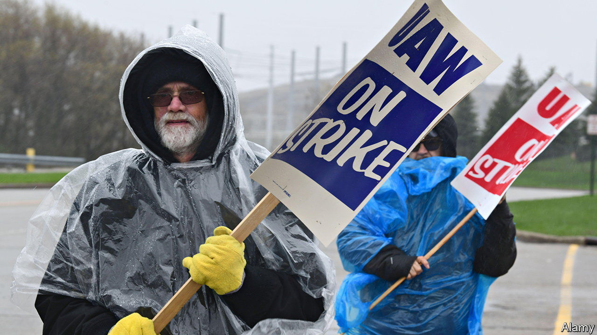

###### Curdling badgers

# Why Wisconsin has such odd politics 

##### The state shows the Democrats’ evolution from a party of union members to a party of college graduates 

 

> Oct 6th 2022 


On a strip of well-manicured lawn across from a Walmart supermarket on the edge of Racine, a modest city in the south-eastern corner of Wisconsin, a picture of old-school politics is playing out. A couple of dozen workers, dressed almost to a man in hoodies, jeans and baseball caps, hold up picket signs from the United Auto Workers (uaw) and call out to drivers who toot their horns in support. The group are part of several hundred workers from the CNH Industrial tractor factory just down the road, who have been on strike since May, demanding higher wages, more holiday time, and better health insurance. 

Through the crowd walks Mandela Barnes, Wisconsin’s 35-year-old lieutenant governor and the Democratic candidate for Senate. In a short stump speech noting his father’s long membership of the UAW, he denounces the firm (whose biggest shareholder is Exor, which also owns 43% of ). “Nobody builds a successful company without a strong union workforce,” he says. So far, however, the strike has not been especially successful. “They think they’ve got us over a barrel, and they really don’t,” says Michael Tenuta, who has worked at the firm for the past 11 years. The problem, ironically, is that factories nearby have been raising wages sharply. And so even as on paper, the workers’ position gets stronger, the union itself is getting weaker as its membership drifts away to better-paying jobs elsewhere.

That decline of union power is one of the reasons why Wisconsin has drifted away from Democrats in recent years. Twenty years ago, the state had significantly higher union membership than most of America; now it has significantly lower. Having been won comfortably by Barack Obama in 2008 and 2012, in 2016 it narrowly voted for Donald Trump, before swinging back marginally to Joe Biden in 2020.

And yet, even as the Democratic-leaning blue collar workforce shrinks, the Democratic vote is growing elsewhere. The following day, Mr Barnes spoke to a rather different crowd, mostly composed of smartly-dressed women, in a diner in Madison, the state capital. There, instead of stressing his father’s union membership, he instead talked about his mother. Before he was born, she had to terminate a complicated pregnancy. “I probably wouldn’t be here if my mother didn’t have the right to make choices about her health care,” he said, to cheers.

It is thanks to that growing vote that Mr Barnes, a black progressive with a long history of left-wing stances, still has a chance of unseating Ron Johnson, the Republican incumbent, in November. It also makes Wisconsin a rather unusual sort of state, that nonetheless illustrates well the transitioning Democratic voter base.


On the one hand, it retains a large blue-collar workforce—19% of the state’s GDP comes from manufacturing—who have been drifting more towards Republicans in recent years, making the state look more like Indiana or Ohio, which are now both solidly Republican. On the other hand, it also has a vast and growing progressive vote, particularly around Madison, the home of the largest University of Wisconsin campus. About 7% of the state’s adult population consists of students, who are well organised, and who this year especially, have been fired up by the Supreme Court’s decision to undo abortion rights (it helps that Wisconsin now has, by virtue of a law passed in 1849, one of the strictest bans on abortion in the country.)

This helps to explain why the Badger State is so weird. Essentially, when Democrats can motivate their electorate (which also includes the large black population of Milwaukee, and a surprising rural redoubt in the north-west) they can win. The state’s junior senator, Tammy Baldwin, is a lesbian progressive who wants America to introduce universal health care. But when they fail, Republicans, with their more unified base, can also get in their own radicals. Mr Johnson thinks global warming is fake, covid-19 vaccines are dangerous, and that the Trumpist riot on January 6th 2021 was no big deal. Only six other states have senators from both parties, and none where the two differ as starkly. Mr Johnson has campaigned almost exclusively on crime, painting Mr Barnes as a black radical who wants to defund the police (Mr Barnes denies that, but he has in the past tweeted vociferously attacking cops). 

Overall, polls suggest Mr Johnson is still the favourite. Lower turnout, a feature of off-year elections, favours Republicans. But not least thanks to that messy Democratic electorate, Wisconsin is a tricky place to survey. An unexpectedly large turnout could swing it the other way.

Indeed, in some ways the state has always been odd. In 1962, the state elected Gaylord Nelson, an early environmentalist and opponent of the Vietnam war. Two years later, in the presidential primaries, a large share of the very same electorate plumped for George Wallace, Alabama’s segregationist governor. Whatever Wisconsinites decide to do in November, it will be an indicator of both the opportunities the Democrats have and the challenges they face making the most of them.■

