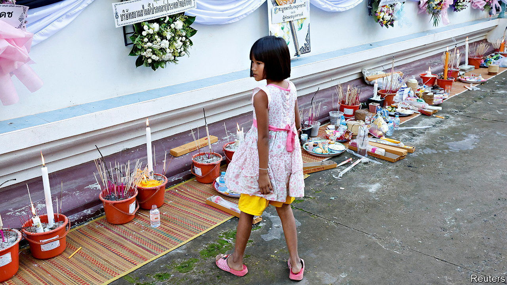

###### Tragedy after tragedy

# After a mass killing, Thailand’s government declares war on drugs 

##### The policy is unlikely to prevent another massacre 

 

> Oct 13th 2022 

Curled up asleep under a blanket in the corner of the nursery, a single toddler survived the horror. Nearly two dozen others did not. Panya Khamrab, a former police officer, hacked them to death with a machete on October 6th on his rampage through a child-care centre in Nong Bua Lam Phu in Thailand’s north-east. He also killed a dozen adults, many of them minders trying to protect the children. Then he went home, where he shot and killed his wife and her son before taking his own life. 

Since that horrible day Thailand, a country unaccustomed to such massacres, has been deep in thought about how to prevent another one. There has been much talk of restricting access to guns and improving the country’s shoddy mental-health provision. But the background to the tragedy has prompted the government to home in on drugs. 

Mr Khamrab had been dismissed from the police force in June for possession of (crazy pill), a drug containing methamphetamine and caffeine which delivers a blast of energy. He had confessed to having been addicted since high school, and had appeared in court on drug charges just before the massacre. Though tests showed he did not use drugs in his final days, years of  use can leave addicts with permanent psychosis and paranoia.

In the days following the massacre, police around the country lined up for photo ops next to piles of confiscated drugs. On October 12th Prayuth Chan-ocha, the prime minister, announced a series of “urgent measures” to tackle Thailand’s drugs problem. He instructed underlings to draw up a list of targets for a future crackdown by the end of the month. All government workers will face random drug testing. A minister crowed that all this was tantamount to a “war on drugs”.

In theory, fighting drug addiction in Thailand is a sensible idea. The country is awash in. Popular with partygoers in the 1990s, consumption moved to the working class as the cost of the drug dropped to a fraction of its former price, thanks to plentiful supplies from neighbouring Myanmar. Costing as little as 20 baht ($0.50) per pill, it has replaced locally grown opium as Thailand’s most popular narcotic. Around three-quarters of rehab patients in the country are addicted to it. 

Yet past experience does not bode well for the success of a new war against drugs. Though the recent liberalisation of cannabis laws has earned Bangkok the moniker of “Asia’s Amsterdam”, the country’s policy on other drugs remains far from liberal. It retains the death penalty for traffickers. Thai people locked up on drug charges make up a third of all prisoners (for any crime) in South-East Asia. Many of those whom the government deems addicts are carted off to rehabilitation centres run by the army that resemble boot camps more than clinics. A war on drugs launched by a previous government in 2003 under Pheu Thai, currently an opposition party, resulted in a wave of extrajudicial killings. Most of the 2,600 victims turned out to have no affiliation with the drug trade at all. Meanwhile,  remains ubiquitous. 

Before the massacre, there were signs of improvement. Last year a new narcotics code shifted the task of designing treatment for addicts to the public-health ministry. Rehab was to be made voluntary. But the interior ministry now says anyone caught with even a single  pill will be ordered to undergo at least a week of treatment. That is unlikely either to help addicts or to curb the spread of the drug.

As yet, the government’s campaign looks likely to be haphazard and ineffective rather than lethal like the one in 2003. Yet the opposition is as enthusiastic about a new war on drugs as the general public. With elections due next year, the government has every incentive to appear tough. Thais must hope that the response to one tragedy does not produce another. ■

