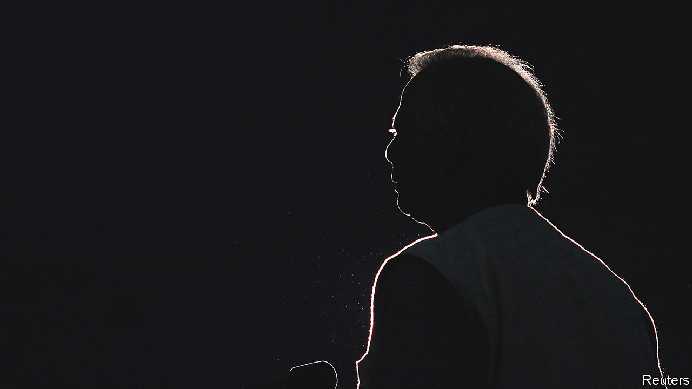

###### Reviled rival

# Bangladesh ramps up its persecution of Muhammad Yunus 

##### The campaign against the Nobel prizewinner is part of a wider crackdown 

 

> Oct 13th 2022 

When he became the first Bangladeshi to win the Nobel peace prize in 2006, Muhammad Yunus’s compatriots celebrated in the streets. The model of small, high-interest “microloans” to the poor that Mr Yunus pioneered in the 1980s had helped millions of people around the world lift themselves out of poverty. At home and abroad, the entrepreneur was a much-loved household name. 

At home, at least, that has changed. In today’s Bangladesh, Mr Yunus is less celebrated than hounded. This month he is due to be hauled before the country’s anti-corruption commission to face questions about his business. Along with a growing list of his associates, he risks being barred from leaving the country. 

The summons from the commission is the latest salvo in a decade-long campaign waged against Mr Yunus by Sheikh Hasina Wajed, Bangladesh’s prime minister. Her government claims that the aim is to root out corruption. But the probe into Mr Yunus is testament to rising authoritarianism in Bangladesh, which is increasingly circumscribing the space for the civil society the country once sought to nurture.

Mr Yunus’s fate hints at the changing status of social enterprises and non-governmental outfits in Bangladesh. Starting in the 1970s, successive governments keen to boost the country’s development embraced the work of organisations such as Mr Yunus’s Grameen Bank. But eventually they began to worry that such groups were amassing too much power of their own. 

Sheikh Hasina began probing Mr Yunus’s business more than a decade ago, when a Norwegian documentary alleged that he had diverted donations from Norway’s aid agency in the 1990s (an investigation by the Norwegian government found no evidence to support the claims). The prime minister may have worried that Mr Yunus, who had briefly dabbled in politics in 2007 during a period of military rule which Sheikh Hasina spent in prison, might turn into a viable political opponent. She accused him of avoiding taxes, lambasted him as a “bloodsucker of the poor” and launched a probe into Grameen Bank, Mr Yunus’s micro-lending business, as well as into his private finances.

As Sheikh Hasina tightened her grip on power, her suspicion of Mr Yunus deepened. In 2011 the government ousted Mr Yunus from Grameen on the basis that he had passed the compulsory retirement age of 60 (he was 70 at the time). Three years later it took over the bank’s board of directors entirely. In 2012 plans to build a bridge across Bangladesh’s Padma river were temporarily derailed when the World Bank withdrew its $1.2bn funding commitment, citing corruption by Bangladeshi officials. The prime minister later claimed that Mr Yunus, angry about his removal from Grameen, had lobbied America to persuade the World Bank to pull out of the project.

Sheikh Hasina doubled down on the claims earlier this year when the bridge, built with help from China, was at last opened: she told Bangladeshis that Mr Yunus should be “dipped in the river”. The government said it would investigate why the World Bank withdrew from the project. (Mr Yunus denies any involvement.) In July it launched a separate probe into accusations that Mr Yunus embezzled millions from workers at Grameen Telecom, a not-for-profit firm. (Grameen Telecom and Mr Yunus deny the allegations.) The probe has since been widened to include a slew of other companies and organisations using the Grameen name, including several based abroad.

The timing of the recent probes appears to be motivated by Sheikh Hasina’s worry about political competition ahead of an election next year. Since August the government has filed criminal charges against thousands of critics and members of the opposition, according to Human Rights Watch, a pressure group. Mr Yunus’s international standing makes him a potent threat to the prime minister’s power, reckons Asif Nazrul of Dhaka University: “If the international community looks for an alternative to this regime, Dr Yunus could be very important in that process—if he wants.” Mr Yunus has shown no such inclination since his abortive foray into politics back in 2007. But Sheikh Hasina seems unwilling to take the risk. ■

