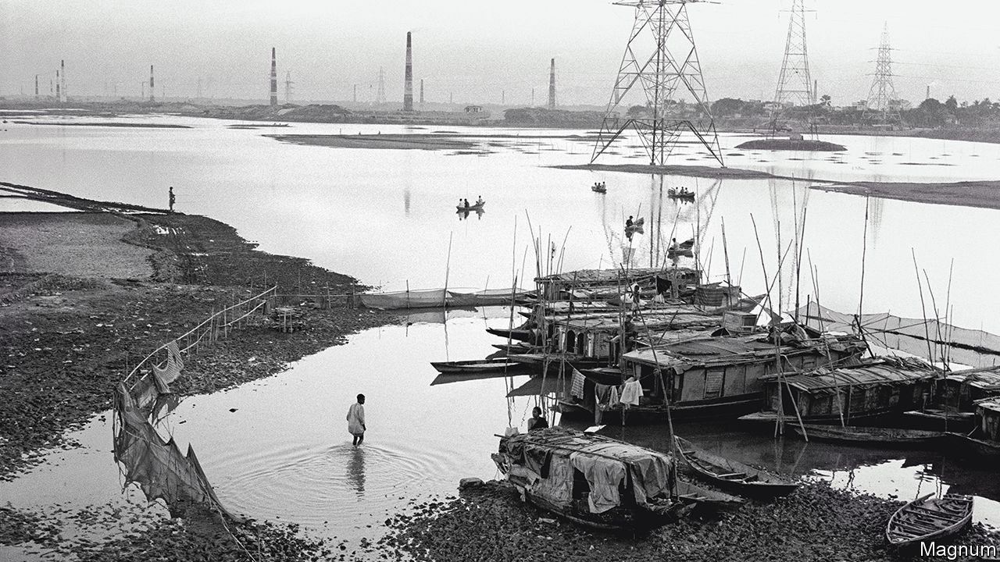
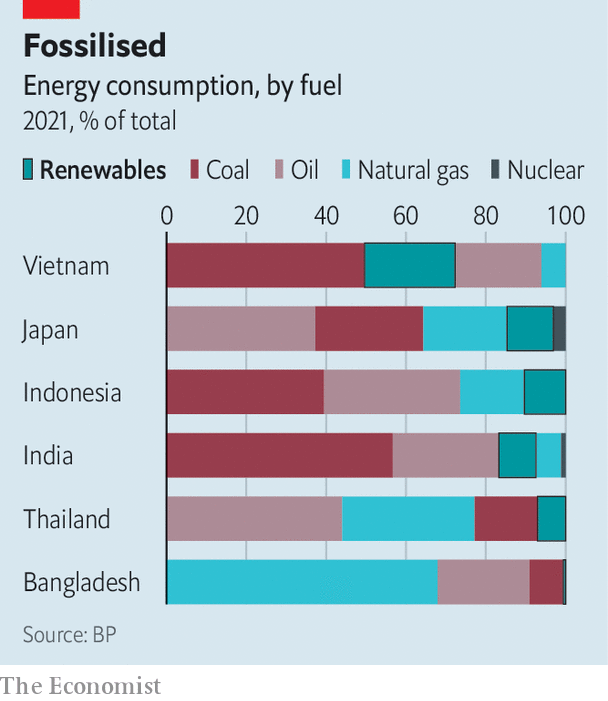

###### Transitional justice

# How to get Asia to net zero 

##### Weaning the continent off fossil fuels will be difficult and costly 

 

> Oct 13th 2022 

WHEN THE electricity cut out earlier this month in her flat in Dhaka, Sabina Yeasmin’s first thought was for her 17-month-old daughter. Bangladesh’s capital fills with dengue-carrying mosquitoes at this time of year. With no working fan or air conditioner, Ms Yeasmin could not put her toddler under the stifling mosquito net. A diesel shortage had put the backup generator out of commission. Even the price of candles had quadrupled. Ms Yeasmin could barely keep from crying.

The power cut that plunged her building into darkness on October 4th did the same to most of Bangladesh: four-fifths of the country’s 165m people lost electricity for seven hours. Factories ground to a halt. Pumps in tenements ceased to work, depriving residents of water. The grid failure was an extreme symptom of an electricity shortage caused by geopolitics. Over the past decade, Bangladesh has added a lot of generation capacity to keep up with its growing economy, mostly by building natural-gas plants that run on imported fuel. Russia’s invasion of Ukraine pushed up the price of gas. Gulf gas producers have prioritised exports to Europe, which pays top dollar, over those to poor countries. 

The problems faced by Bangladesh are a harbinger of things to come. Asian economies will be the world’s fastest-growing in the coming decade. Their demand for energy will surge. At the same time, countries in the region are already among the worst affected by climate change. The cost of floods, droughts and heatwaves will only rise. Meanwhile the availability of fossil fuels is subject to political vagaries. Asia’s future success and the well-being of its people, including the ability to keep the lights on, will depend on whether it can green its energy supply quickly enough.

 


It is a formidable challenge. Energy demand for the ten members of the Association of South-East Asian Nations (ASEAN) is projected to increase by about a third of the EU’s current total by 2050. India alone will probably need additional capacity equivalent to that of today’s EU by 2040. Ideally, much of that extra demand will be met by renewables. Yet fossil fuels continue to dominate the energy mix across the region (see chart). Their dominance is entrenched through subsidies or political favouritism. In India, Indonesia, Malaysia and the Philippines coal, the filthiest of fossil fuels, remains king. India, the world’s third-biggest emitter after China and America, has set a zero-carbon target date of 2070, two decades later than large Western economies. Some countries have yet to make a commitment at all. 

Breaking away from coal is a priority. Though existing coal plants will be needed to ensure the stability of grids across the region for years to come, the construction of new ones must slow. China, Japan and South Korea, which were funding 95% of such plants, have promised to stop financing them abroad, albeit with loopholes. New forms of financing should help retire old ones. India, Indonesia and Vietnam are lobbying to copy a model being tried in South Africa, where rich countries provide grants and cheap loans to shut coal generators. The Asian Development Bank wants to blend aid with private capital to refinance coal barons’ debts. The idea is to allow them to make their money ahead of schedule on the condition that they close their plants early, too.

As for new sources of energy, hopes are rising for “green” hydrogen—made from splitting water using renewable energy. Hydrogen is abundant, clean and energy-dense, but both the technology and the infrastructure are untested at scale. Plans are nevertheless ambitious. In the Pilbara region of Western Australia, a renewable-energy hub will, its boosters claim, cover 6,500 square kilometres (2,500 square miles) of desert and have capacity of 26GW a year, to be used to produce hydrogen and ammonia (a way to store hydrogen and make it portable) for export.

Given the uncertainties surrounding green hydrogen, for now solar energy and wind power will be the chief focus of Asia’s energy transition. Some dream big: one Australian company promises a A$30bn ($18.7bn) underwater power link sending electricity from solar panels in Australia’s Northern Territory to Singapore, using 12,600km (7,800 miles) of cables. If completed as promised, by 2029 it will supply one-sixth of the city-state’s electricity.

Most Asian renewable projects will be smaller in scale. Yet their cumulative impact could be significant. The Economist Intelligence Unit, a sister company of , forecasts that renewables will double their share in Asia’s electricity mix from 15% to 31% by 2031. India’s share will reach 21%, with 200GW of fresh, non-hydro renewable capacity. China is expected to add 700GW of such capacity. The head of China’s planning agency claims 450GW worth of wind projects will be built in the Gobi desert alone. 

For the transition to work, nuclear will need to be a part of the mix, as it already is in China. Bangladesh, India and South Korea are all adding nuclear capacity. Asia’s large-scale manufacturing of green-energy products will help. Malaysia, Vietnam and South Korea are the world’s biggest makers of solar modules after China. Indonesia is the biggest producer of nickel, a vital input for batteries. The country’s bid to modernise its nickel processing and to encourage battery-makers from South Korea and elsewhere to set up is a notable success. Tim Gould, chief economist at the International Energy Agency, predicts that nickel will earn more for Indonesia than coal ever did.

Yet not all projects will be commercially viable. Weaning Asia off carbon will require some $26trn-37trn in investment between now and 2050, estimates the Asia Investor Group on Climate Change, a club of business types. Grants and subsidies from rich countries will be needed to spur private investment. India’s prime minister, Narendra Modi, has named his price for agreeing to net zero: $1trn in funding by 2030 alone. That is ten times the annual amount promised to all poor countries under the Paris agreement of 2015, little of which has so far been disbursed. When countries meet in Egypt next month at the UN’s annual climate summit, money will be at the heart of discussions. Asia’s low-carbon future hangs on the outcome. ■


