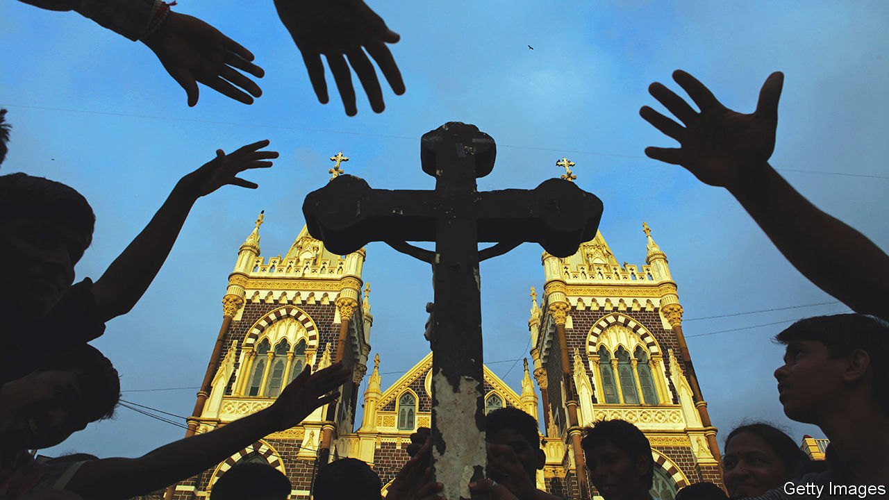

###### Pilgrims’ pleas

# What a church in Mumbai reveals about Indians’ desires 

##### As the country grows richer, its people dream bigger 

 

> Oct 13th 2022 

THE SUPPLICANT enters the Basilica of Our Lady of the Mount and walks to the sanctuary. On the floor, far below the feet of the golden-robed Madonna and the baby Jesus, he finds a row of blue plastic boxes. In one of them he carefully places a small piece of wax shaped to look like a pair of human lungs. Stepping back he bows his head, joins his hands and utters a silent prayer. 

Every day hundreds of people like him climb to the top of the hill of Mount Mary in the leafy Mumbai suburb of Bandra to seek the Virgin’s favour. During the Feast of the Nativity, which is celebrated with a sprawling fair for eight days each September, up to 100,000 pilgrims visit daily. Whenever they come they find, just outside the church, stalls selling votive offerings whose waxy forms provide an insight into the desires of the people of India. 

The most common items on display are houses: cute cottages with slanting roofs and gaping front doors. Babies, little boys and girls and nuclear families are represented in abundance. There are ships, motorcycles, cars and planes. Trays overflow with arms, legs, hearts, heads, eyes, ears and other organs. “All body parts are available,” says Augustine Fernandes, who runs one stall. 

The current, imposing Indo-gothic structure of the basilica dates from 1904, but Christians have worshipped at this spot since at least the 16th century. Though Catholic, the church is popular with supplicants of all faiths. In 1882 the “Gazetteer of the Bombay Presidency”, a colonial compendium, noted that Hindus, Muslims and Parsis made votive offerings here. A history of the church from 1964 observed that during the nativity feast pilgrims offered “the waxen images of parts of the human body—hand, ear or eye, according to the favour they want granted”. 

As India’s economy has grown more sophisticated over the past decade, so have the pleas of pilgrims. Vendors of offerings adapted to keep up with changing tastes. Body parts and simple houses have been joined by more glamorous two-floor homes in bright colours, daubed with the words “dream villa”, “lovely home” or “bungalow”. 

In addition, there are flat-roofed factories, hotels, schools, colleges, clinics, and even a “bar and restaurant”. There are blocky replicas of Indian currency. Some offerings are simply sheets of wax screen-printed with photos of visas to Western countries, or words like “business”, “career”, “success”, “cricketer” and “movie star”—but also “forgive”, “thank you” and “peace”. Prices start at 30 rupees (35 cents) for simpler shapes. The fanciest villas go for 200 rupees. 

High-quality jobs may be scarce and real houses in Mumbai eye-wateringly expensive. But on Mount Mary, everyone can afford to dream. 

