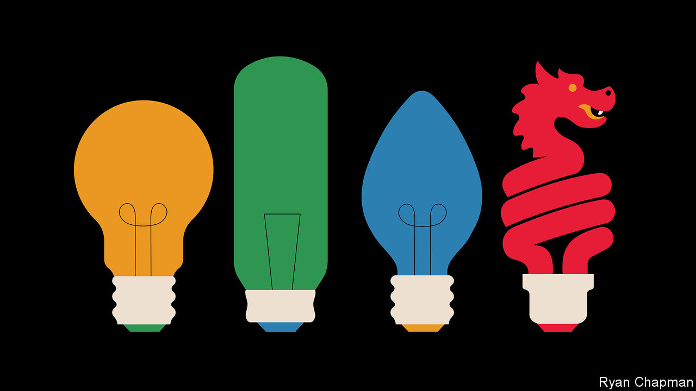
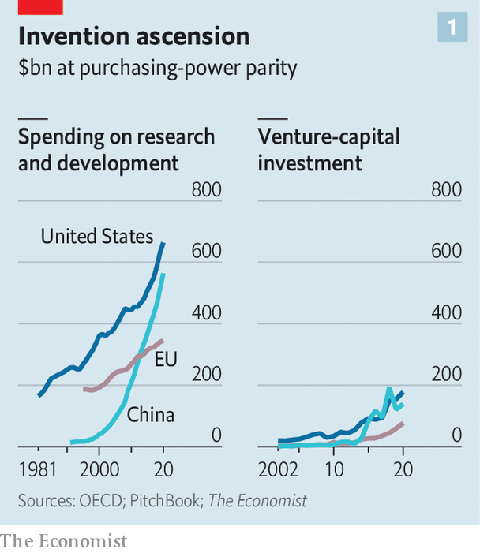
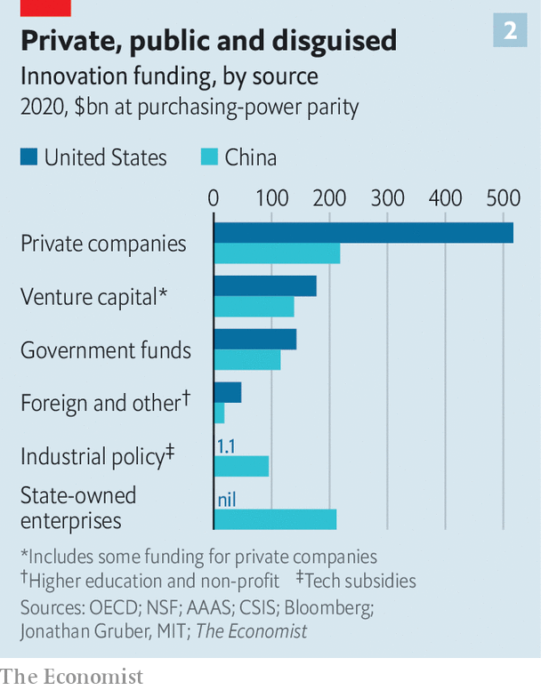
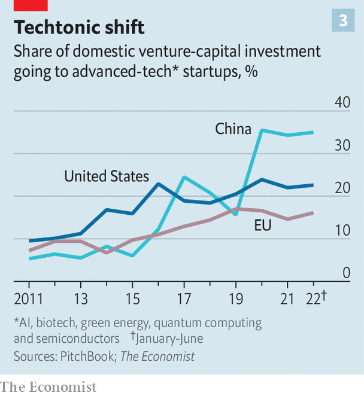

###### Mothering invention

# China and the West are in a race to foster innovation 

##### Which will have more success? 

 

> Oct 13th 2022 

“China’s government is planning on winning the ai race, winning future wars and winning the future,” warned Todd Young, an American senator, in July. “At stake” in the West’s technological competition with China, echoed a report from American officials and businessmen in September, “is the future of free societies, open markets, democratic government, and a world order rooted in freedom not coercion.” This week the head of a British intelligence agency joined the chorus, urging “deep investments” in new technology to counter China’s growing prowess. 

The anxiety is easy to understand. In 2008 China spent a third as much as America did on research and development (R&amp;D) and about half as much as Europe, after adjusting for differences in the cost of living. By 2014 it had surpassed Europe. By 2020 its spending was 85% of America’s. 

The fruits of this investment are becoming apparent: in August a Japanese research institute calculated that China now produces more of the world’s most highly cited academic research than America does. Since 2015 more patents have been issued in China than in America. China’s output of a basket of sophisticated goods including information technology, pharmaceuticals and electronics is expected to surpass America’s this year, according to a report published by the Information Technology and Innovation Foundation, an American think-tank. “China has become a serious competitor in the foundational technologies of the 21st century,” concluded another report last year from the Belfer Centre at Harvard University.

Small wonder, then, that Western countries are embarking on a frantic effort to retain or regain their technological edge. On October 7th America issued fierce new restrictions on exports to China of advanced semiconductors and related equipment. The new rules could be as crippling to the Chinese chip industry as previous American sanctions were to Huawei, a Chinese telecoms firm, says Greg Allen, who used to head the artificial-intelligence (AI) unit at America’s Department of Defence. “It’s a total clamp down, trying to cut off every head of the hydra of China’s chip industry.” 

As well as trying to disrupt the flow of technology abroad, America’s government is investing more in innovation. In August Congress approved $370bn of spending on green energy, including lots of money for research. The month before it passed the Chips and Science Act, which provides $52bn over five years for the semiconductor industry, some of which will incentivise private R&amp;D.

The act also revamps the National Science Foundation (NSF) to put more emphasis on applied science and technology and potentially doubles its funding. Germany, Japan and South Korea are making multi-billion-dollar investments in computer chips. Last year Britain announced the $1bn Advanced Research and Invention Agency (ARIA) to supercharge high-risk, high-reward science.

The result of all this is a global boom in investment in innovation. In 2020 the world’s spending on R&amp;D exceeded $2.1trn, over 2.5% of global GDP, a record. The binge has three notable features. The first is the heavy involvement of governments, which are unwilling to leave investment to capital markets and are instead both funding R&amp;D and subsidising production of certain high-tech goods. Both China and the West explicitly link such spending to geopolitical competition. “Technological innovation has become the main battlefield of the international strategic game,” said China’s president, Xi Jinping, in a speech last year to Chinese scientists. “We’re in a multi-generation era-defining competition against the ccp [Chinese Communist Party],” rhymes Mr Young, one of the sponsors of the Chips Act. 

The second feature of the new era is experimentation with different types of funding that couple industrial policy with efforts to promote risk-taking or private-sector rigour. America and Britain, for instance, are reviving research missions akin to America’s cold-war quest to put a man on the Moon. China, meanwhile, is using “guidance funds”, in which the state takes a stake alongside private investors, to steer money to startups in AI and chips, among other advanced technologies.

Third, governments are trying to ensure their country captures more of the benefits of innovation. That can mean both preventing exports of some goods and using industrial policy to promote domestic production. 

But there remain big differences in approach between China and the West—most notably the far more muscular role the state still plays in directing innovation in China to favoured industries. The West, in contrast, relies on a more diffuse network of universities, non-profits and private businesses that have more freedom to set their own priorities. There is little doubt that China’s system has helped it catch up with the West in some existing technologies, but analysts question whether it will be as good at generating future breakthroughs. The answer will determine the outcome of the global battle for technological dominion.

America’s government invested lavishly in innovation during the cold war, through such organisations as the NSF and the Defence Advanced Research Projects Agency (DARPA). Its spending peaked at 1.86% of GDP in 1964. But after the fall of the Berlin Wall federal spending on R&amp;D fell well below 1% of gDP. Private investment, meanwhile, doubled from 1% of GDP in 1979 to 2% in 2017. Giant tech firms such as Google, Facebook (now Meta), Amazon and Apple sprouted in America. China spawned similar titans, such as Alibaba, Baidu, JD.com and Tencent. 

But on both sides of the Pacific the age of free-flowing private capital left many disappointed. The Communist Party has called the spread of big consumer-tech firms a “disorderly expansion of capital”. It has obliged China’s internet giants to follow its priorities, blocking share sales and issuing abrupt regulations to cow wayward firms. It seems to want less video-gaming and online commerce and more AI, chips and green tech. 

Many Americans have similar misgivings. Peter Thiel, a fabled investor, has argued that there has been too much investment in “bits” (software and analytics) and not enough in “atoms” (hardware and manufacturing). “With chips we were caught behind the eight ball,” says Eddie Bernice Johnson, a Democrat from Texas who chairs the committee that drafted the Chips Act, “It was a national security imperative.” Mr Young of Indiana agrees: “The totally free-market theories of Friedman, Hayek—they don’t make sense when you’re facing an existential threat that plays with market forces.”

Buying breakthroughs

To allow a proper comparison of the sums devoted to innovation on the two sides of the Pacific,  has totted up corporate spending on R&amp;D, venture-capital investment, direct government funding and, for advanced technologies, implicit funding through subsidies, and subtracted the overlap among these categories. This calculation confirms that America maintains a slight edge (see chart 1), spending about $800bn or 3.8% of GDP in 2020. That compares to about $660bn in China after adjusting for differences in the cost of living, or 2.7% of gDP.

 


But China’s spending is growing far quicker than the West’s. China’s investments are also more co-ordinated. Although its government and America’s both directly dispense only about 15-20% of their country’s expenditure on innovation, state-owned enterprises and industrial subsidies massively increase the influence of the state in China (see chart 2). Different arms of government have also set up nearly 2,000 “guidance funds” in which the state invests alongside private capital. The Chinese government began investing in semiconductors in this way as early as 2014, with a $20bn “Big Fund”. The second iteration of the fund has raised nearly $30bn. The state is now China’s biggest investor in venture-capital and private equity, contributing over 30% of the total. 

 


All this allows the government to steer money towards its goals, in what is called or the “whole-of-the-nation system”. Whereas in America the share of vc devoted to strategic industries as defined by the Belfer Centre report (AI, semiconductors, biotech, energy and quantum computing) has gradually grown from 10% to 20% over the past decade, in China it soared from 15% in 2019 to 35% in 2020 in line with government directives (see chart 3).

 


Yutao Sun and Cong Cao, two Chinese academics, argued in  last year that  had helped develop “a few state-led sectors with clear goals, such as high-speed rail and large passenger aircraft”. It was less effective, however, in “areas where there is no leader to follow”. Only 6% of China’s R&amp;D spending is on basic research, compared with 17% of America’s.

What is more,  can also lead to misallocation of funds. A paper published in the journal in July suggests that Chinese spending on R&amp;D spurs less growth in productivity than that of neighbouring Taiwan. That is in part because the state often supports SOEs, even if they are less productive. Several studies suggest that corporate R&amp;D in China is about half as productive as in America (although they do not focus exclusively on advanced technology).

America’s expenditure, meanwhile, is much more diffuse. Private businesses account for about 60%, venture capital for nearly 20% and foundations, charities and universities more than 5%. In a recent presentation, Pierre Azoulay, a professor at mit, notes that the “Cambrian explosion of philanthropic funders” is a “silver lining” compared with the perceived sclerosis in government funding. From 2010 to 2019, research funding from non-profits nearly doubled, from $12bn to $22bn. “Our system is unique because its more distributed and bottom-up; not top-down,” says Maria Cantwell, another senator.

America may also be more daring in its investments. The Institute for Progress (IFP), an American think-tank, is helping government agencies distribute grants more effectively, says Caleb Watney, a co-founder. Erwin Gianchandani of the nsf cites “golden tickets” as an example. Rather than the standard consensus-based process to allocate funding, a single reviewer can champion a project.

Michael Lauer, head of extramural research at America’s National Institutes of Health (NIH), lists a handful of new programs where labs receive funding with far fewer strings attached than normal. The Other Transactions Authorities, a recent NIH program that quickly funds unconventional projects, disbursed over $2bn in 2020 and 2021. 

Hunting for lightbulbs

America is also creating more “moonshot” programs in an effort to replicate the success of dARPA. Last year it launched the $1bn Advanced Research Projects Agency for Health (ARPA-H) to focus on ambitious biomedical research. The total amount of funding in this category increased from about $4bn in 2021 to nearly $6bn in 2022. Tom Kalil of Schmidt Futures, another organisation that aims to shape policy on innovation, says this heralds a shift towards more risk-taking. China lacks any equivalent funding agencies, notes Mr Cao of Nottingham University China.

It is possible to exaggerate the strengths of both the American and Chinese systems. For all the talk of moonshots, notes a former White House official, nih was still slow to fund research on covid-19 at the beginning of the pandemic. And researchers are still often buried in paperwork. The new funding does little to address the administrative burden in the current system—researchers lose about 40% of their time to that, notes Tony Mills of the American Enterprise Institute, another think-tank. By the same token, although thousands of new firms have sprung up in China in favoured industries, such as AI and semiconductors, most of them do not seem to have achieved much.

Neither system has a monopoly on results. According to a report published in September by the Special Competitive Studies Project, a research group organised by Eric Schmidt, a former ceo of Google (and a former member of the board of ), China is dominant in some industries, such as 5G telecoms. It makes some 80% of the world’s lithium batteries. But the West is ahead on biotech, cloud computing and AI. It has been the source of most fundamental advances in these fields, such as crispr (a gene-editing technology) and the transformer architecture that underpins many big AI models.

Although few advanced computer chips are made in America, American firms tend to design them. asML, a Dutch manufacturer of chipmaking equipment, has a monopoly in the advanced lithography needed to make the fanciest ones. And the Chips Act is prompting Intel and tsMC, two of the biggest chipmaking firms, to build new semiconductor fabs in America. Intel is also set to spend nearly $20bn on new chip factories in Germany. 

China has built first-rate AI models by throwing money at researchers and firms. Wu Dao, its version of GPT-3, an American AI model that can write like a human, uses ten times more parameters to train itself. Yet the chips used for much of this sort of machine-learning, GPUs, were originally developed to generate graphics for video games—one of the industries on which the Chinese government has cracked down most ferociously. By the same token, it was not until September that a Chinese firm developed a vaccine against covid-19 that is as effective as Western ones—a recent high-stakes test of its capacity to innovate. “China does best in products where manufacturing is complex but the science is mature, for example in batteries,” says Dan Wang, an analyst at Gavekal Dragonomics, a research group. 

But China is trying to mend some of the failings of its system. It boosted funding for basic research by 16% last year, in an attempt to foster more breakthrough discoveries. It is also trying to reduce centralisation. In July the party announced new rules to increase scientists’ autonomy. “There is evidence that China has recognised the limits of using a blunt metric to evaluate scientists,” adds Mr Wang. “Thus universities are starting to move towards the peer-review system of the West.”

There are some mistakes, however, from which China shows little sign of retreating. Mr Xi’s decision to rein in the tech industry contributed to an 11% contraction in venture-capital investment from the first three quarters of 2019 to the same period in 2022. In America vc investment grew by 70% in that time. China’s stubborn zero-covid policy, meanwhile, is driving foreign capital and talent out of the country. A survey by the German Chamber of Commerce in May found that nearly a third of foreign workers plan to leave. 

Such talent is crucial to competitiveness. In the past China benefited from both foreign investment and large cohorts of “sea turtles”, students and researchers who work or study abroad and later return. The share of Chinese students studying abroad who eventually returned home rose from 25% in 2004 to 65% in 2019. And from 2015 to 2019, the number of academic papers published involving co-operation between American and Chinese researchers grew by over 10% a year, according to . 

Yet in 2020 this growth in academic collaboration between the two countries abruptly stalled. Less than half as many Chinese received visas to study abroad in the first half of 2022 as in the first half of 2019. This pulling apart is bad for the world, but China may suffer more. It does not have as diverse a pool of researchers as the West. According to data from MacroPolo, a think-tank, although 60% of the world’s best AI researchers work in America, over two-thirds of them are foreign (and over a quarter of them Chinese). In contrast, China draws overwhelmingly on domestic talent: almost all its best ai researchers are Chinese, and 70% of them have studied only in China. 

America is not only open to foreign expertise, it also benefits from a big network of alliances with other technologically advanced countries. Collectively, America, Britain, France, Germany, Japan and South Korea spend over twice as much on R&amp;D as China. China, by contrast, has few allies, and none that are powerhouses of research and innovation. 

Bulbs blown

American politicians do not seem to understand the advantage conferred by their country’s openness, however. The original draft of the Chips bill included a provision to boost skilled immigration. Although some politicians, including Mr Young, gave it cautious support, it had to be removed to ensure the support of more Republicans, in particular. (America’s allies, happily, are doing better. Britain has devised a scheme to provide visas to graduates of top universities. Australia and Canada, already home to lots of immigrants, are increasing immigration further.)

Whatever the limits to America’s openness, however, China’s growing isolation—both self-imposed and enforced by restrictions like America’s new rules on tech exports—is far more severe. After several years when its technological rise seemed unstoppable, the outlook suddenly seems much less clear. In the coming days Mr Xi will preside over China’s 20th Party Congress. Across the Pacific, America’s Congress will be debating how much money to devote to the new research initiatives at agencies like the Nsf. You can be sure each will be on the other’s mind. ■

