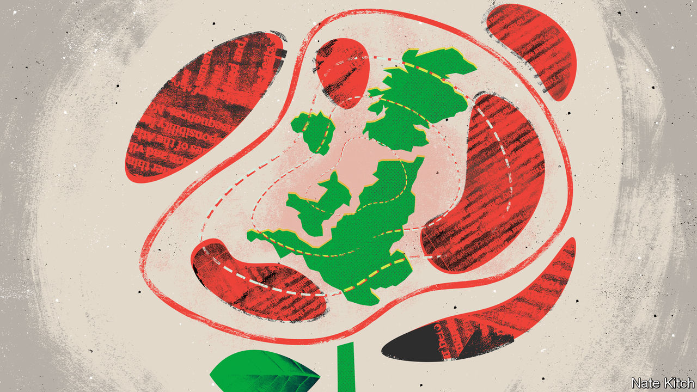

###### Bagehot

# A thaw in Britain’s frozen union 

##### Labour’s surge and the Tories’ troubles could refresh the United Kingdom 

 

> Oct 13th 2022 

Outsiders watching Britain in recent years have toyed with a gloomy calculation. Which would survive longer: the ancient Conservative and Unionist Party, or the even older United Kingdom that it governs? The Tories love the union, but the shocks of their 12 years in office—the Scottish independence referendum in 2014, the Brexit referendum in 2016 and Boris Johnson’s scandal-prone premiership—stirred nationalist sentiments. It was an unforgiving dynamic: the more Conservative dominance in England seemed assured, the more likely it seemed Britain would fracture. The party or the country: something had to give.

It has. The Tories’ popularity has crumbled. Polls point to a landslide majority for Labour if an election were held tomorrow. A new era in Britain’s territorial politics is opening up, and the union has a reprieve and a chance of renewal. 

The fissures are deep and wide. Half of Scotland’s voters would choose independence. The margin between those supporting divorce and the union in Wales has gradually narrowed. Sinn Féin, whose driving purpose is Irish reunification, has topped the polls in both Northern Ireland and the Republic. Mr Johnson’s response to a rising separatist tide was a doctrine of muscular unionism, which asserted Westminster’s supremacy over the devolved parliaments created in the 1990s, waved the Union Flag and flexed the Treasury’s muscles. Above all, a second Scottish independence referendum would be resisted (this week the Supreme Court in London heard arguments on whether the Scottish government can hold another, advisory referendum on the issue).

The outcome was not collapse but stalemate. The union, which ought to be a living, evolving thing, has become frozen and brittle. But with Labour’s surge, the ice is shifting.

In Scotland the referendum of 2014 polarised Labour’s historic electorate. The Scottish National Party (SNP) told working-class nationalists that only independence could rid them of Tory rule; Tories told working-class unionists that only they could halt another referendum. As the constitution dominated elections, voters sought the strongest bulwark against their opponents. Labour’s weakness begat weakness. Now on the rise nationally, Labour hopes that this spiral is moving into reverse, with the party emerging both as the most plausible defender of the union in Scotland and the fastest way to rid Scotland of Tory governments. “The view on the doorstep is, ‘I’m for independence, but let’s just get rid of these bastards’,” says one hopeful figure.

This complicates the SNP’s strategy. At her party’s conference in Aberdeen this week, Nicola Sturgeon, Scotland’s first minister, turned her guns on Labour’s leader, Sir Keir Starmer, whose mild manners and social-democratic credentials make him a trickier target than a Tory. If Sir Keir can win a majority, he too will be able to resist demands for a second referendum. There are signs the SNP is settling in for a long game, and pivoting from confrontation with Westminster to a show of co-operation—part of a gradualist tradition of enlarging Scotland’s powers, decade by decade, as a stepping-stone to separation.

Powerless in Scotland, Labour has been irrelevant in Northern Ireland. Sir Tony Blair helped forge the Good Friday Agreement in 1998, which stemmed decades of bloodshed. But under Jeremy Corbyn, Sir Keir’s predecessor, who supported Irish Republicanism much as Bangkok taxi-drivers support Manchester United—enthusiastically, but from afar—it had nothing to offer. 

A shift is detectable there, too. Republicans would overwhelmingly prefer to see Sir Keir in Downing Street. Their disdain for the Tories is centuries deep, and they are closer economically. Yet he is explicitly pro-union, declaring he would campaign for Northern Ireland to vote to stay British were a referendum ever held. A senior figure in the Democratic Unionist Party (the biggest unionist group) says that the party believes a Labour government would boost the union, since the closer EU deal Sir Keir hopes to strike would remove many of the Irish Sea checks created by Mr Johnson’s reviled Brexit deal.

Sir Keir will soon receive a blueprint for a new United Kingdom he commissioned from Gordon Brown, a former prime minister. It will reflect a view in Labour that just piling more powers onto devolved administrations will not heal an unhappy union. The bigger problem is England. It is far larger than its peers, it is governed from Westminster, most of its people voted for Brexit, and a rising share consider themselves more English than British and would be quite happy if Ms Sturgeon got her divorce. Mr Brown’s remedy is more muscular English devolution, empowering mayors and cities, and a new architecture to force the nations to work together on equal terms—a sort of European Council for Britain.

I’m afraid there is no money

Labour MPs are giddy, savouring stratospheric polling figures last seen in the mid-1990s. But for the union, the clock cannot be turned back to the carefree optimism of that time. One reason is money. The compromises of devolution were greased with cash. In the 2000s, when relations were good, identifiable spending per person (which includes things like welfare, but excludes items such as defence) in Scotland, Wales and Northern Ireland grew by 3.7% per year in real terms. In the lean and fractious 2010s it shrank by 0.3% per year. Sir Keir has warned his party that if it wins, there will be little money to chuck around. 

The other is identity. If Labour is lucky, it may shave off enough support for Scottish independence to box the SNP in. But Scots’ views on the constitution have become remarkably robust and impervious to external shocks, notes Robert Johns of the University of Essex. The risk for a Labour government is becoming marooned: offering sensible but technocratic ideas that fail to satisfy new, powerful identities. The union will outlive this Conservative government. But so will the scars of the past decade. ■


