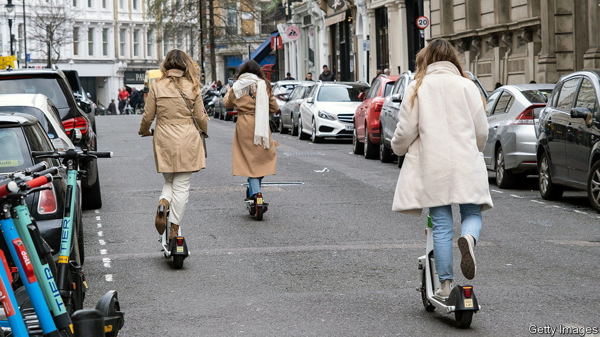

###### Scoot first

# A trial of e-scooters in Britain has encouraging results 

##### But the public remains to be convinced 

 

> Oct 11th 2022 

On England’s south coast, Michael Dewey is about to hop onto a coral-coloured e-scooter. Mr Dewey usually drives to and from Portsmouth Harbour, where he works in the docks, but today he left his car in the garage. It will cost him £1.90 ($2.10) to rent the scooter for the four-mile (6km) journey home. He reckons a taxi fare would be four times that. 

“E” stands for “electric”, but in Britain it could also mean “experimental”. Since 2020 the Department for Transport has allowed 31 English local authorities to carry out e-scooter rental trials. The scheme was fast-tracked during the pandemic, when lockdowns restricted public transport. Its primary aim is to help the government decide whether to legalise e-scooters as a way of reducing emissions (private scooters are illegal unless ridden on private land, though some ride them regardless). Lynne Stagg, a member of Portsmouth council, which is running a trial, says the city has “a major congestion problem” and poor air quality. “We wanted to get as many people as possible out of their cars.”

Not everyone is keen. In surveys, two-thirds of non-users in Portsmouth say they want them banned. One concern is safety. Across the country stories abound of drug dealers scooting to drop-offs to evade the police, and of the deaf, the blind and the old being mown down by these quiet machines. In 2021 the total number of reported e-scooter crashes tripled, to 1,352. No pedestrians died, but ten riders did. 

It is tricky to read much into such numbers, which blend private and rental scooters. PACTS, a charity, estimates, from the crashes for which data are available, that 82% involve illegal machines. The government has not yet released statistics specific to the trials, but other figures suggest e-scooters are safer than the alternatives. According to the Royal Society for the Prevention of Accidents, another charity, e-scooters are involved in 0.7 collisions per 1m miles, compared with 3.3 for bicycles and 5.9 for motorbikes. 

Transport infrastructure makes a difference to safety. To the ire of many motorists, rented e-scooters may be driven on the road (but not on motorways) and in special cycle lanes. A recent study of six European countries found that traffic accidents reported to the police increased by an average of 8.2% after rented e-scooters were introduced, but did not rise in towns with good cycle lanes. 

Another reason given to oppose e-scooters is that they may not be as green as people think. Rides typically replace short journeys on foot or by bike, rather than by car, says Christian Brand of the University of Oxford. A French study found that, because of an e-scooter’s short life, the total emissions from its use can be six times those from taking the metro. In Portsmouth, however, the council says that 34% of users responding to its surveys say they would otherwise have used a car for their most recent e-scooter journey. Only 15% walk or cycle less than they did before. 

One of the most notable things about the English scheme is that it allows for local experimentation, notes Lorna Stevenson of the University of Westminster, who is completing a PhD on the trials. In consultation with councils, e-scooter companies constantly refine their “geofencing”, which uses the satellite-based global positioning system to map “no-go” areas, where the scooters shut down, and to automatically enforce speed restrictions. In Oxford riders cannot scoot by the river, presumably to stop students dumping the machines during drunken nights out. 

Public feedback also informs the schemes. Surveys consistently show a demand for more parking bays, as well as concerns about safety. Britain has more mandatory parking bays than other European countries, notes Jim Hubbard of Voi, the Swedish firm that operates the fleets in Portsmouth and Oxford. 

If interest is a measure of success, the trials are going well. So far 29 of the 31 councils have chosen to continue them. The trial period has been extended to 2024. But its most tangible result may come sooner, if private e-scooters are legalised, which could happen in a transport bill expected next year. Then “e” might also stand for “everywhere”. ■

