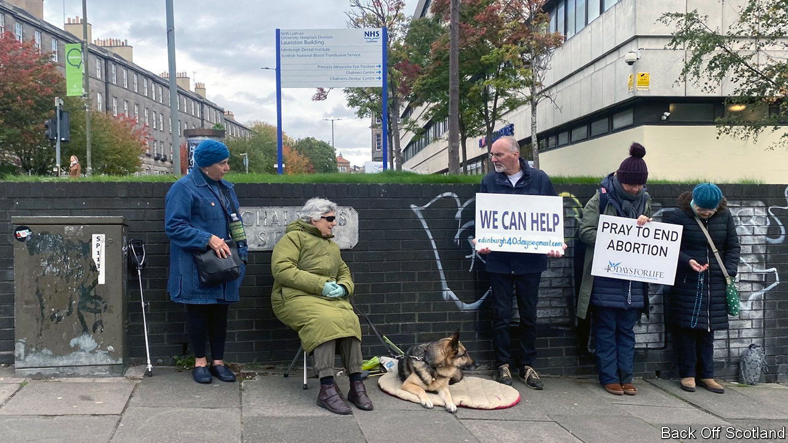

###### Free speech

# American pro-life activists make their presence felt in Britain 

##### Scotland may introduce laws to keep protesters away from abortion providers 

 

> Oct 13th 2022 

WHEN DOES quiet(ish) prayer become intolerable protest? When it takes place outside abortion clinics, thus upsetting patients and medical staff, according to Nicola Sturgeon, Scotland’s first minister. The presence of hard-praying anti-abortionists from 40 Days for Life, a group based in Texas, outside Scottish hospitals and clinics has prompted Ms Sturgeon to back legislation that would allow no-go “buffer zones” around abortion providers. 

Introduced into England in 2010 and Scotland in 2017, 40 Days for Life holds 40-day “vigils” twice a year in more than a dozen places across Britain. The latest began on September 28th. Though the group says it discourages volunteers (most of whom are locals) from using graphic images of aborted fetuses and yelling, it has attracted some protesters who do. Shawn Carney, its co-founder and chief executive, says that doesn’t worry him. “Our main concern is the bigotry of the government,” he says. “Sturgeon…doesn’t like us, so she wants to get rid of us.” If the buffer law is passed, he says: “We will sue.”

Mr Carney’s group is one of several American pro-life organisations that are stepping up their activities in Britain. CBR UK, an affiliate of the Centre for Bio-Ethical Reform, a Californian anti-abortion outfit that disseminates particularly gruesome images, says its British network of “volunteer educators”, who set up street displays, has grown from 50 a decade ago to 500. Dave Brennan, head of the group’s church ministry, says it wants to double that within a year. The group is currently focusing on universities. 

Stanton Health Care, from Idaho, which operates “clinics” that try to dissuade women from terminating pregnancies, opened in Belfast in 2015 and will do so in Edinburgh this year. British pro-lifers hope that they can learn from the long and successful campaign to overturn , the American Supreme Court ruling of 1973 that enshrined the right to an abortion. American pro-lifers have also played prominent roles in campaigns to keep children on life support alive against the wishes of their doctors and the courts.

Such activists are often supported in their efforts by ADF UK, the British chapter of Alliance Defending Freedom, an American conservative legal-advocacy group, which opened in 2015. With Christian Concern, a British association of similarly crusading lawyers, it set up the Wilberforce Academy, which trains young people for “Christ-centred leadership”. 

Freedom of speech and of religious expression—issues that have been more prominent in America than Britain—are at the heart of ADF UK’s battles. Its lawyers represented a midwifery student at Nottingham University who faced an investigation over her public opposition to abortion. In 2020 the university apologised and settled. The following year ADF UK helped a Catholic priest from Glasgow successfully challenge the government’s attempt to close churches during lockdown.

Future campaigns seem likely to focus on the push to introduce abortion buffer zones. In America ADF sued to strike down a law allowing such zones in Massachusetts and won. Though the British Pregnancy Advisory Service says protests outside clinics are becoming more common, a policy on buffer zones across England and Wales seems unlikely soon. (In 2018 Sajid Javid, then the home secretary, said there was little need for one.) Yet several councils have established their own zones or are considering doing so. The Supreme Court has been asked to consider whether a prospective law allowing buffer zones in Northern Ireland would disproportionately affect the right to protest.

Claims that buffer zones criminalise free speech have begun to influence anti-abortionists’ arguments more widely, according to Lucy Grieve, co-founder of Back Off Scotland. She set up the group in 2020 to oppose protests in Edinburgh, where she is a student. She has noticed a shift, she says, away from moral objections to abortion to talk about free speech. That is good news for Mr Carney of 40 Days for Life. Even pro-choice Britons agree with him about its importance, he says. “Freedom of speech is being butchered in Scotland. They can ban us…but they can’t do that and call themselves a free democracy.” ■

