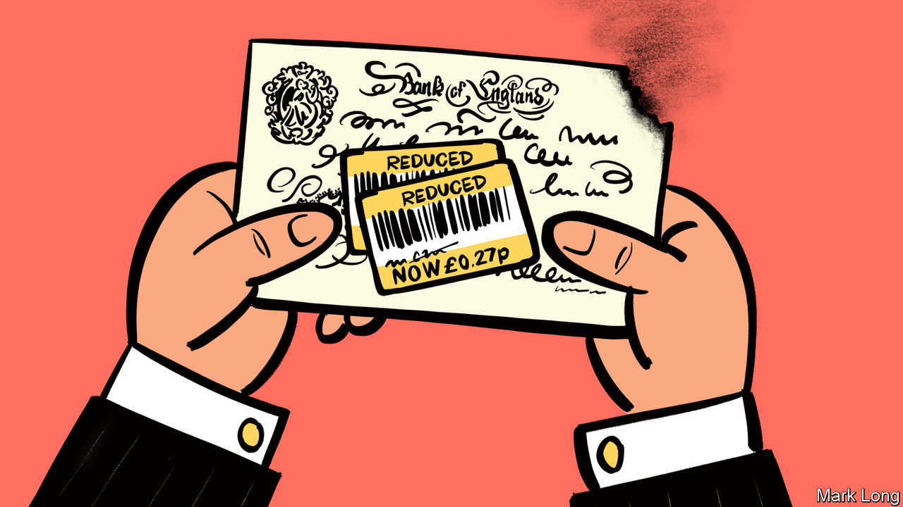
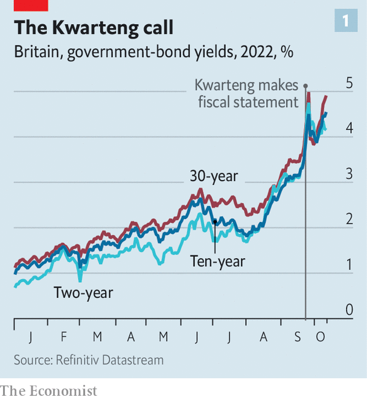
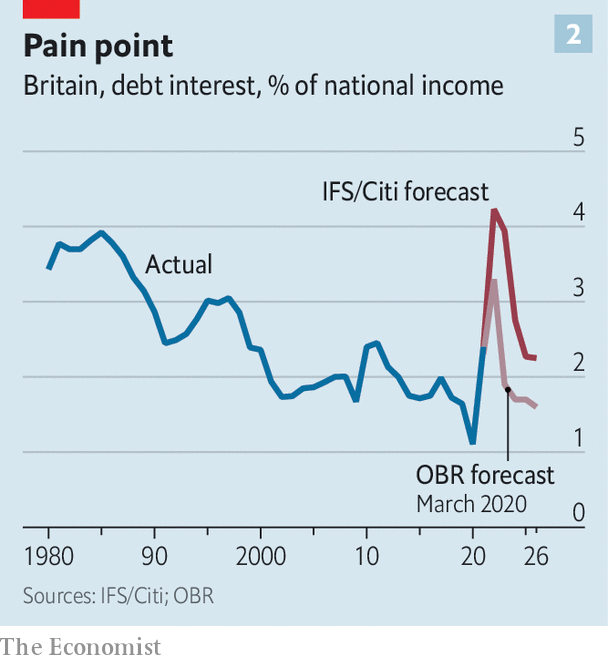

###### Playing with fire

# Britain’s government is yet to deal with a mess of its own making 

##### Investors in its bonds are still far from satisfied 

 

> Oct 12th 2022 

BRITAIN’S PRIME MINISTER came to office promising to fight “Treasury orthodoxy” and the department’s “abacus economics”. Yet barely a month later, financial markets are teaching Liz Truss and her government a lesson about the importance of sums adding up. Ever since September 23rd, when Kwasi Kwarteng, the chancellor of the exchequer, announced the biggest tax cuts in half a century with no hint of how he would pay for them, the markets have been in varying states of turmoil.

 


The pound cratered at once, hitting a record intraday low of $1.035 three days later. It has since recovered to around $1.10, and more or less stabilised. But the turbulence that hit Britain’s government bonds, or gilts, has proved both more persistent and more ominous. By September 27th the cost of new ten-year government borrowing had soared to 4.5%, and that of 30-year debt to 5% (see chart 1). Prices, which move inversely to yields, had fallen sharply. Those of longer-maturity debt had plummeted by 26%. 

Amid the havoc, including reports of fire sales of gilts, on September 28th the Bank of England stepped in. It promised to buy up to £5bn-worth ($5.5bn) of long-dated gilts daily until October 14th, prompting the 30-year yield to fall by a full percentage point. It has since raised that pledge to £10bn and expanded it to include inflation-linked gilts. Yet as that intervention nears its end, cracks are reappearing. Traders’ nerves are jangling and yields are marching upwards again, threatening mortgage-borrowers, businesses and the government with still higher interest rates. 

The Bailey blunder

That is partly because the bank’s own touch no longer looks so sure. On October 11th Andrew Bailey, the bank’s governor, sent the pound tumbling by declaring that the purchase programme would not be extended. Yet overnight, reports emerged of officials briefing the opposite. Gilt yields climbed again the next day, with the 30-year yield briefly breaching 5%. 

Mr Bailey’s clumsiness was unfortunate. But the underlying questions facing both ministers and investors remain unchanged. For the government: how will it pay for its plans? In recent days it has been prodded into action, or the promise of it. Mr Kwarteng has twice brought forward the publication of a plan for taming the burgeoning national debt, now due on October 31st. The Office for Budget Responsibility (OBR), an official watchdog whose forecasting services the chancellor at first spurned, will publish its projections at the same time. A plan to bring in an outsider to run the Treasury has been axed. Instead James Bowler, who spent 20 years there before overseeing the trade department, has been appointed. 

The question for investors comes in two parts. The first is whether the market disorder that preceded the bank’s intervention will return once it ends. The pledge to buy bonds came after some “liability-driven investment” (LDI) funds were forced into selling gilts at any price in order to raise cash. Such funds hedge their liabilities with interest-rate derivatives, the value of which rises and falls with gilt prices. Normally this frees capital that can be invested in equities and private assets. But when gilt prices fall sharply, as they did after Mr Kwarteng’s tax-cutting speech, the derivatives’ value plunges too, prompting the funds’ counterparties to demand cash as security. The funds must sell assets—including gilts—to raise it, forcing prices down further.

In such a vicious circle, buyers have little incentive to step in, expecting further falls in gilt prices. The result is a downward spiral in prices and an upward one in yields. In the past fortnight the bank, by acting as a buyer of last resort, has broken that cycle, without having to buy very much (in the first ten days, it spent £8.8bn out of a potential £60bn). 

The worry is that chaotic selling will resume once the bank’s buying ends. Moyeen Islam of Barclays, a bank, notes that volumes in the overnight deposit market increased by nearly 50% in the days after the bank’s intervention, suggesting LDI funds have reduced risk by starting to rebuild their cash buffers. Pension funds have said they need more time to unwind the derivative positions that sparked the fire sale. Few in the market expect the bank to sit on its hands if widespread disorder returns.

The second question for investors is whether gilts have become riskier over the longer term, demanding the compensation of a permanently higher yield. There seems little doubt that they have. On October 5th Fitch, a rating agency, downgraded Britain’s credit outlook to “negative”, citing high budget deficits and government debt, increased policy uncertainty and the risk of prolonged inflationary pressures.

Meanwhile, the government’s promise to shield households and businesses from higher energy costs for two years means that in the near term gilt issuance will be volatile and linked to the gas price, notes George Cole of Goldman Sachs, a bank. And unlike American Treasuries, which offer investors a safe haven in turbulent markets, gilts are not essential to a bondholder’s portfolio. “For a global investor, there has been no strong reason to bias towards UK government bonds for a long time, and clearly that’s gotten worse,” says Vivek Paul of BlackRock, an asset manager.

Underlying the market’s gyrations is scepticism that the government has a credible plan to keep its finances in good order. To be sure, some things may improve its position. For example, extra inflation drags more taxpayers into higher tax brackets, raising revenue by stealth. It also cuts the real value of departmental budgets set a year ago in cash terms. 

 


The trouble is that the factors going the other way tend to dominate. The economic outlook is weakening. Citi, another bank, forecasts that growth over the five fiscal years to 2026-27 will be less than half what the OBR forecast in March. And higher interest rates from the Bank of England as well as higher gilt yields will push up debt-interest spending. Citi and the Institute for Fiscal Studies (IFS), a think-tank, project that by 2026-27 debt interest spending will be £66bn, £18bn more than expected in March. As a share of GDP it will exceed the peak of the early 1980s, before receding to roughly where it was in 2011-12, after the financial crisis (see chart 2) . 

Without further policy changes, over the next few years the IFS and Citi expect the ratio of debt to GDP to rise from around 84% in 2021-22 to 97% in 2026-27. That would breach the government’s current fiscal rules, which say it should fall by 2025-26. As they expect the balance of borrowing, excluding investment, to slide from a surplus of 1.3% of GDP to a deficit of 1.1%, another rule would be broken. 

We’re waiting, Mr Kwarteng

Assuming the OBR draws similar conclusions, the government has four options: weaken its fiscal rules; raise taxes; cut spending; or gun for higher growth. None is straightforward. With the fiscal rules, there are limits to the amount of fudging Mr Kwarteng will be able to get away with, under the watchful eye of investors and given his own promises. He has said debt as a proportion of GDP will fall over the “medium term”. That could mean five years, rather than three under the existing rules. But even then, he would need to make savings. The IFS calculates that if he picks 2026-27 as the year when the ratio should fall, he will have to find spending cuts or tax increases of £62bn.

Ms Truss made tax cuts a central pillar of her campaign to become prime minister. Still, postponing rather than scrapping an increase in corporation tax would help with the arithmetic. So would conditioning income-tax cuts on the government meeting its growth target of 2.5%. But either would be an admission of defeat. Although officials are reportedly exploring the idea, “reversing the budget undermines her fatally,” says a former minister. 

As for spending, Ms Truss surprisingly promised on October 12th that there would be no cuts—though Downing Street later said “difficult decisions” must be made. Cuts offer no easy escape. Trimming public-sector investment by, say, £14bn to just 2% of GDP would be odd for a government supposedly bent on growth. Uprating working-age benefits with earnings rather than inflation would save £13bn, says the IFS. Finding the rest of the £62bn by slashing £35bn from public services, while preserving health and defence as the government says it will, means cutting the rest by 15%. After a decade of spending restraint, such deep cuts would go beyond fat-trimming to hack away at bone. And with the Tories trailing Labour by around 25 points in the polls, its MPs are in no mood to load pain onto their constituents. 

Faster growth would shrink the size of the hole to fill—and here the government had grand plans, intending to announce a series of supply-side reforms. But rather than a torrent of substantive policies, so far it has only leaked out such ideas as abolishing limits on the ratio of staff to children in nurseries or requiring fewer cheaper houses in new developments. The political feasibility of bold schemes seems to be diminishing by the minute. On October 11th Mel Stride, the Tory chair of the Treasury select committee, warned Mr Kwarteng that he needed cross-party support for any such measures before his statement on October 31st, as “any failure to do so will unsettle the markets.”

It is still unclear whether Mr Kwarteng has accepted what a pickle he is in. On October 11th he bragged that the IMF had said Britain’s growth was “going up”. Having forecast growth of just 0.3% next year, the fund did say that his fiscal package would increase growth “somewhat above the forecast in the near term”—but added that it would cloud the inflation outlook. Its medium-term forecast is 1.5%, a percentage point below the government’s target. 

The government, then, has no good options, and the markets will be watching. “The issue is that a financially credible plan would be very difficult politically, and a politically credible plan would be very difficult financially,” says BlackRock’s Mr Paul. Whether Ms Truss likes it or not, abacus economics is here to stay.■

