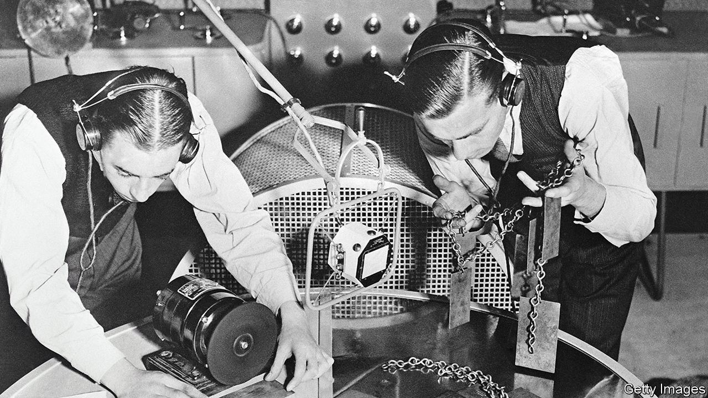

###### Apocalypse then

# The BBC marks its 100th birthday 

##### The broadcaster’s second century is unlikely to be as successful as its first 

 

> Oct 13th 2022 

The sound of the apocalypse would be soothing. Whereas prophets and novelists tend to imagine Armageddon as noisy—earthquakes, looting and whatnot—for the BBC, it would sound like Peter Donaldson. As documents declassified a few years ago revealed, he was the newsreader chosen to usher in the end of the world. 

“This country has been attacked with nuclear weapons,” he says, with velvet voice and perfect diction. “Do not, in any circumstances, go outside the house.” The broadcast adds a few more details. Food must be conserved. Water must be rationed (“It must not be used for flushing lavatories”). Even in the end times, the BBC would not countenance the word “toilet”.

For many, this felt less unnerving than apposite. The organisation, which turns 100 this month, had announced the start of the second world war and its end. It had covered the liberation of Belsen and the coronation of Queen Elizabeth II, the Suez crisis and the Falklands war. For 100 years, the BBC has parcelled up disaster and defeat, then distributed them, after the pips and before the weather forecast, to the British. If Armageddon was to come, it felt right the BBC would announce it, probably after “The Archers”, certainly in an RP accent.

It was not, in the beginning, obvious that this would be so. The BBC was founded a century ago from pragmatism rather than idealism, the result of a lacklustre compromise to satisfy new radio companies (which thought they would flog more sets if people had programmes to listen to on them) and the General Post Office (which wanted to stop anyone from gaining a monopoly over the airwaves, but couldn’t be bothered to oversee programmes itself). So it was that on October 18th 1922, to the interest of almost no one, the British Broadcasting Company was born. “Company” became “Corporation” in 1927.

Today the BBC tends to offer news as its main mission, spending £314m ($346m) a year on it. But as David Hendy, a historian, explains in a new book, it was at first far less interested. As one early bbc boss put it: “I didn’t really care what was happening in Abyssinia.” By agreement with the newspapers, the BBC broadcast no bulletins before 7pm, to avoid competition. But the BBC—which in its early days employed no journalists—hardly tried anyway. “There is no news,” ran one crisply conclusive bulletin in 1930, before returning to a broadcast of Wagner’s “Parsifal”. 

Wagner wasn’t mere filler. Cultural betterment, not bulletins, was seen as the BBC’s main mission. William Haley, an early BBC chief, envisaged radio as a pyramid with popular programmes at its base and high culture at its apex. The common man would be drawn in low and then, in a sort of audio purgatory, be purified by BBC programming until he achieved the blessed state of voluntarily enjoying Buxtehude. Presenters in dinner jackets, their speech a lesson in itself, carefully followed strict pronunciation guides: “quad-” was to be pronounced with the accent on its last syllable; “-istine” on its first. 

To justify the imposition of an annual licence fee, BBC programming has always had to offer a combination of popularity and piety. Television, which currently takes 55% of the £159 fee, has always tended to provide the popularity. In the 1970s the comic double act of Eric Morecambe and Ernie Wise won audiences of over 20m. Today, “Strictly Come Dancing”, a game show, gets ratings of 7m. 

Radio tends to do the piety. The World Service broadcasts in 42 languages to 492m people. Radio 3 offers programmes with such titles as “Discovering Music: Monteverdi Madrigals”. Radio 4 offers the implausibly wholesome “In Our Time”. Recent episodes have included “Hegel’s Philosophy of History”, “The Hittites” and “Tang Era Poetry”. “Parasitism” (typical quote: “You can get parasites that effectively castrate their host”) was considered such fun it was offered as a summer repeat.

The common man has not always been grateful for the BBC’s efforts. A 1950s sketch show described the BBC as a “part of the English heritage. Like suet pudding and catarrh”. But the BBC mattered. Its news (despite grumbles about lefty bias) was trusted, its radio all but loved. For Britons of a certain age not only the outspread century but humdrum daily life itself was, like a bourgeois Book of Hours, measured out by its tread: breakfast with “Today”, supper after “The Archers” and insomnia with the shipping forecast, whose litany of names—“North Utsire, South Utsire, Forties, Cromarty…”—was as unintelligible as a religious chant and, to many, as comforting. 

Now that bond is breaking. Smartphones and streaming have switched off communal tvs and radios. Programmes are consumed individually, and at will. The particular blend of serendipity and boredom that led people to watch “Antiques Roadshow”, or to listen to the wind forecast for the Faroe Islands, has gone. 

Mr Hendy observes that the BBC was born with an “umbilical link” to radio. The technology, it turns out, wasn’t there to serve the BBC; the BBC served the technology: the medium was the message. In its triumphant first century, the BBC forgot this. It is now being painfully reminded of it. The message from the era of smartphones is brutal. Viewing figures among the young have collapsed; in a typical week, a fifth of 16- to 34-year-olds consume no bbc content at all.

There is a sense that the bbc doesn’t do enough to justify itself: it can cover a state funeral beautifully but it is increasingly irrelevant to many. Too few shows are “Strictly” style hits; too many are tosh. At a time when it needs to prove its worth, it has cut World Service jobs. Catastrophe is unlikely, but decline of some sort probable. The end of the BBC’s first century has a less than celebratory feel. ■

