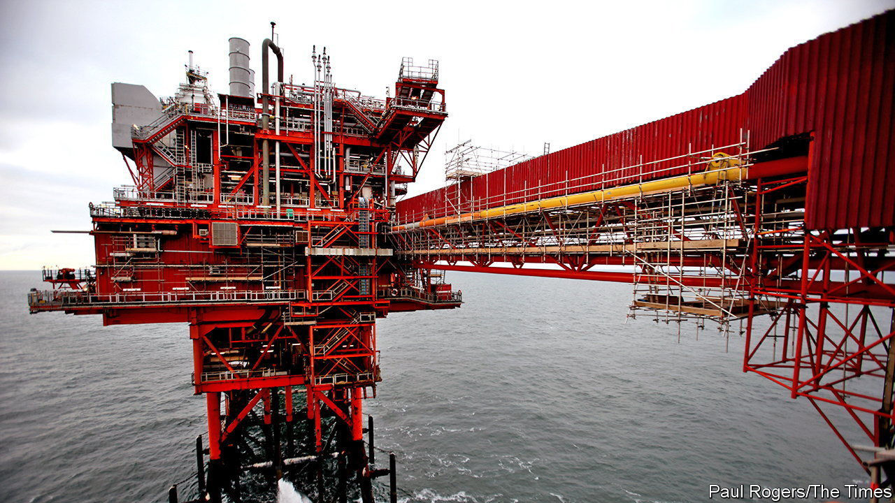
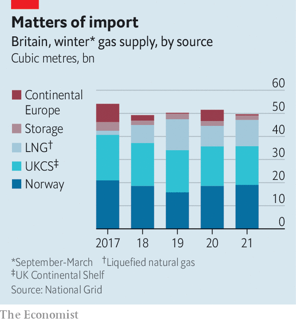

###### Rough weather

# The threat of energy blackouts in Britain forces a rethink on gas storage 

##### As Europe builds up stocks for the winter, Britain has only meagre capacity 

 

> Oct 7th 2022 

To summer heatwaves, rolling strikes, high inflation and political upheaval, add another : the threat of energy blackouts. Projections for Britain’s gas-and-electricity supply this winter were released by National Grid, an energy-transmission firm, on October 6th. They underscore the challenges ahead as continental Europe learns to operate without Russian gas, raising the risk of shortfalls in the imports that Britain relies on to heat homes and produce electricity. Although the company’s base case is that it can get through the winter without interruptions to electricity supply, National Grid also makes it clear that rolling blackouts for firms and households are possible. 

If Russia is the cause of the chaos in energy markets, it is also true that Britain has not helped itself. The current government is  to give the public advice on how to conserve energy this winter. And it is suffering the consequences of a decision made five years ago, to kneecap the country’s gas-storage capacity. That was when Centrica, an energy firm, closed down Rough, a depleted gas field located 18 miles (29km) off the Yorkshire coast. Until recently the government was sanguine about the lack of storage. Record prices and the prospect of shortages have forced a rethink, but too late to make a difference this winter.

Rough was opened as a storage facility in 1985, the year before British Gas was privatised. Gas was injected into a reservoir below the seabed during the summer and withdrawn in winter. Falling profits and decaying infrastructure prompted Centrica, which still owns the facility, to close it down in 2017, removing more than 70% of Britain’s storage capacity. Faith in an increasingly globalised gas market to cover any shortfalls led the government to turn a blind eye.

Britain was already an outlier; that decision made it more unusual still. Storage facilities in the European Union are capable of meeting more than 20% of the annual demand for gas; an EU target compelling members to fill storage to 80% by November has been met. Britain’s current storage is around 2% of annual demand. Since some remaining facilities can be emptied and filled multiple times during winter, National Grid says that what remains could satisfy up to 4% of winter demand. This storage capacity has been full since June, meaning that import facilities for liquefied natural gas (LNG) stood largely unused over summer.

Until Russia’s invasion of Ukraine, the government was relaxed about Rough’s demise. In 2021 Kwasi Kwarteng, who was then the minister responsible for British energy supply, called gas storage a “red herring”. Its relevance, he said, was diminished for two reasons. First, Britain is less reliant on storage because it has diverse sources of energy supplies. Second, storage does not affect the global price of gas. 

 


There is truth to both points. Britain has been a net importer of gas since 2004. As North Sea reserves have declined, Britain has become hooked up to an increasingly global market (see chart), relying on short-term spot markets. LNG terminals and pipelines connecting Britain to Belgium and the Netherlands were built. The assumption that the global gas market will step in to meet surges in demand is reasonable in most circumstances. 

But when supply comes under extreme pressure, as is now the case, this argument is faulty. Even if supplies are available, the prospect of choosing between sky-high prices and blackouts is not a signal of energy security. Reports of negotiations with Equinor, a state-owned Norwegian producer, and Qatar, a major supplier of LNG to Britain, to lock in long-term supply contracts indicate that the British government has now realised this. 

Attitudes have also shifted on Rough, where Centrica has again begun testing gas injections into the facility. Two hurdles need to be surmounted before Rough can operate properly again. The first is technical. Centrica has received the regulatory go-ahead to open less than a quarter of Rough’s previous capacity of around 3.7 billion cubic metres (bcm) this winter, but restoring even this amount of storage is hard-hat-scratching work. 

Faulty injection wells, which pump gas into the facility, were instrumental in Rough’s closure in 2017. Drilling new wells and rebuilding the whole offshore facility was the only way to mitigate all risks to an acceptable level, Centrica told regulators at the time. In the five years since, Centrica continued to withdraw “cushion gas” (the gas needed to achieve sufficient pressure in the field) for sale, another complication. 

The second, bigger problem is one of incentives. Storage has been an unprofitable business for years. Gas producers, utilities firms and traders pay to inject their gas in the summer and withdraw it in the winter, profiting from the seasonal difference (or “spread”) in gas prices. The higher the spread, the more Centrica and their customers earn. This spread has been in decline, eating away at margins and scuppering investment in ageing facilities or new projects; it could stay persistently low if countries are now intent on buying more gas in the summer to fill storage facilities. 

The government is in talks with Centrica to find a commercially viable solution for Rough. A cap and floor arrangement modelled on the operation of Britain’s electricity interconnectors, where the government “tops up” revenue to a minimum and collects excesses over a defined amount, looks likely in the short term. That would be quite the reversal. In 2013 when the coalition government decided not to subsidise investment in new gas-storage facilities, savings of £750m ($840m) over a decade were touted as a good deal for bill-payers. The world, and the government’s own thinking, have changed a lot since then. ■

