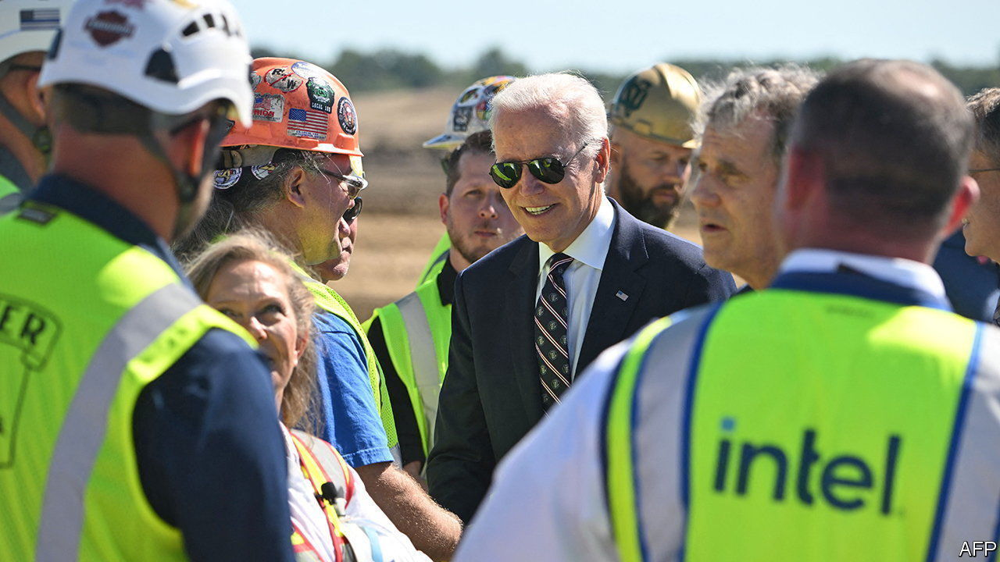
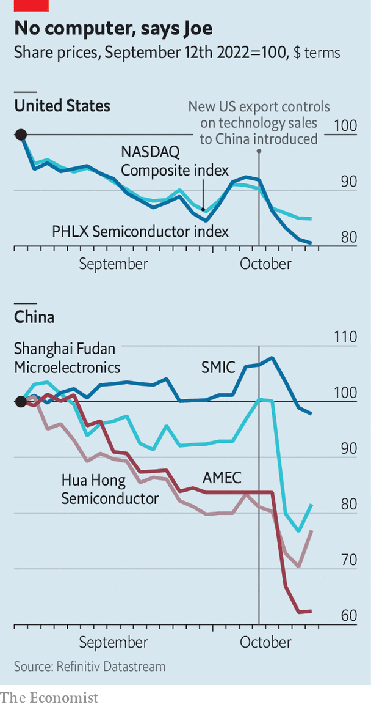

###### No more Mr Nice Guy

# America curbs Chinese access to advanced computing 

##### For real this time 

 

> Oct 13th 2022 

Visions of a technologically ascendent China keep American strategists up at night. They see the contours of a surveillance state implementing the will of President Xi Jinping by algorithmic edict at home and projecting computing power abroad. To erase those contours for good, on October 7th President Joe Biden’s administration announced the most sweeping set of export controls in decades. The new rules cut off people and firms in China from many advanced technologies of American origin, and from products made using these. The list includes chips used for artificial intelligence (ai), software to design advanced chips and the machine tools to manufacture them. Selling such things to China is now barred without explicit permission from America’s government. Rulebreakers risk being cut off from American tech themselves. 

 


The share prices of affected Chinese firms have sunk (see chart). China’s biggest producer of memory chips, the state-owned YMTC, has 60 days to allow American officials to inspect its operations for compliance. American companies that sell advanced semiconductor technology to China have also been hit, even as they reel from a deep cyclical slump in demand for their wares. This week it emerged that Intel, America’s chipmaking champion with Chinese sales of $21bn last year, is about to axe thousands of jobs. 

America has previously used similar rules to kneecap Huawei, China’s telecoms-gear giant. Jake Sullivan, Mr Biden’s national security adviser, boasted recently that export controls have forced Russia to “use chips from dishwashers in its military equipment”, which will “over time degrade [its] battlefield capabilities”. In the case of China, America’s goal is likewise no longer just to stay ahead of its rival in the tech race but to “put the high-end Chinese chip-design industry out of business”, says Greg Allen, a former defence-department official who has studied the new rules. 

Whether America gets its way depends on several factors. There are “real questions” about the rules’ legality, says Peter Lichtenbaum of Covington &amp; Burling, a law firm in Washington. He expects someone to test the restrictions in court. Donald Trump’s administration was successfully sued over an executive order banning TikTok. Even legal export controls are leaky. Plugging the leaks requires more resources for the enforcers at the Commerce Department. “Their to-do list has exploded,” says Mr Allen. “Their budget has not.” 

And China imports $400bn-worth of chips a year, more than any other country. Though private companies and allied countries might be happy to go along with the Americans now, the amount of money being left on the table by not selling to Chinese customers may start to rankle. ■


