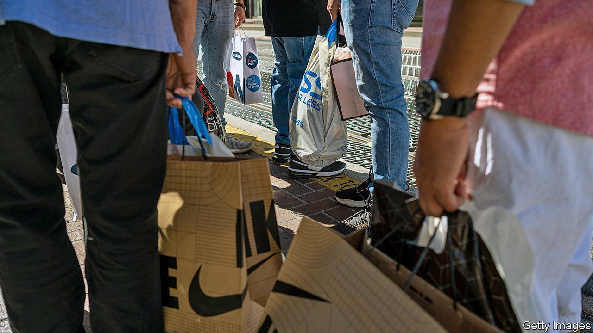
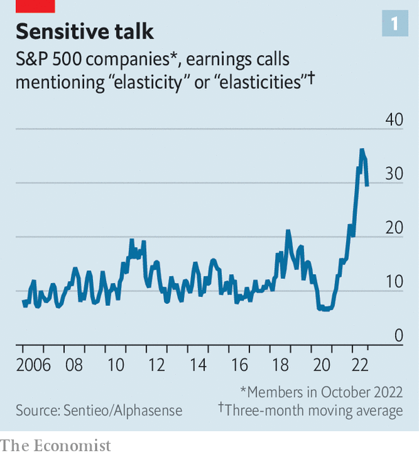
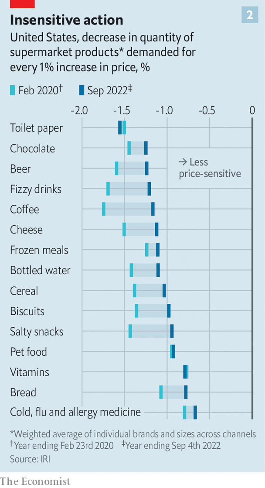

###### Elastic brands

# American consumers are becoming more price-sensitive again 

##### Pandemic-era insouciance seems to be over 

 

> Oct 13th 2022 

ASKED ABOUT the state of the economy, Americans are surprisingly gloomy. More than half say they are experiencing financial hardship; more than a third say they are having difficulty paying for regular household expenses. Yet, even as surveys suggest that Americans are tightening their belts amid persistently high inflation, data show that they continue to spend at a healthy clip. Last month the Bureau of Economic Analysis reported that consumer spending is growing by 1.8% year on year after adjusting for inflation—not far from its historic average. A report by the Bank of America Institute, a think-tank, finds that consumer payments are growing at double digits, a sign that the American shopper “is still spending”. 

This resilience can be explained in part by mattress-loads of savings. Americans accumulated more than $2trn in excess savings during the pandemic, when the federal government doled out unemployment benefits and stimulus cheques even as households cut back on travel, entertainment and eating out. Although some of this has been spent, households are still sitting on a $1.4trn cushion, reckons Ian Shepherdson of Pantheon Macroeconomics, a consultancy. The labour market is healthy, too. Unemployment has fallen to 3.5%, the lowest it has been in 50 years. In August there were 10.1m job openings, or 1.7 vacancies for every jobless person. 

 


But another less-appreciated reason why spending has been so steady in the face of soaring inflation is a shift in consumers’ sensitivity to prices, or “price elasticity of demand”. This concept, seldom mentioned outside economics textbooks, has been a hot topic of debate among investors and company executives in the past year (see chart 1). The term has found its way to the earnings calls of consumer-goods giants such as PepsiCo, whose bosses talked of favourable “demand-elasticity trends” while presenting the food-and-drinks giant’s unexpectedly bubbly quarterly results on October 12th. 

 


The available data appear to back them up. Figures compiled by IRI, a market-research firm, suggest that consumers are indeed significantly less price sensitive now than they were before the pandemic. Using scanner data on prices and sales recorded with each purchase of thousands of items across more than 125,000 supermarkets, chemists, dollar stores and big-box retailers, IRI estimates that price elasticities have fallen for 22 out of 25 product categories since February 2020, and remained flat for the other three (see chart 2). All told, IRI reckons that consumers were roughly 20% less price sensitive in the 52-week period ending September 4th than they had been in the year before the pandemic. 

Why the shift? Experts offer three possible reasons. First, as panic-buying led to empty supermarket shelves in the early months of the pandemic, consumers adjusted their shopping routines and tried brands they weren’t used to, says Brett Gordon, a marketing professor at Northwestern University. With more time at home, people also became more comfortable splurging on pricier food and household items. Last, consumers cut the time they spent shopping—by roughly 9% between 2019 and 2021 according to government statistics. The way they use that has changed, too. “A lot of people maybe spent more time shopping for things to outfit their homes, but less time worrying about everyday consumer products,” says Alexander MacKay of Harvard Business School. 

There are some signs that consumers are starting to pull back. Walmart, a retailing behemoth, says that its shoppers are switching from pricey deli meats to hot dogs, and from gallons (3.8 litres) of milk to half-gallons. Best Buy, an electronics retailer, says its customers are increasingly opting for private-label tvs over name-brand sets. Such shifts in consumer behaviour are most pronounced among lower-income households. tjx, a discount department store, says that, for the first time in years, outlets in higher-income areas are growing faster than those in lower-income ones. “Middle-income and high-income consumers are continuing to spend,” explains Krishnakumar Davey of IRI, but “low-income stores and low-income consumers are pulling back a little bit.” 

This will be on the minds of investors as America’s listed companies report their quarterly earnings in the coming weeks. Those hoping for clear answers may be disappointed. Although packaged-goods firms agree that shoppers will start to balk at higher prices, there is far less consensus about when exactly this will happen. As James Quincey, boss of Coca-Cola, told investors earlier this year, “I expect elasticity to increase at some point in the future. Will that be next quarter? Or will that be next year? I can’t give you the answer to that.” ■


