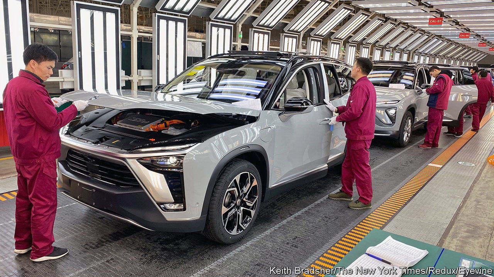

###### Plugging away

# Chinese marques try to make inroads into Western markets 

##### Second time lucky? 

 

> Oct 13th 2022 

The failure of the first serious attempt by China’s carmakers to conquer European markets, around 15 years ago, was self-inflicted. Their cars were terrible. The shabby quality of Brilliance’s “bs” range (no joke) was matched with looks that scarcely merited the word “design”. Since then the Chinese car industry has become the world’s biggest and its products have improved immeasurably. It churns out more electric vehicles (evs) than any other country, and many are anything but bs. It is also an ev-battery superpower. 

ev-friendly Europe is again in China’s sights. Norway, where generous tax breaks mean that four out of five cars sold are fully electric, has served as a bridgehead. Now Chinese firms are launching a wider assault on the continent. In Berlin on October 7th Nio, a Tesla wannabe, showed off three new models. At the Paris motor show, which opens on October 17th, byd and Great Wall Motors (gwm) will give more details of their plans for Europe. 

Rich subsidies have created a vast home market for Chinese evs, encouraging established firms and startups alike. byd’s plug-in cars (some are hybrids rather than full evs) now outsell Teslas worldwide. Subsidies contingent on local production have deterred imports, obliging firms such as Tesla to set up in China, strengthening domestic supply chains. A ban on foreign battery-makers has made China their predominant manufacturer. And cheap money supplied by central and local government has given Chinese firms access to buckets of capital.

Scale at home has helped Chinese firms keep costs low. Their cheaper evs are now filling the European market ill-served by Western carmakers, which have focused on higher-end rides. Chinese brands already accounted for nearly one in 20 evs sold in western Europe in the first eight months of 2022, according to Schmidt Automotive, a consultancy. Around half of those sales, some 22,000 cars in 14 countries, were budget evs from mg, a division of saic, a Chinese state-owned giant. gwm will soon aim at the same segment with its “Funky Cat” ev, from its Ora marque.

The Chinese are trying to establish trusted brands, not always from scratch. Geely has owned Sweden’s Volvo since 2010 and an affiliated investment vehicle owns 10% of Mercedes-Benz. Last month Geely bought 8% of Aston Martin, a struggling British sports-car firm. Its experience of making cars to European standards may be why its Polestar evs, part of Volvo until 2017, sell nearly as well in Europe as mgs do. The U5 from Aiways, a five-year-old startup, was a finalist this year in the prestigious European Car of the Year contest. byd’s recent deal with Sixt, a German car-rental firm, to supply it with 100,000 evs by 2028 may help to familiarise motorists with its cars, including a small, cheap suv. 

Competition will be tougher in the more lucrative premium segment, observes Matthias Schmidt of Schmidt Automotive. byd’s larger models cost about as much as similar Western cars. Fancier Chinese brands such as Nio, Xpeng and gwm’s Wey may have missed their chance as Germany’s premium carmakers belatedly roll out more upmarket evs. And if they do too well, one industry boss notes, their European rivals can always plead for more protection. As anti-Chinese sentiment grows in the West, politicians are in the mood to grant it. ■


