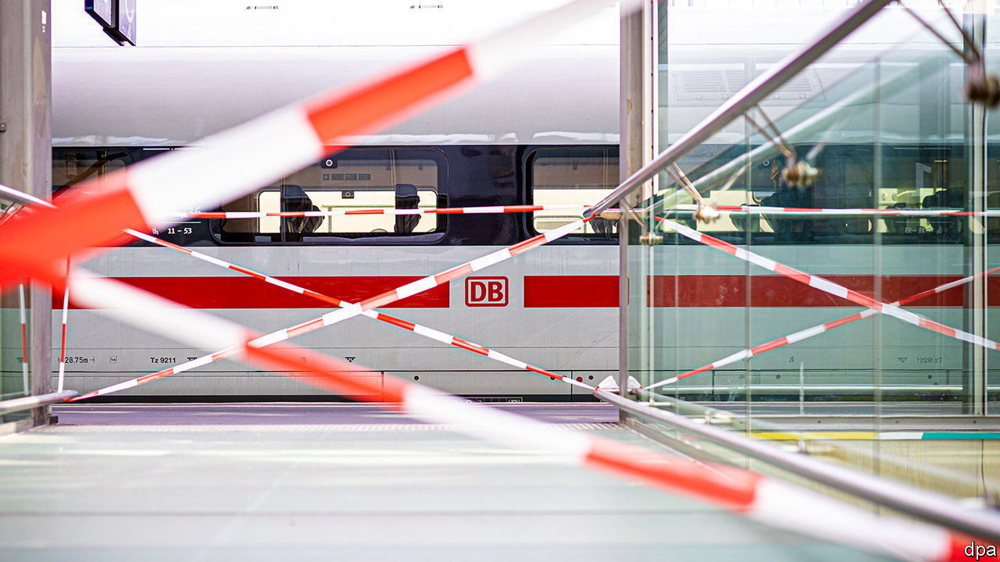

###### Derailed

# Deutsche Bahn is hit by suspected sabotage 

##### The incident piles more woe onto Europe’s biggest railway 

 

> Oct 13th 2022 

Weeks after explosions caused leaks from Nord Stream 1 and Nord Stream 2, two undersea gas pipelines linking Russia and Germany, another act of suspected sabotage rocked Europe’s biggest economy. On October 8th Deutsche Bahn (db), the state-owned rail giant, said it needed to suspend all services in northern Germany for around three hours. Damage to cables indispensable for rail traffic had led to a breakdown of its wireless communication system. The incident left thousands of passengers stranded on a Saturday morning.

On October 10th Germany’s federal prosecutor announced an investigation into the pipeline leaks, adding to Danish and Swedish probes. The German police are looking into what happened to db. Many think Russia was behind both acts of subterfuge. The Kremlin certainly has a motive: it hopes to scare Germans into reducing their support for Ukraine, which has scored victories against Russian invaders in recent weeks. It also has the means: the db attack displayed a level of sophistication that other possible culprits, like left-wing anarchists, are incapable of.

Whoever was behind it, sabotage is the last thing db needs. Once considered a paragon of punctuality and efficiency, in recent times it has mainly made headlines because of delays, missed connections and crowded compartments. In June and July fewer than 60% of its long-distance trains were on time, far shy of the firm’s stated goal of at least 80%. Decades of neglect and underinvestment have pushed Germany’s rail network to the limit of its capacity, explains Christian Böttger of the University of Applied Sciences in Berlin. It has failed to adapt to long-term changes, such as people moving to cities and increased freight traffic from ports. In February db at last pledged to invest nearly €14bn ($13.6bn) in train stations, bridges and rails, only to receive another blow in June, when Michael Odenwald, chairman of its supervisory board, resigned after Volker Wissing, the newish transport minister, said he would meddle in management. 

The sprawling group employs more than 330,000 and has more than 500 subsidiaries in 130 countries. Half its sales stem from businesses unrelated to German rail. It owns Arriva, a British transport firm, Schenker, a logistics group, and even a cable-car firm. Years of poor management have created huge overheads and sapped productivity. Mr Böttger calculates that db Cargo, the loss-making freight arm, is transporting around a third less freight than it did a year ago, with the same number of employees. Red tape, cumbersome new rules on things like health and safety, and powerful unions are exacerbating db’s problems. Last month the German train drivers’ union organised three rounds of strikes that caused travel chaos for a week. 

Deutsche Bahn says it has 4,300 security personnel who work with 5,500 police officers to keep its assets safe. The latest attack shows that even those numbers cannot guarantee comprehensive surveillance of 34,000km of railway tracks. Roderich Kiesewetter, a foreign-policy expert in the opposition Christian Democratic Union, proposes the creation of a civilian reserve force to defend Germany’s critical infrastructure, including db’s network. That may help fend off db’s external foes. It won’t help deal with those from within. ■


