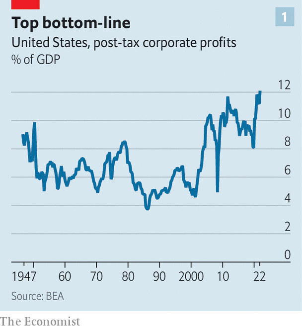
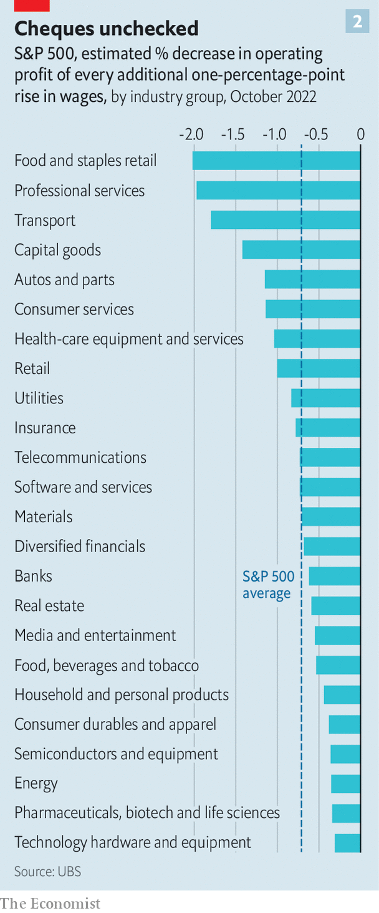

###### The profit cycle

# Have profits peaked at American businesses? 

##### The forces which fuelled a decades-long rise in corporate earnings are petering out—or going into reverse 

 

> Oct 9th 2022 

Fedex nearly failed to get its wheels off the ground. Months after it first began delivering packages overnight in 1973, the first oil shock buffeted the  and the young logistics firm looked destined to crumble. Now, as the Organisation of the Petroleum Exporting Countries once again sent shock waves through the already wobbly world economy with an announcement on October 5th of a , fuel prices are just one of the firm’s worries. Weak package volumes and persistently high costs caused FedEx to withdraw next year’s profit guidance in September, knocking more than a fifth, or $11bn, off its market value.

 has long been regarded as a bellwether for the broader economy. In a sign that this reputation is well-earned, corporate titans everywhere are now warning of profit hits as Wall Street gears up for America’s earnings season, which began this week. On October 6th Shell, a British oil supermajor, said it expected margins in its refining and chemicals businesses to plummet. The next day Samsung, a South Korean electronics giant, cautioned that its operating profits will decline for the first time in three years. 

Many icons of America Inc are making similar noises. Ford has blamed its expected profit squeeze on, among other things, shortages of parts for its cars. Nike is struggling to clear its bursting inventory of unsold sportswear. Even America’s tech behemoths, which are freezing hiring as advertisers tighten digital-marketing budgets and inflation-weary consumers put off buying a new smartphone, are no longer looking invulnerable. The odd set of upbeat results, such as PepsiCo’s on October 12th, only highlight how unfizzy the broader picture looks. 

All told, forecasts for third-quarter profits for the s&amp;p 500 index of big American firms have so far been revised down by 6.8% since June. That is more than twice as big as the average revision in the past decade. Expectations for next year are bound to fall. Some of the pain is down to the strong greenback, which makes foreign revenues, accounting for almost a third of the s&amp;p 500’s total, worth less in dollars. A bigger reason is the economic slowdown. If this turns into a recession, as seems likely, bottom lines will almost certainly suffer more, which they tend to whenever gdp contracts. Since the second world war earnings per share fell by an average of 13% around recessions, calculates Goldman Sachs, a bank.

 


In the past few decades such cyclical dips have mostly been short-lived episodes in a long bull-run for corporate profits. Powerful structural forces have been propelling earnings to one record after another, relative to gdp (see chart 1). In the last quarter they were at an all-time high. Some of these long-lived profit motors are winding down. Globalisation, which allowed companies to cut costs and become more efficient, is stalling amid geopolitical tensions. Global trade will grow by only 1% next year, the World Trade Organisation forecast on October 5th. Two days later America  on the export of technology to China even further. At the same time, relentless consolidation, which has made many industries more concentrated and lucrative, may have run its course: trustbusters are no longer as relaxed as they had been about oligopolies, which anyway have accrued so much market power that it is difficult to see it rising further. 

More worrying for ceos, other important engines of corporate profits—rock-bottom interest rates, low taxes and stagnant wages—may be going into reverse. After years of receiving a small share of companies’ takings, lenders, governments and labour are demanding more.

Historically low rates of interest and tax have contributed one-third of the s&amp;p 500’s profit growth (excluding financial firms) in the past two decades, according to a study by Michael Smolyansky of the Federal Reserve. Both are now rising. Higher interest rates will make it costlier for companies to service their debts, which will eat into the bottom line. To begin with, this will affect those companies—typically riskier ones—that borrowed at a floating rate. Although floating-rate debt accounts for just 11% of s&amp;p 500 companies’ total borrowing, a slug of the remaining 89% will also need to be refinanced sooner or later—almost certainly at much higher cost. That includes $1trn-plus of investment-grade bonds issued in 2020.

Just as financiers become more demanding, so too is the taxman. As appetite for deficit-funded tax cuts wanes, another Tax Cuts and Jobs Act, which was signed into law by Donald Trump in 2017 and slashed the statutory corporate rate from 35% to 21%, looks unlikely. The Inflation Reduction Act (ira), passed recently under Mr Trump’s Democratic successor, Joe Biden, includes a 15% minimum corporate-tax rate on profits of businesses with more than $1bn in pre-tax income. In addition, earlier this year interest-expense deductions became less lenient. Goldman Sachs reckons that the new rules will reduce overall s&amp;p 500 earnings by a modest 1% in 2023, with technology and health-care sectors hit hardest. Still, strained public finances make it likely that taxes will rise in the medium term. Adding insult to injury, the ira introduces a 1% tax on share buy-backs, indicating a political appetite to squeeze companies with nothing better to do with their profits than fork them over to shareholders. 

 


Employees, too, are tired of being squeezed. Since the 1970s the share of gdp going to workers has declined across the rich world, even as that going to companies in the form of profits has risen. This so-called labour share spiked during the pandemic, when many companies continued to pay workers even as gdp plummeted. It came down but earlier this year remained the highest it had been since the early 2000s. Labour accounts for 40% of costs at big American firms. The actual contribution of wages to costs is far higher: after all, suppliers have to pay their own workers, too, and pass some of those costs up the value chain. Official figures for September, released on October 7th, suggest that the red-hot job market is not cooling fast enough and wages are still going up. Since pay increases are sticky, they can remain a significant drag on margins. According to ubs, a bank, labour-intensive sectors such as retail could see operating profits decline by 2% for every additional one-percentage rise in wages (see chart 2). 

American chief executives are less squeamish than their European counterparts about countering the combination of rising labour costs and weakening demand with lay-offs. Some are already trimming payrolls. On October 6th it was reported that General Electric was planning to sack 20% of staff at its American wind-turbine business. Intel, a chipmaker, is also rumoured to be cutting thousands of jobs.

Yet businesses may find it harder than in the past to wield the axe. The balance of power between labour and capital is shifting. A new rule proposed by the Department of Labour on October 11th would make it harder for firms to classify their workers as contractors rather than employees, raising costs. Union membership, which spent the second half of the 20th century in decline, is enjoying a small but significant revival. A Gallup poll puts public support for organised labour at its highest level since 1965. 

Many businesses are already feeling the heat. A walkout of 90,000 railroad workers was narrowly averted in September after unions threatened to bring railways to a standstill, which could have done $2bn-worth of damage per day to the economy. Younger workers are discovering a taste for organising—even wage rises this summer have not stopped Starbucks baristas from joining union efforts in growing numbers. ceos may not be able to keep them, the lenders and the government out of the profit pool for much longer. ■


