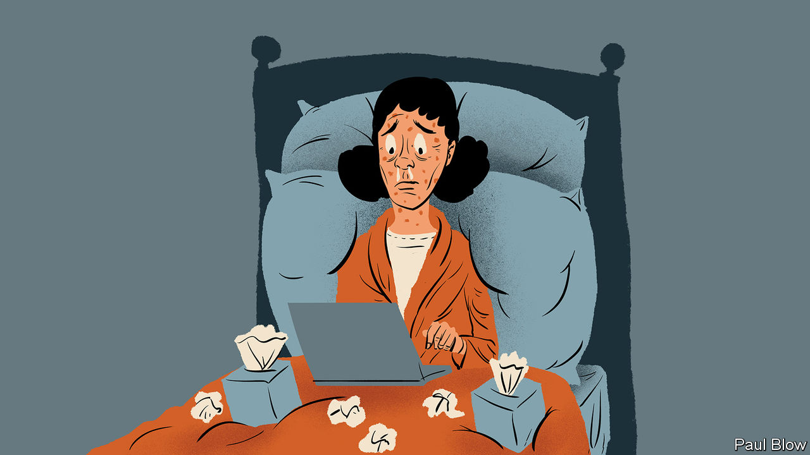

###### Bartleby

# It is becoming harder to take off a sick day 

##### That isn’t good for anyone 

 

> Oct 13th 2022 

If you have a high temperature or are recovering from heart surgery, it is difficult to use machine tools. And if you are having a nervous breakdown, machine tools are best avoided. Sick days are the remedy. They are meant to prevent people from hurting themselves, their co-workers, customers or passers-by on the job. Working from home has flipped this logic on its head. If you can work from the kitchen table, today’s hybrid workers increasingly conclude, then why not from bed—so long as the brain is on and the Zoom camera off? 

The work-from-home revolution has raised the bar for what counts as being sick. At the height of the pandemic people worked from home even with nasty symptoms such as fever, shortness of breath or nausea. Many still do. Nicholas Bloom of Stanford University has been tracking work-from-home habits since before the corona-crisis popularised them. In a recent working paper he presents the results of a randomised controlled trial at a large Chinese multinational company, where sick days fell by 12% for employees working from home two days a week relative to those coming in full time. 

Your columnist, a guest Bartleby, can sympathise. In the past, while convalescing, she had no qualms about wrapping herself in a blanket with a hot toddy, toast and some tissues. When she got covid-19 early this summer, by contrast, she kept going with her phone and laptop sunk in the duvet. Her managers strongly urged that her work should be passed on to a colleague. For her, this was unthinkable, at least until she almost passed out. 

To be in bed not doing anything connotes not only physical discomfort but also cognitive impairment. Salaried workers, who are often evaluated on the basis of their input rather than output, find it hard to say they are off the game for a few days now that they don’t need to worry about spreading germs in the office. For high-achievers, putting in the hours is not a chore but a way of life. Unplanned breaks are antithetical to the pervasive anxiety to perform. As recession looms and puts future job security into question, showing yourself to be useful becomes even more important. Hybrid-work etiquette is fluid and many companies have yet to update their sick-leave rules for the new era. 

Though all this is understandable, it is also troubling. Tapping away at a laptop and smartphone from the discomfort of a sick person’s bedroom is not as dangerous as driving a forklift. It nevertheless carries risks—both for the ill-disposed individual and their employer. And it isn’t just covid, whose common symptoms include brain fog. Any bug brings fatigue.

Being even mildly sick can impair brain function as much as high altitude, whose effect can feel like a bad hangover. It is difficult to exercise proper judgment if one cannot focus on the task at hand. It is why people with lower oxygen concentration sometimes remove protective clothes atop Mount Everest; some freeze to death. Firing off emails while feeling dizzy and depleted will put the body under further stress and also risk being incoherent. Soldiering on may make the employee both sicker and less productive for longer. Digital presenteeism, for that is what such persisting amounts to, is in no one’s interest.

Resisting it is therefore important. You don’t need to have had a blood transfusion or liver transplant to feel that you have earned a bit of time off. Sleeping soundly can restore body and spirit. Staring at the ceiling gives you time to take stock of your harried life. Do not worry about being judged to be shirking. True laziness cannot be disguised—if someone is malingering, chances are that their bosses already know. 

In the world of flexible working, managers can lead by example, taking the occasional day off when suffering from a cold. Why not use it as an opportunity to delegate tasks? This tends to build trust in a team and helps appraise subordinates’ strengths and weaknesses.

The dust will eventually settle on work habits in the hybrid era. When it comes to illness, they will hopefully settle somewhere close to where they were in pre-covid days. Being sick is part of the human condition. It is not going away. Nor should sick days. Bartleby remembers lying on the sofa recovering from a stomach bug in New York 17 years ago, undisturbed by colleagues and untroubled by thoughts of work. The next time she is ailing, she will not be on Slack. Instead, she will listen to her managers and sign off.


