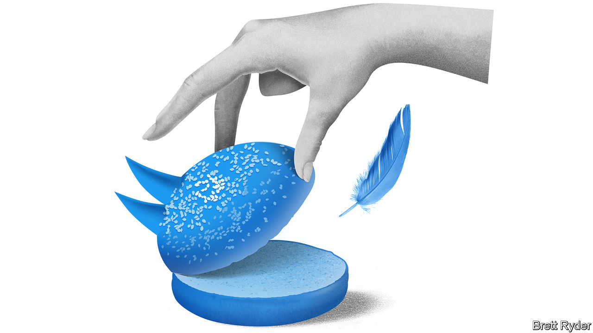

###### Schumpeter

# Will Elon Musk-owned Twitter end up as a “deal from hell”? 

##### Everything app. Or nothingburger 

 

> Oct 11th 2022 

Unlike tolstoy’s description of families, mergers and acquisitions that end happily do so for a variety of reasons. It’s the unhappy ones that are alike. This is particularly true of m&amp;a deals done at the top of the business cycle, when hubris runs amok, lofty valuations make acquirers sloppy with their money and the most radical ideas are made to sound plausible. In this category sits Elon Musk’s , once again in the offing after a judge gave both sides until October 28th to consummate it. Mr Musk’s latest attempt to justify it is to describe it as a step towards a Chinese-style “everything app”. It is just as likely to go down in history as a top-of-the-market “deal from hell”. 

The annals of business have colourful examples of such Stygian mishaps. Sony’s ill-fated acquisition of Columbia Pictures in 1989 occurred when Japan’s bosses thought they were invincible, the bubble economy made any price appear worth paying, and dreams of the convergence of hardware (consumer gadgets) and software (entertainment) were in the air. AOL’s merger with Time Warner, an even bigger mess, was first announced in 2000 at the apogee of dotcom frothiness. The bosses of both companies, one an internet upstart, the other a fading media giant, fantasised about creating a colossus of the internet age. They torched nearly $200bn of value in a matter of months. In 2007 Royal Bank of Scotland (RBS), an acquisitive financial institution, led a consortium to buy ABN AMRO, a sprawling Dutch banking group. It was the biggest banking takeover in history—yet done with little due diligence or oversight of gung-ho executives, even as the world was on the brink of the great recession. It occurred shortly before RBS’s spectacular demise and a bail-out from the British taxpayer. 

Mr Musk’s approach to Twitter is different from these in one important respect. He is acting in a personal capacity as the world’s richest man. He has no known plans to integrate the social-media platform with Tesla and SpaceX, his electric-vehicle and rocket firms. Mercifully. 

Yet the stock phrases that sum up such debacles—wrong target, wrong time, wrong price tag—already seem applicable to his pursuit of Twitter, and may explain why he has spent so long trying to . If the two sides do not reach an agreement later this month, the judge says she will haul them back to the Delaware Court of Chancery and decide their fate for them. Whatever the outcome, Robert Bruner, a professor of business at the University of Virginia who in 2005 wrote a book called “Deals from Hell” to explain m&amp;a fiascos, says Mr Musk’s Twitter saga already bears many subtler hallmarks of the genre. 

In Mr Bruner’s diagnosis, the first hints of hell come from hubris. The self-styled “” has every reason for self-belief. Tesla is the world’s most valuable carmaker. SpaceX is literally rocket science in action. Yet for executives like him it’s a fine line from that to overconfidence. Sony’s Morita Akio crossed it. So did AOL’s Steve Case and RBS’s Fred Goodwin. In Mr Musk’s case, excessive faith in his ability to turn Twitter around is exacerbated by a saviour complex: his main goal, he said when he announced the deal in April, was furthering the cause of free speech. That appears to have blinded him to the need for due diligence. Moreover, like other exalted leaders, he is surrounded by yes-men. Billionaires compete to throw money at him. No chairman of any board appears to put a restraining hand on his shoulder. For now his reputation for walking on water continues to sustain him. But if he has overplayed his hand, history will not let him off lightly. Just ask Messrs Case and Goodwin (Morita passed away in 1999). 

The corollary of hubris is sloppy financing, another attribute of top-of-the-market megaflops. This is particularly true at the tail end of bull markets, such as the one that recently vanished in a puff of smoke. Not only was Mr Musk so unconcerned about overpayment that he based his $54.20-a-share offer for Twitter on an overused cannabis joke. Big banks jostled to back one of the world’s largest-ever buy-outs, even though by then cracks had started to appear in the market for leveraged loans. 

As with many M&amp;A deals, deteriorating markets can turn a flawed acquisition into a disaster. That possibility must haunt Mr Musk. The  on which Twitter depends has crumbled. Tesla’s own shares, the source of most of his wealth, have lost a third of their value since he made the bid (don’t cry for him, he is still worth $220bn). The deal financing includes $13bn of high-risk debt and spreads on this kind of instrument have soared. Whether Mr Musk reaches a deal with Twitter or the judge forces the sale to go ahead, the repercussions are likely to be troubling. Either banks are stuck with hard-to-sell debt and suffer hefty losses or, in the unlikely event they abandon the deal, a superhero of 21st-century capitalism faces a $44bn day of reckoning.

The X-factor 

Finally there is strategy. In Mr Bruner’s analysis, the worst M&amp;A deals are done when the target is in an industry far beyond the acquirer’s “domain knowledge”. That is surely true of Mr Musk and Twitter. It may explain why he has started to offer hints of a grander strategic vision. He has raised the prospect of reducing Twitter’s reliance on advertising, and instead incorporating it into an “everything app”, known as X, with online payments that hark back to the days when he helped found PayPal. It is a tantalising idea. The model is WeChat, Tencent’s superapp in China. Others, like Meta, have tried it with mixed results. 

If it works, it would provide yet further testimony to Mr Musk’s ineffable genius. But it also has a hellish side. It could pit the world’s most powerful businessman against tech regulators. It could stir up trouble geopolitically (imagine a reinstated Donald Trump weighing in, as Mr Musk has done, on Russia and Ukraine). And as a result it could anger China, thwarting Tesla’s prospects there. Another deal for the history books, no doubt. ■


