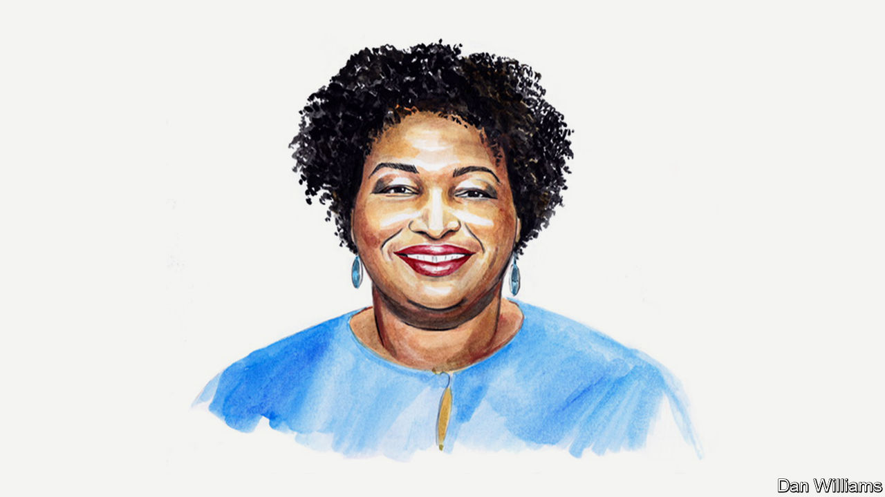

###### America’s 2022 midterms

# A conversation with Stacey Abrams 

##### Georgia’s gubernatorial candidate on election disputes, the state’s economy and abortion rights 

 

> Oct 10th 2022 

STACEY ABRAMS is  against the Republican incumbent, Brian Kemp. The pair faced each other in 2018, too. If elected on November 8th, Ms Abrams would become America’s first black female governor. Rather than write a guest commentary, she chose to speak to our editors from her office in Georgia. The script has been edited for length and clarity. 

:

: I actually would frame it slightly differently because the working class is a much broader narrative than it’s often given credit for being: it includes women, it includes people of colour, and those communities are actually migrating towards the Democratic Party. Typically, when we hear the working class, it’s actually a demographically narrow set. And my responsibility is to first and foremost acknowledge those who are here and in need of our help but also to expand access and so the work that I’ve done both as a legislator and as a candidate has been about how do we increase access? How do we tackle the fundamentals so that everyone sees the Democratic Party as the party of the people? 

That’s why my campaign is grounded in using a record and historic $6.6bn surplus to actually fix the broken pieces of the state of Georgia. That’s education, health care, housing, and the ability to make a good living, whether you work for yourself or someone else. To that end, every policy I’m proposing, every metric that I’m using, cuts across communities but especially lifts and invests in the working class, because they are the most likely to need access to public education. They are the most likely to face the challenges of unaffordable housing. They are the most likely to be affected by a broken health-care system, and they’re the ones who want to be able to not just make a living but make a good living. And so my responsibility is to propose ideas and then to execute them, should I become governor, in ways that demonstrate to them that I am in this for that.

: 

Let’s start with the larger issue. We know that there are no monoliths in politics, but there have been loyalties that are important, and I take none of these loyalties for granted. Part of my intention has always been to meet communities where they are and to be very thoughtful about asking for their help and asking for their vote. Because to do otherwise is deeply disrespectful. That intentionality has actually been loaded into this mirage—and I think that language is appropriate. I am doing as well with black voters as I was in 2018. I am doing exactly the same as Senator Raphael Warnock, but what is often lost in the horse race number is that this is not a question of whether they intend to vote for me or the other guy. It is whether they intend to vote or not. And it is that level of disrespect and that level of disingenuity that often convinces black voters, especially black men, not to vote.

If we assume that they have to, if we presume that because they exist, I will get their votes, then that is both malpractice on my part and bad punditry on the parts of those who would take those numbers and spin out these narratives. My approach has been the same both in 2018 as it is in 2022. I hold conversations, I publicly engage. I understand that I have to earn those votes with the same assiduous attention that you would have to earn any other cohort’s votes. And I do so in a very public way. Because I know that to build the coalitions we need to win elections in a deeply polarised state that you’ve got to talk to everyone and that is why I’ve had conversations with African-American men, with Latinos, with AAPI [Asian-Americans and Pacific Islanders], the Muslim community, with the disabled, I go everywhere and I talk to everyone. And I think it’s always critical that when we look at these numbers, we actually understand what the question was that they asked and what the information was that they got. And these questions largely reflect the failure to say, is this a question about whether you’re going to vote for a Democrat or not? Or is it a question of whether you’re going to vote or not? And if you look at the concomitant numbers of people who simply haven’t decided to vote, you see what my mission is, which is to get those who are the most distrustful of our policies to show up because they don’t trust the government writ large, regardless of who’s in charge.

: 

In 2018 I, at the start of my speech, acknowledged the outcome of the election. And what has been the entire narrative of Donald Trump has been a dispute about the outcome. I’ve never disputed the outcome. But what I’ve always questioned is the access and we have to remember in politics, those are two very different things. And in a democracy, access is about who can vote. Outcome is about who can win. No politician is guaranteed an outcome, but every eligible citizen should be guaranteed access, and my refusal to concede was very specifically and carefully and I would say, exhaustively used to describe the access issues.

And recently there was a 288-page decision by a federal court that acknowledged that under Brian Kemp, he administered a racist voter system that discriminated disproportionately against black and brown voters [On September 30th a federal judge rejected a lawsuit alleging that Georgia’s voting practices violated voters’ rights. It was filed in 2018 by a voting-rights group founded by Ms Abrams.] And while he did not have the authority to actually remediate the last three claims, that authority under his own analysis existed under the Gingles Standard, but did not exist under the 2021 Brnovich decision [Brnovich v Democratic National Committee, a Supreme Court case that held that Arizona laws did not violate the Voting Rights Act], which further weakens section two of the Voting Rights Act. And this governor has used the erosion of the Voting Rights Act to expand his voter suppression, and he did so with SB 202 [a controversial state voting law passed by Georgia Republicans in 2021]. And we are seeing it happen on the ground right now. We have groups that are using the law, that he passed with the knowledge that this could happen, to challenge 64,000 voters. We are watching in real time as senior citizens and the disabled and especially AAPIcommunities that use absentee ballots are being denied access because of the complicated nature of the system. We’ve seen higher rejection rates. We know that families that needed to use dropboxes—1.9m—are being denied that access because Brian Kemp thought that it led to too many people who voted. I am not misquoting him. He said he was frustrated by the results. Well, by his own admission, there was no fraud. So the only results he could have been frustrated by was the fact that his party lost.

My deep concern is that his failure to commit treason once has obfuscated his very intentional and long-standing voter suppression. Some 50,000 people were denied voter registration under the last election—within weeks of the election—under his own hand after he’d been successfully sued in a federal court. And even the most pernicious and just the most mean spirited piece, the refusal to allow people to have water in the line. Brian Kemp was a voter suppressor. It has been one of his signature moves, and I’m deeply concerned that he will do so again. But to go back to the fundamental question, my fight will always be about guaranteeing access because that’s what any patriot should do. That’s what any citizen should want. I have absolutely no right to an outcome. I’ve got to work for that. And that’s why I intend to talk to every community and reach into every hamlet in every neighbourhood to turn out as many voters as I can. But there is no equivalence between my fight for access and Trump’s fight for a manufactured outcome.

: 

Because every governor in American history has done exactly the same. He simply didn’t commit treason. We should not lionise someone for not being an arsonist. You’re not supposed to burn the house down. You’re not supposed to commit treason. The consequences for not giving into a blatant lie was that the lie didn’t get told. That’s what we’re taught to do in third grade. You don’t do the wrong thing. You don’t get praised for simply doing your job. That’s why you got hired. And what he’s done is he’s used this to hide the fact that for fair-minded and independent voters that he also pushed and used the big lie to justify a draconian voter suppression law. He used that same veil to hide the fact that he’s made it less safe to live in the state of Georgia, that under his leadership, gun violence has gone up and access to freedom has gone down. And he pretends to be a Main-Street Republican when people are looking, but the policies that he espouses and the laws that he assigned, and the promises he’s made to bring a Texas-style anti-abortion law to Georgia, to continue to weaken gun laws, to deny access to affordable housing to communities. Those are things he will continue to do and not committing treason should not obfuscate everything else he is.

:

Abortion is a medical decision. It is not a political decision. And as long as we allow politicians to make these choices, and to set these arbitrary limits, what we are doing is denying women their fundamental right to control their bodies and to control their medical choices. My belief is that abortion care should be available up into the point of viability as determined by a physician. And that viability if it threatens the life and health of the mother, that the priority has to be the mother. That is the responsibility, that is the obligation, and there should be no interference by politicians and government in what are medical decisions.

:

Georgia has a record surplus and that record surplus can be invested over the next four years, not even the whole surplus, but we can use a portion of the surplus to actually amortise almost every one of the programmes that I’ve described without affecting future revenues or requiring additional revenues. And this has been validated by economists at MIT, who looked at my programme and said that indeed, I’m correct. What has happened in Georgia is that we’ve been lulled into this poverty of imagination but also false maths. In the state of Georgia, by expanding Medicaid, by increasing salaries, we not only can solve immediate issues, we actually can generate the revenue necessary to sustain and expand access and opportunity. And fundamentally it’s the best economic development we can do. If the goal is to generate sufficient revenue to meet need, then right-sizing our budget using that surplus as a-once-in-a-lifetime, once-in-a-generation infusion of capital is the moral equivalent of essentially fixing the roof and fixing the plumbing so that the house is in good standing for another 100 years. And that’s my plan and it’s been proven to work.

: 

 I believe in every person making a living wage and in the state of Georgia $50,000 is a living wage. ■

