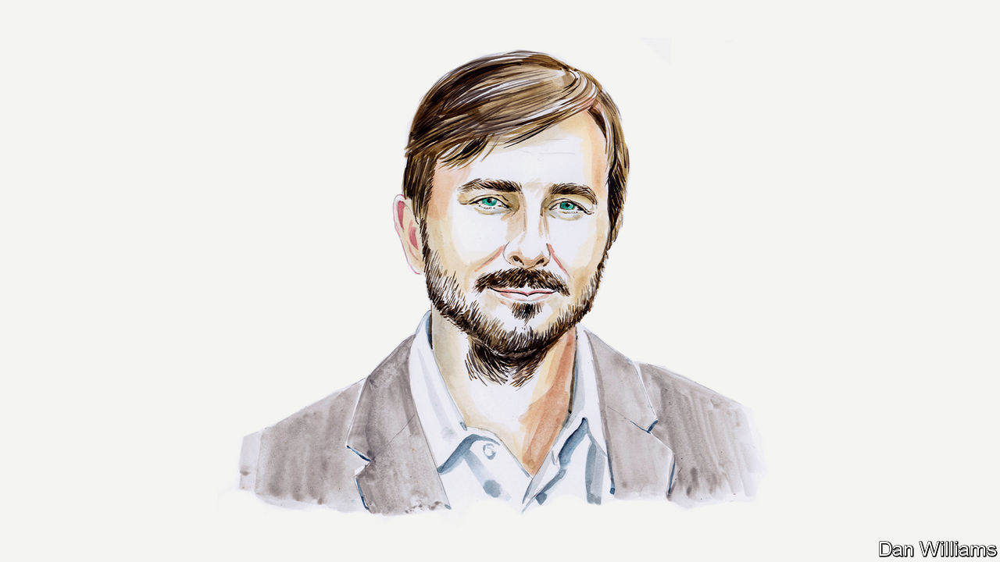

###### America and the Taliban

# Afghanistan’s central bank needs its assets back, argues Graeme Smith 

##### Technical negotiations may succeed where political ones have failed, says the policy expert 

 

> Oct 12th 2022 

AFGHANISTAN’S CENTRAL bank remains hostage to political drama, with perilous results for 20m Afghans on the brink of starvation. Arguments over its frozen assets abroad have raged since the Taliban seized back control of the country in August 2021. In a standoff between the Taliban and America, there is a desperate need to find low-key solutions for reviving the financial sector, and thus the Afghan economy, despite the mutual hostility that persists.

I have worked in Afghanistan since 2005, most recently researching the economic crisis. In the local bazaars, most people have never heard of “monetary stability”—but they suffer from a lack of it. Afghanistan’s central bank, Da Afghanistan Bank (DAB), can barely function. American financial institutions are restricting access to $7bn of the bank’s reserves; the remaining $2.1bn are frozen in European and Middle Eastern banks.

Even the best minds in finance would struggle to run a central bank that is practically bankrupt. And the Taliban have hardly appointed such folk. The bank’s new bosses include Taliban picks with dubious credentials, including at least one freshly minted banker, Ahmad Zia Agha, who has been sanctioned by the US Treasury.

The bank should be protecting the value of the Afghan currency, limiting inflation and supplying foreign exchange—important tasks in a country that imports most of its food, fuel and medicine. Now a lack of liquidity and banknote shortages are hurting businesses and crimping remittances, payrolls, aid efforts and many other facets of the cash-based economy. The result is rising prices for some of the most vulnerable consumers in the world: in September wheat prices were 37% higher than they were a year earlier, for example. The situation has been made worse by the war in Ukraine. Half of Afghanistan’s 39m people suffer from hunger. Poor harvests are raising fears of even more desperation this winter.

The Taliban’s solution is simple: get back DAB’s money. They promise to use the reserves only for monetary policy, in accordance with DAB regulations and Afghan laws. When asked why former insurgents should be entrusted with such responsibility, the Taliban point out, justifiably, that they have started cleaning up wholesale corruption at customs houses. The new masters of Kabul promise a similar cleanup in the banking sector, claiming that DAB retains enough of its former staff to meet international standards, including precautions against money laundering and terrorist financing. Knowing they face scepticism, the Taliban have also offered to bring in third-party monitors.

Some outside experts say there is no choice except taking the Taliban’s word for it, because recapitalising the central bank is the only way of restoring confidence in the Afghan financial system. Those offering such advice include Joseph Stiglitz, a Nobel laureate, and dozens of other economists. They signed a letter to the American government in August, calling for the return of all the central bank’s assets to Kabul. They have the right idea, but implementing it will be hard.

To start with, Western officials understandably balk at the idea of sending what might be mistaken for an enormous gift to the Taliban. The American government does not trust the Taliban’s intentions, especially after the shock of discovering Ayman al-Zawahiri, an al-Qaeda leader, living in Kabul this year.

Talks over the bank’s future have faltered already. America wanted the Taliban to remove staff who appeared on sanctions lists or lacked “independence” (not that America explained how any official at DAB—appointed and guarded by the Taliban—could be sufficiently independent). The Taliban have said they would follow international banking rules, but refused all of the personnel changes the Americans demanded.

Hostility between former opponents on the battlefield should be expected, especially after a conflict as ferocious as the war in Afghanistan. So it’s not surprising that America called off the negotiations in early September and shifted half the frozen assets into a trust fund in Switzerland. The so-called Afghan Fund will start with $3.5bn, as other assets in America remain mired in litigation by 9/11 victims. The fund could grow if European banks transfer their own holdings of DAB assets or the 9/11 plaintiffs lose in court (as is expected).

In the short term, the Afghan Fund is expected to help DAB with basic tasks such as international dollar payments for critical imports, including electricity. Given the scale of Afghanistan’s challenges, however, the new fund should not be content with deploying the central bank’s assets on its behalf. Some observers claim that the trust could become a “shadow” central bank, but that would be disastrous. The Taliban have proven they will block efforts to circumvent their government, and aid experts warn that parallel structures cannot substitute for Afghan state institutions.

Instead a more ambitious agenda is required when the fund’s board of financial experts—who are Afghan, American and Swiss—meet for the first time in the coming weeks. They should resume negotiations with the Taliban about the conditions under which DAB could satisfy technical requirements for a gradual recapitalisation. This is not just a matter of trickling money back into the central bank for currency auctions. Funding and expertise will be required to rehabilitate DAB, restore its essential functions and rebuild confidence in the Afghan economy. A strong central bank is needed to persuade overseas correspondent banks to resume doing business with Afghanistan, to ensure price stability for basic goods and, possibly, to address future crises in the fragile private-banking sector.

None of this will be enough, by itself, to fix the ruined Afghan economy. The World Bank says GDP has shrunk by one-third in the aftermath of the war and will take years to recover. A huge share of the money flowing into Afghanistan in recent years funded killing; replacing the war economy with something else will need inspired leadership and it is far from obvious that the Taliban can provide it. 

Repairing the central bank is of paramount importance even so. This proved impossible in confrontational talks between old enemies. But room for compromise may be found in technical discussions among bankers. 

_______________


