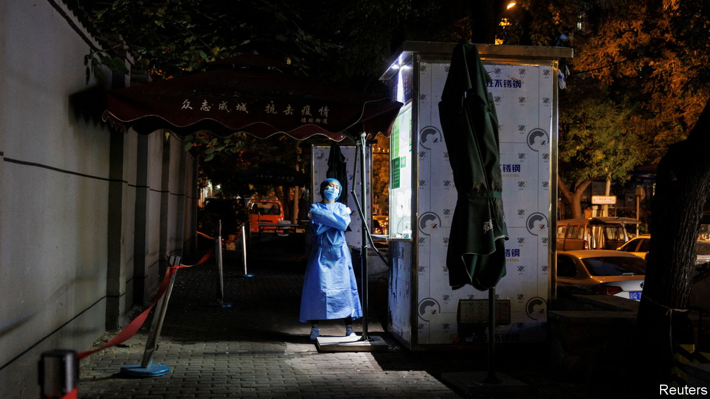
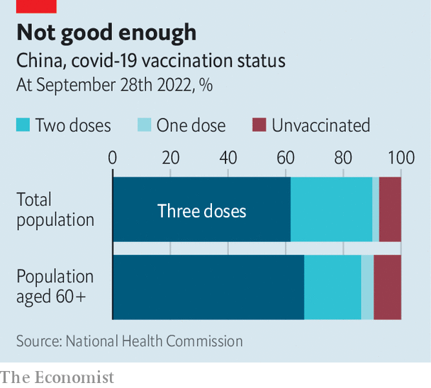

###### Not going anywhere

# China shows few signs of loosening its zero-covid policy 

##### The state has neither ramped up vaccination nor prepared public opinion for ending lockdowns 

 

> Oct 13th 2022 

Will the Communist Party congress mark a turning-point in China’s fight against covid-19? The week-long event, beginning on October 16th, will see Xi Jinping re-anointed as the party’s leader. Some hope he will use the stage to signal an end to his “zero-covid policy”, which relies on mass testing, big lockdowns and draconian restrictions to contain outbreaks. But in recent days the , a party mouthpiece, has dimmed those hopes. “Fighting the epidemic is a test of the spirit,” said one commentary in the paper. Another condemned “war-weariness and wishful thinking”.

Much of the public has indeed grown weary of the zero-covid policy. Whereas China has experienced a much lower death toll from the virus compared with other big countries, its economy is buckling under the weight of virus-related restrictions. The IMF expects China’s gdp to grow by just 3.2% this year, much slower than the government’s target. Youth unemployment is close to 20%. China’s commercial hub, Shanghai, suffered a two-month lockdown earlier this year—and may soon close again, amid a spike in cases. The region of Xinjiang has been largely sealed off since the summer owing to multiple outbreaks. An ever-increasing number of people have been caught up in the government’s covid controls.

Will they ever end? Parsing the  is one way to gauge Mr Xi’s intentions. Another is to look at the checklist of things China must do to exit the zero-covid policy without a big loss of life. So far Mr Xi has approached these tasks with a revealing lack of urgency.

 


A new vaccination campaign would be an essential first step. Over 90% of the population has received two or more doses of one of China’s vaccines. A recent push to vaccinate more old people has been somewhat successful. But, as of September, only two-thirds of those aged 60 and over had received three doses, the amount needed to greatly reduce the risk of severe illness and death (see chart). Meanwhile, protection from booster shots is fading. In September experts at the Chinese Centre for Disease Control and Prevention argued that the population would have to have a fourth dose of vaccine before the government loosened controls, otherwise the health system would be overwhelmed. 

China is able to jab people at an impressive pace. At the height of the most recent vaccination drive, some 10m people a day were given shots. But China has 1.4bn people, many of whom need more than one shot. Some 270m of them are elderly. Millions more have pre-existing conditions that make them vulnerable to the virus. Completing another round of vaccinations would probably take several months. No new campaign is in the offing. 

Nor, for purely political reasons, has the government allowed the import of more effective Western mRNA vaccines. It also has not approved its own mRNA shot. It has, though, authorised an antiviral drug, Paxlovid, made by an American firm, Pfizer. In August Pfizer said it had teamed up with a Chinese firm that would manufacture the pills domestically. A home-grown antiviral drug, called Azvudine, was also approved for use on covid patients in July.

If Mr Xi were looking for a way out of the zero-covid policy, he would also need to strengthen China’s health-care system. Ideally, this would mean increasing the number of intensive-care-unit (ICU) beds, to treat serious cases. On this measure (when calculated per person), China ranks far behind Western countries. But fixing that problem could take years. Other moves, such as building basic hospitals for relatively mild covid cases, could be done more quickly. China built two hospitals in two weeks in the city of Wuhan at the beginning of the pandemic. 

Another sign of change would be a shift in propaganda about covid. The Chinese media are full of stories about death and devastation in the selfish, decadent West. Governments that have chosen to live with covid are portrayed as incompetent and cruel. The zero-covid policy, by contrast, is presented as enlightened and humane. Though many Chinese have grown disillusioned with the policy, plenty of others still support it. Many fear the disease—and the stigma attached to it. No one wants to be the reason their neighbours are sent into quarantine. Convincing people that, actually, covid poses little risk to them if they are healthy and vaccinated will take a whole new public-relations campaign.

Whenever that change happens, Mr Xi is likely to try to paint it as China’s (and his) victory over the virus. But that will be difficult. Lifting the zero-covid policy will inevitably cause people to die. Huang Yanzhong of the Council on Foreign Relations, a think-tank in America, thinks that even a well-executed exit would result in 140,000 deaths, mostly among old people with pre-existing conditions.

Fear of so many deaths—and of the party being blamed for them—is a big reason why Mr Xi shows no signs of loosening up. Before China’s last big political event, a parliamentary session in March, there was a similar hope that covid restrictions would be lifted. Instead, officials such as Mr Xi began repeating an old revolutionary slogan: “Persistence is victory!” ■


