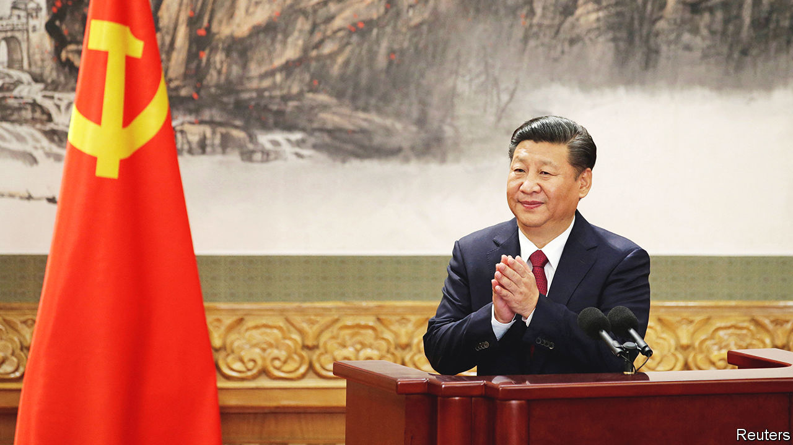
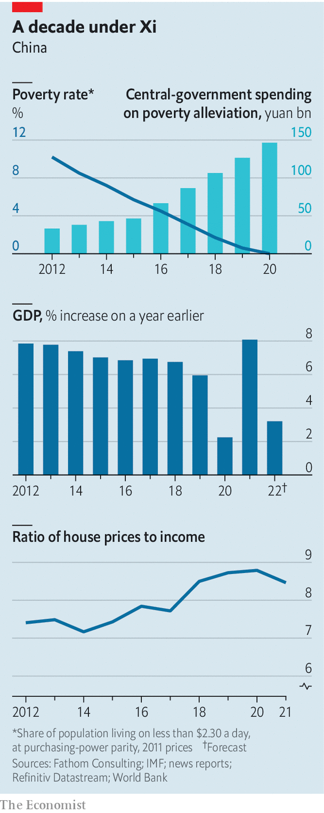
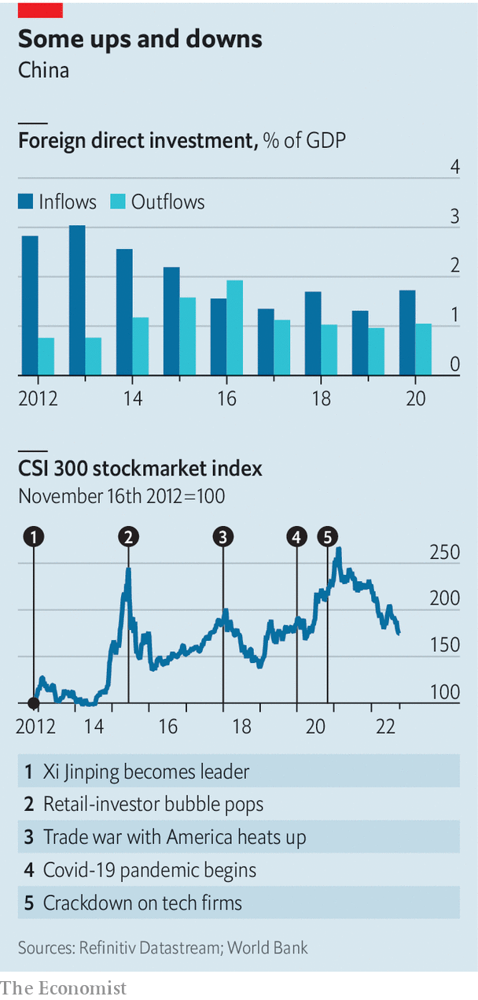

###### Showtime in China

# The Communist Party congress will highlight Xi Jinping’s power 

##### No one in the new Politburo will be a threat to the party chief 

 

> Oct 13th 2022 

No other regular political event in China involves the mobilisation of people and resources on the scale of a Communist Party congress. None other dominates the agenda of so many officials, for so long. Never mind that the country is being battered by pandemic-related lockdowns—red banners everywhere urge citizens to “joyously welcome” the gathering that will open on October 16th. As they do every five years when such events are held, the country’s eyes are turning to the capital, Beijing, for the party’s big reveal, the tightly choreographed culmination of months of secretive dealmaking. 

Party congresses are closely watched because they involve a huge turnover of the party’s senior leadership and provide clues to its long-term priorities in domestic and foreign affairs. This one will be striking. More than any other since the death of Mao Zedong in 1976, it will showcase the power and achievements of one man. In the build-up to this event, state media have been filled with adulation for the “people’s leader”, the “helmsman”, the “navigator” whose wisdom has steered China to within reach of a “great rejuvenation”. This torrent of praise is intended to hint that only Mr Xi can enable China to attain that goal, and therefore—despite a convention that party leaders serve a maximum of two five-year terms—he must remain the party’s boss. 

In theory, the congress could boot him out. The most important duty of its nearly 2,300 delegates is to cast ballots for the selection of a new Central Committee, a body comprising about 370 high-ranking officials and military commanders as well as bosses of large state-owned enterprises and other grandees. The number of candidates is expected to exceed the number of seats by more than 8%, so theoretically Mr Xi could fail to make the grade. 

At the 15th congress in 1997, Mr Xi—then the deputy party chief of the province of Fujian—only just squeaked into the Central Committee as a non-voting member. He had the lowest number of votes. He has been elected as a full member at every congress since, and needs to keep that position in order to remain in the Politburo. 

In reality, there is no chance of humiliation this time. Last year the Central Committee pronounced that establishing Mr Xi as the leadership’s “core”, and his political ideas as a guiding ideology, reflected the party’s “deepest wishes”. The importance of upholding these “two establishes” has been drilled into delegates at pre-congress training sessions. On the day after the gathering the reshuffled Central Committee (more than half of its members will be new) will meet to “elect” a new Politburo and Party Military Commission—ie, rubber-stamp decisions already made. Mr Xi will undoubtedly be given new five-year terms as chiefs of both. At its annual session next year, probably in March, the national legislature will give Mr Xi another five years as state president, a title mostly used when dealing with foreigners. 

The new Politburo, which currently has 25 members, is expected to include even more of his protégés. It is unlikely that new members of its Standing Committee, now comprising seven men, will include a younger politician who is clearly being groomed to take over from Mr Xi at the next congress in 2027. “For the moment he is concentrating on further consolidating his own power to ensure his lasting legacy,” writes Charles Parton in a report for the Council on Geostrategy, a think-tank in London. “Sharing the limelight would be distracting for all.”

Many observers now believe that Mr Xi aims to serve for at least two more terms. In 2032 he will turn 79, still younger than Mao was when he died (82) and Deng Xiaoping when he retired (85). Deng remained hugely influential for another several years, with no party titles. Someone of Mr Xi’s power—on a par with that of Deng and Mao—would be unlikely ever to step aside completely unless forced to by ill health or an extremely determined rival.

 


It may be a measure of the discipline Mr Xi has imposed on the party that little has leaked about the Politburo line-up. It remains a topic of wide-ranging speculation. Li Keqiang will give up his job as head of government at next year’s meeting of the legislature. By convention he is young enough, however, to retain his seat on the Politburo Standing Committee. He may become the legislature’s new chief. 

Who replaces him will be closely watched. The clue will be in the Standing Committee’s new membership. One possibility is that Han Zheng, Mr Li’s most senior deputy, who is already a member, will take the job. He is 68, which would normally mean he has to retire at this congress, but it is not clear whether the unwritten age rules will apply this time (they will not for Mr Xi). If he leaves, Hu Chunhua, another of Mr Li’s deputies, who is 59, may be promoted to the committee and succeed Mr Li next year. There are other candidates, too, including Wang Yang, a committee member who, at 67, is just young enough. Mr Wang and Mr Hu are not longtime associates of Mr Xi, but neither is Mr Li. It may be that Mr Xi has sidelined the role of prime minister to such an extent that he does not see a pressing need to give the job to someone very close to him. 

No one in the new Politburo will be a threat to Mr Xi. Anyone thinking of grumbling about his rule will be reminded, during the congress, of the dangers of doing so. The party’s disciplinary body will deliver a report at the event. It will describe its work in recent years, which has involved both fighting corruption and ensuring loyalty to Mr Xi. The two tasks intertwine. The report is likely to mention the recent jailing of several security chiefs. They were sentenced for graft, but officials have described them as members of a “political clique” that threatened “party unity”. 

Here’s a thought

The congress will be peppered with signs of Mr Xi’s power and his determination to flaunt it. These may be evident in tweaks to the party’s charter that delegates will endorse. Details of these have not been revealed, but they may include the shortening of the umbrella term for his political thinking from the wordy “Xi Jinping Thought on Socialism with Chinese Characteristics for a New Era” to the snappier “Xi Jinping Thought”. That would equate him with Mao. 

 


It will certainly be evident in Mr Xi’s report, which he will read aloud on the first day from a lectern in the Great Hall of the People. At the previous congress in 2017 this took more than three hours. (So much for his demand, soon after taking power, that speeches be kept short.) The report will be filled with praise for the party’s achievements during the past decade—that is, under his rule. It will highlight the elimination of extreme poverty (defined as $2.30 a day at 2011 prices), which the party said it achieved last year. But it will skate over problems, including sputtering economic growth, not least as a result of Mr Xi’s draconian “zero-covid policy”, as well as a stockmarket slump and a shortage of affordable housing in cities (see charts). 

The aim of the speech will be to distract those who worry about such matters with plenty of feel-goodery. At the congress five years ago Mr Xi raised eyebrows in the West by talking of his country “moving closer to centre stage” in global affairs. This time he will emphasise how much this has happened, possibly with digs at what he and his officials often portray as Western disarray. The  will be declared a great victory . There will be stern words about Taiwan. Delegates will applaud as he explains the virtues of China’s political system. He will not mention himself, but it will be all about him. ■


