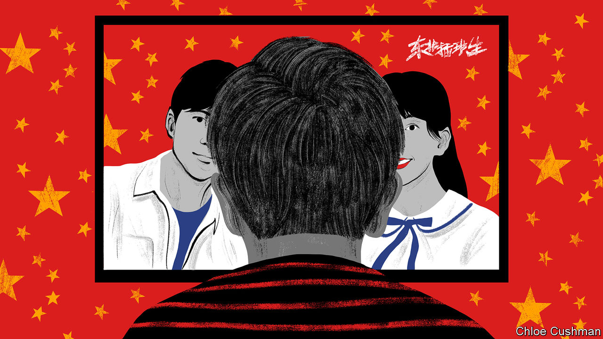

###### Chaguan

# The dark side of Chinese pop culture 

##### A hit TV series for teenagers peddles nationalist fantasies 

 

> Oct 13th 2022 

For ChinESE showbiz, October is a month for waving the national flag. With each passing autumn, especially in the ten years since President Xi Jinping came to power, audiences are offered ever more patriotic works. During the week-long public holidays around National Day, on October 1st, cinemas present historical war films or action movies with gleaming fighter planes and warships. Streaming services offer television dramas about selfless public servants, from pandemic-fighting medics to police squads hunting fugitives overseas. 

For film-makers and producers of TV serials, cranking up their jingoistic fervour offers two ways to profit. First, it pleases Communist Party ideologues, who demand works filled with “positive energy” and that follow the “main melody”, a musical term borrowed by propaganda officials to describe political lines that creative types should adopt. Second, patriotic productions can generate box-office gold, especially now that Hollywood films find it hard to secure permits needed for a Chinese-cinema release.

For countries made nervous by Chinese nationalism, it makes sense to worry about works that play up China’s ability to project power and influence worldwide. This October offers a fresh example. China’s cinemas are having a rough 2022, thanks to pandemic lockdowns in scores of cities and a slowing national economy. Still, during this national-day season, ticket sales have been propped up by “Homecoming”, a film about fearless Chinese diplomats rescuing compatriots from an African crisis. 

Yet it would be a mistake to focus too narrowly on tales of derring-do by servants of the Chinese state. For that risks missing another trend, one that involves the success of teenage dramas which portray the mainland as a cool, admired “big brother” to youngsters from many ethnic-Chinese backgrounds.

A case in point is a comedy-drama series, “North-Eastern Transfer Students”, currently streaming on iQiyi, a Netflix-like Chinese service. A parade of chauvinist clichés, its hero is Wang Hu. He is a muscle-bound, exam-flunking teenage tearaway from the north-eastern Chinese city of Shenyang. Quick-witted but lazy, Wang Hu is sent by his father to a school in the former Portuguese colony of Macau, across the Pearl River from Hong Kong. Fellow students include youngsters from Taiwan, Macau, Hong Kong and the Cantonese-speaking south of China. One is a half-Chinese teenager from Thailand who insists that he is descended from a Tang-dynasty emperor.

Playing up stereotypes about bluff, crude but wise-cracking north-easterners, Wang Hu is shown scorning southern food. He complains when locals do not understand his Mandarin Chinese or, worse, speak Cantonese, though that language is the mother-tongue of 80m southern Chinese, including most Macau residents. His half-Chinese schoolmate from Thailand, Li Jiangang, is given a thick accent and a cringing, effeminate manner, and offers the strapping newcomer from Shenyang his puppy-like devotion. Wang Hu patronises his Thai friend over his claims of imperial Chinese blood, and recoils when shown a picture of the teenager’s sister in Thailand, who—it is explained—was his brother before transitioning. Yet by the end, Wang Hu has won over his peers and teachers alike, who hail him as an ideal of Chinese manhood. He is shown beating a Taiwanese judo champion in a fight, then teaching the boy to treat his father with more respect, in line with traditional values. Wang Hu nudges the school’s Cantonese-accented basketball captain to be kind to less-skilled classmates—after demonstrating his own unrivalled skills on the court.

A grey-haired literature teacher from Macau singles Wang Hu out for praise as a patriot. The teacher explains to the class, bitterly, that he had to study Portuguese as a colonial subject many decades earlier, despite being a “yellow-skinned, black-haired” son of China. The final episode ends with the school saluting the raising of the national flag, as tears run down the faces of pupils, Taiwanese and Thai included. “This is Chinese territory,” Wang Hu says approvingly to a teacher. “There are no foreigners in the class.” Though the show’s cast lacks a well-known star to draw viewers, it has been widely praised since its release in late September. iQiyi does not release viewing figures, but a hashtag aggregating posts about the show on the Weibo social-media platform has 110m views to date. The drama’s score on Douban, a popular ratings site, is an unusually high 7.7.

Aspiring to be “big brother”

In real life, mainland China is regarded with wariness and even antipathy by many young Hong Kongers. Since the crushing of anti-government protests in 2019, they have chafed under national-security laws imposed directly by rulers in Beijing. In polling this year, when asked to choose between identifying as a Hong Konger and calling themselves Chinese, 2.2% of respondents aged 18-29 chose Chinese. In contrast one in five Hong Kong residents over 30 call themselves Chinese. Similar generation gaps may be seen among Taiwanese, whose self-ruled island has never been governed by the Communist Party but faces the threat of invasion should it ever seek formal independence.

A generation ago, candy-hued Taiwanese teenage dramas were a staple of pop culture for young Chinese. Now, however, many of the island’s dramas are too edgy for mainland outlets. The mood has darkened in other ways, too. To prosper in China, Taiwanese actors must declare their loyalty to the People’s Republic and its rulers in Beijing, or face the wrath of online Chinese nationalists. None of this reality intrudes on “North-Eastern Transfer Students”. As a result, this teenage fantasy of pan-Chinese unity is as dangerous as any war film. Taiwanese distrust of the mainland should inspire caution among Chinese who imagine that the island would be easy to govern after an invasion. Wang Hu’s antics obscure that truth. Their October success is cause for dismay. ■


