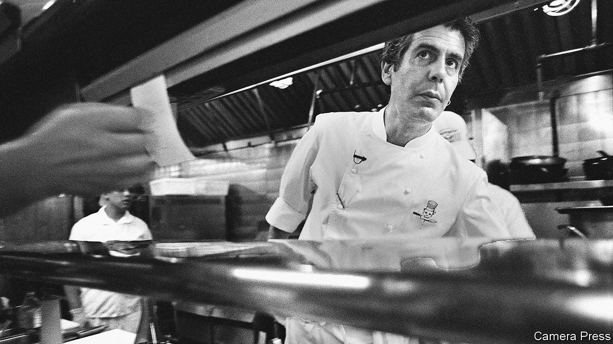

###### World in a dish

# A candid new book explores Anthony Bourdain’s trials 

##### Sometimes getting everything you want can be as disastrous as failing to 

 

> Oct 13th 2022 

By the time Anthony Bourdain hanged himself in a French hotel room on June 8th 2018, he was the envy of food-obsessed travellers the world over. Twenty years earlier he had been a competent but unknown chef with frustrated literary ambitions and a louche, drug-filled past. Then “Kitchen Confidential”, his book of 2000, became a surprise bestseller, and launched a series of increasingly ambitious television shows built around a simple concept: “I travel around the world, eat a lot of shit and basically do whatever the fuck I want.”

It turned out that a lot of people liked watching him do just that: between 2002 and his death he made hundreds of episodes. Off-screen, he had two failed marriages, a rocky relationship with Asia Argento, an Italian actor, and a punishing schedule that kept him on the road for most of the year. As “Down and Out in Paradise”, Charles Leerhsen’s gritty, well-researched new biography makes clear, Bourdain carried with him an array of compulsions, addictions and insecurities. Mr Leerhsen tries to explain why a man with legions of adoring fans and the best job in the world would end his life and why, years later, so many people still care about him.

Bourdain left no note, making Mr Leerhsen’s first task speculative. He was drinking heavily, taking steroids and human-growth hormone and, on some level, deeply unhappy. “I hate my fans,” he texted his second wife a few months before he died. “I hate being famous. I hate my job. I am lonely and living in constant uncertainty.” But after a shoot on the last night of his life he went to a beer garden in Germany, where “he lit up like the Tony I once knew”, a companion said. “Everything was normal.” The only person who knew what was going through Bourdain’s mind that night was Bourdain himself.

But biographers and friends alike have looked for clues. Certainly, he put himself under tremendous pressure. He worked far more than he needed to. Before his screen and literary careers took off, he was distinguished more by his organisational skills than his culinary imagination. He could oversee a kitchen cooking hundreds of meals per shift, but did not devise new techniques or recipes. He never lost this driven, line-cook’s mentality.

His tv shows, which began as a sort of lark (“scary and amateurish”, an early colleague called his approach), had become an enterprise. And he had become what he had once mocked: a television personality. He did it on his terms, with a sort of punk-rock soulfulness—curious, intrepid and warm, yet also a little shy and diffident. But he was still a brand. As Mr Leerhsen explains, “authenticity, in the sense of being the real thing and not a pretender, was [a] lifelong preoccupation” for Bourdain. The pretence involved in the brand-building may ultimately have been intolerable.

It made him rich and famous—but tragedy, as Oscar Wilde knew, can sometimes stem from getting everything you want, rather than from failing to. “What do you do”, Bourdain asked his viewers, near the end of a show shot in Sardinia, “when all of your dreams come true?” ■

