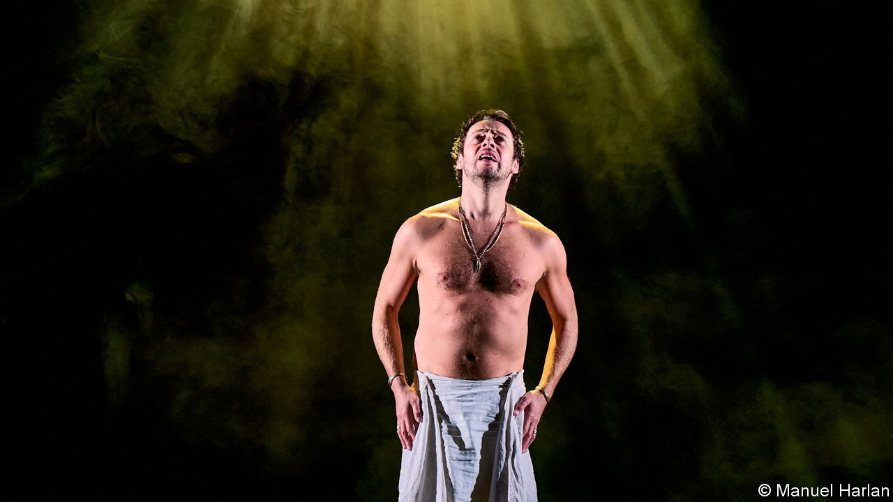

###### Back Story

# A row over anti-Semitism leads to a searching dramatic inquiry 

##### After a scandal, the Royal Court Theatre stages a lesson in trust 

 

> Oct 13th 2022 

In the 1960s, when censors still oversaw the British stage, the police were regular visitors to the Royal Court Theatre. Scandalously, it flouted bans on “Saved”, a play in which a baby is stoned to death, and “Early Morning”, which makes Queen Victoria a lesbian. These and other fabled controversies arose from the theatre’s radical ambitions. The one that struck it last autumn, by contrast, was inadvertent and shameful. Yet it has led to important lessons in prejudice, and, just as urgently, in dialogue.

“Rare Earth Mettle”, which opened in November, featured a megalomaniac tycoon whose name, before an outcry, was to be Hershel Fink. The character wasn’t Jewish, but the name clearly was. For Jews, the context sharpened the sting of this old, defamatory link to rapacious wealth. Despite its swish location in London, the Royal Court is closely associated with the British left—which from 2015 to 2020, when Jeremy Corbyn led the Labour Party, itself became closely associated with anti-Semitism. Some class warriors who saw capitalism as a conspiracy defaulted to a belief in a Jewish one. Convinced of their moral virtue, some could not see the bigotry in their views on money and power. 

The Royal Court apologised for its “unconscious bias”. After it emerged that insiders’ concerns about the name had been disregarded, it apologised again. An inquiry was conducted; staff were given training. But the story didn’t end there.

Vicky Featherstone, the artistic director, says she and Tracy-Ann Oberman, an actor and vocal opponent of anti-Semitism, had already discussed doing a play about its rise on the left. The scandal sped up their plan. The result, on now, is “Jews. In Their Own Words.” 

As Ms Featherstone says, no holds are barred. First comes a zany creation scene, the creation being Hershel Fink. Why is he there? “Because you were going to be a corrupt, manipulative billionaire,” booms the voice of God. “And they gave you a Jewish name.” Fink tries to interject. “You mean,” says the voice, why would an “enlightened, progressive institution deploy such an obvious, and old, stereotype?” 

The text is by Jonathan Freedland, an eminent left-leaning Jewish journalist, who was persuaded that the theatre was “all in”. It weaves together interviews with a dozen British Jews, including Ms Oberman, politicians, writers, a social worker and a painter-decorator (played here by Jewish actors). It mentions another furore at the Royal Court, over “Seven Jewish Children”, put on in 2009. But it opens out to examine left-wing prejudice at large, the lineage of anti-Semitic calumnies such as the blood libel, and the way they seeped into the ether. Mr Freedland says he aimed to show the gulf between “the Jews” of poisonous lore and real Jews, who live with the effects of the fantasies. 

It is also mordantly funny. The decorator says his colleagues “don’t understand why I’m not a lawyer…Actually, my mother doesn’t understand why I’m not a lawyer.” Some of the humour is the bleak kind to be found in absurd conspiracy-mongering. In a chorus-line number written by Mr Freedland that channels Mel Brooks, the caustic refrain is: “It was the Jews that did it.” 

Little things are connected to big things; that is part of the message. An affront at the house theatre of the British left drew on age-old slurs that have contributed to awful suffering and, yes, even to the Holocaust, which looms at the edge of these stories and lives. Not everyone wants to hear that warning. Ms Featherstone says the theatre is receiving the sort of anti-Semitic abuse and trolling that some of the characters describe (“It’s been a big learning curve”). But the play makes another, hopeful point too. 

When rows about bias or prejudice flare up at cultural institutions, as these days they often do, the response can be limited and defensive—some bureaucratic breast-beating, a change in repertoire or cast to fit in neglected voices and talent. The kind of searching critique on show at the Royal Court, not least of its own failings, is unusual. 

It relies on humane attitudes that have come to seem rare: a presumption of goodwill, or to put it another way, trust—from the theatre, Mr Freedland, the interviewees, actors and audience—plus a faith that, if their errors are explained, people can choose to do better. Absorbing myths from the world around you “doesn’t make you a bad person”, says a forgiving figure on stage. On the evening after Rosh Hashanah, the Jewish New Year, the Royal Court served the audience honey cake, a traditional symbol of hope for a sweet collective future. 


