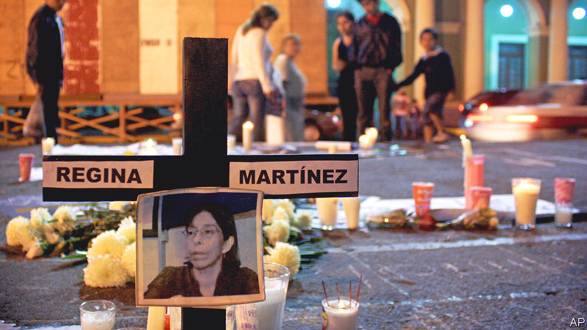

###### Murdering the messenger

# Katherine Corcoran chronicles the perils of Mexican journalists 

##### “In the Mouth of the Wolf” examines the killing of one among many 

 

> Oct 13th 2022 

 By Katherine Corcoran. 

After only nine months, 2022 is already the deadliest year on record for journalists in Mexico. At least 13 have been killed. That is around a quarter of the worldwide total and on a par with Ukraine. Yet though the toll is higher than usual, the peril is tragically familiar. Mexico has often been more dangerous for journalists than active war zones, despite being—on paper at least—a democracy at peace.

Katherine Corcoran, a former bureau chief in Mexico City for the Associated Press, explains this horror by focusing on one murder, that of Regina Martínez in 2012. The victim, a writer for investigative outlets who lived and worked in Veracruz, a state on the country’s east coast, was found beaten and strangled to death in her bathroom. Few observers believe the prosecutors’ conclusion that her killing was a crime of passion (for which the supposed perpetrator is behind bars). Ms Corcoran’s powerful new book, “In the Mouth of the Wolf”, is the product of her years-long search for the truth.

Understanding Mexico’s history is essential for grasping the predicament of its journalists. For over seven decades until 2000, the country was ruled by the Institutional Revolutionary Party, known as the PRI, its Spanish acronym. PRI rule was horribly corrupt and horribly repressive; people were massacred when that was deemed necessary. The press was seen as a tool of the party. Editors were frequently paid to print government drivel, or to hold back damning stories. Chronically underpaid then as they remain now, some reporters were susceptible to inducements.

Especially after power began to alternate between parties in 2000, journalists grew more independent and assertive, and the state less brutal. But the process of improvement is ongoing. Meanwhile reporting has been threatened by the rise of criminal gangs whose activities include extortion and kidnapping as well as drug-trafficking. A twisty nexus between the criminals and state forces has developed in many places, based on fear, common aims or money. Politicians, drug gangs or both together sometimes do away with inconvenient voices; local reporters are among the most vulnerable. (After Martínez’s death, many of her protégés left Veracruz or even Mexico. Some gave up on journalism.)

Ms Corcoran’s digging suggests such a state-criminal combination may have been responsible for Martínez’s murder, and that she was killed because of her work, not a love spat. Though unable to tie up all the loose ends—typical in a country where most crimes are never reported and vanishingly few are punished—the author deftly shows the farcical nature of the prosecution case. When Martínez died, Veracruz was particularly dangerous for journalists. Javier Duarte, its crooked governor, tolerated little dissent. During his six-year term 17 journalists were killed in that state alone. (After fleeing Mexico in 2016 he was caught and extradited and is now in jail for corruption.) Martínez had been investigating mass graves where state authorities may have been dumping bodies.

As that assignment suggests, the plight of journalists is not unique in Mexico, where over 100,000 people are listed as disappeared. Take the infamous case of 43 student teachers who vanished in 2014, which scandalised even violence-weary Mexicans. Recent inquiries into that atrocity suggest a complex interplay between a drug cartel, the army and municipal police. Since Martínez’s death, many more missing people have been found in mass graves of the sort she examined.

In this way, Ms Corcoran’s book lays bare more than the travails of Mexico’s investigative journalists. The corruption and criminal networks that she details are responsible for many injustices inflicted on the wider population. The bad news is that in some ways the situation is worsening. Gangs are getting bolder, their entanglement with politics deeper. During last year’s mid-term elections, 90 politicians were killed, probably by criminals who didn’t like them. Many gangs now field their own candidates in local contests.

The good news is that independent and investigative media outlets are proliferating (as are local organisations that track mass graves and the disappeared). Still, as Ms Corcoran’s book notes—and this year’s death toll confirms—being a good journalist in Mexico demands sacrifice, sometimes the ultimate one. ■

