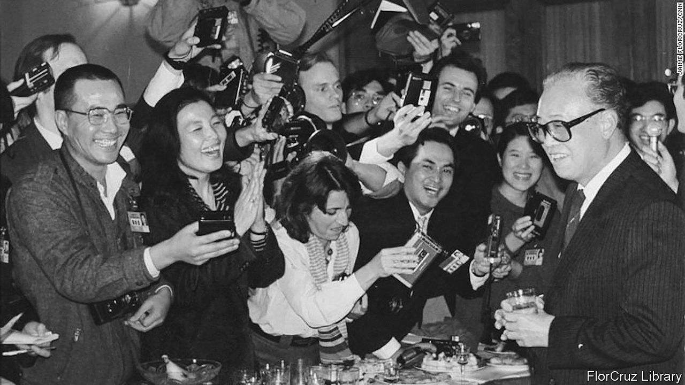

###### Dashed hopes and bad omens

# Might China have followed a more reformist path? 

##### In “Never Turn Back” and “China After Mao”, Julian Gewirtz and Frank Dikötter disagree 

 

> Oct 13th 2022 

. By Julian Gewirtz. 

By Frank Dikötter. 

As China’s Communist Party convenes its 20th congress on October 16th—an event all but certain to result in another five-year term for Xi Jinping, the country’s most dictatorial leader since Mao Zedong—it is worth pondering what might have been. The 13th congress, held in 1987, offered a glimpse. As it ended, your reviewer was in a throng of journalists astonished to be given a chance to pepper the party’s general secretary, Zhao Ziyang (pictured), with any questions they liked. 

Elsewhere such an event might seem humdrum. Not in China. Mao had only been dead for just over a decade. Many features of the highly secretive and repressive political system he installed had remained in place. China’s “reform and opening” had been under way for even less time. In cities, most people still worked directly or indirectly for the state. The surge of private enterprise that has transformed China into an economic giant was still years away. 

In “Never Turn Back”, Julian Gewirtz—a historian who finished the book before taking up a job as China director in America’s National Security Council—describes the 13th congress as plausibly the “single moment that can best represent China’s elite politics in the 1980s”. Zhao’s unscripted press conference was part of a bid by some officials to reform China not just economically, but politically too. Zhao, as Mr Gewirtz observes, was “making a point”. Political reform had been a theme of the congress and he was “putting those principles into action while the ink was still wet on the announcements”. For China, a general secretary talking off-the-cuff to journalists, including Western ones, was a bold experiment. It has not been repeated. 

Reaching this point had been a struggle for Zhao. The 13th congress was the culmination of a dramatic year in Chinese politics, starting with pro-democracy demonstrations by students at the end of 1986. Those were followed by the toppling of a reformist general secretary, Hu Yaobang, by hardliners, and a campaign against “bourgeois liberalisation” that took aim at free-thinking intellectuals. Zhao was Hu’s successor, but barely more trusted by conservatives, who battled with reformers throughout the 1980s for the ear of Deng Xiaoping, the paramount leader. 

The 13th congress was by no means the death knell of the leadership’s conservative wing, however. When pro-democracy unrest broke out again in 1989, this time nationwide, the hardliners returned with a vengeance. A decade of what Mr Gewirtz calls “extraordinary open-ended debate” ended when Deng sent the army into Tiananmen Square to crush the protests. 

The author calls this a “forbidden history” because, he says, the party has created a “myth” around it—that China progressed smoothly from Deng’s rise to power in 1978 to new heights of wealth and modernisation, the clampdown in 1989 marking only a harsh interruption before reforms picked up again in 1992. He says the party has fostered this over-simplified view by suppressing sources and cultivating a narrative that erases key figures (such as Zhao) and covers up debates. He is right, though there is no shortage of alternative sources in Western accounts of the period. Mr Gewirtz’s is a richly researched addition to this literature, enhanced by access to internal Chinese documents and interviews with former officials and intellectuals active at the time. 

Another scholar of contemporary China, Frank Dikötter of the University of Hong Kong, also draws on official records that have not been widely available to look afresh at the history of the reform and opening period. His book, “China After Mao”, highlights two sources: roughly 600 documents that he managed to access in Chinese city and provincial archives; and the diaries of Li Rui, an ardent reformist who served as Mao’s personal secretary and as a senior official under Deng (with nine years behind bars in between). Those are held by Stanford University.

Mr Dikötter is damning of Zhao and his ilk. He notes Zhao’s speech at the 13th congress, in which the general secretary said China would never copy the separation of powers and the multi-party system of the West. He quotes a remark by Zhao to Erich Honecker, then East Germany’s leader, that once living standards had been raised, “we can gradually reduce the scope for liberalisation further and further”. Mr Dikötter suggests that even in the economic realm, talk of reform may be misleading. “What we have witnessed so far is merely tinkering with a planned economy.”

Indivisible power

By contrast, Mr Gewirtz thinks Zhao, among others, had an “ambitious longer-term vision”, involving “greater public participation, accountability and debate” than had occurred in other socialist countries. He provides a fascinating glimpse of highly secretive research overseen by Zhao’s chief aide, Bao Tong, into political reform. Zhao did push back, he reveals, against Mr Bao’s suggestion that the separation of powers “could not simply be rejected”. Such a heresy would be grounds for dismissal (or worse) for a Chinese official today. Yet Mr Bao remained Zhao’s right-hand man until the two fell from grace during the Tiananmen upheaval, Mr Bao ending up in prison for seven years and Zhao under house arrest for the rest of his life. 

The two authors view the 1980s through different lenses. Mr Gewirtz sees a country that “imagined and experimented with many possible ‘China models’”. Mr Dikötter sees a party fixated on only one: keeping itself in power and market forces in check—a goal which, as he sets out in a wealth of detail, has remained consistent ever since. Mr Gewirtz muses on the idea that the great debates of the 1980s may one day be revived: “It is possible to imagine China once again experimenting with meaningful political reforms, increasing the independence of the judiciary and the media.” Mr Dikötter’s view is bleaker, of a country “desperately pumping water and plugging holes to keep the vessel afloat”. 

Mr Dikötter is right to be pessimistic. A clear lesson of the 1980s is that when the leadership feels threatened, it is ready to use extreme violence. The harshness of Mr Xi’s rule is in part a response to what he often describes as the danger of a Soviet-style collapse, caused by ideological laxity, corruption, divisions within the party and attempts by the West to foment unrest. Amid rapid change of all kinds, it is unlikely that party leaders will again feel confident enough to loosen political controls. 

But these authors seem to agree that China’s progress has been more haphazard than outsiders might infer. During the 1980s, Mr Gewirtz reflects, the economic system “was being designed piece by piece, often reacting to events”. Mr Dikötter says there has been “no ‘grand plan’, no ‘secret strategy’, but, rather, a great many unpredictable events, unforeseen consequences and abrupt changes of course as well as interminable struggles for power behind the scenes.” ■

